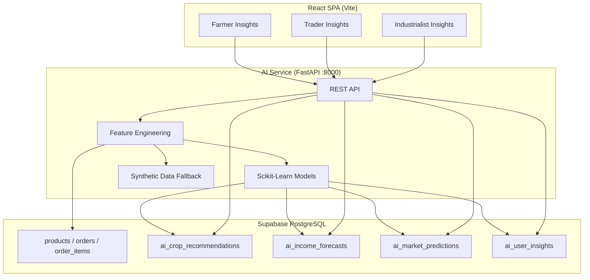

# AgroElevate AI Architecture

**Phase:** B — Intelligence Platform  
**Stack:** Python (FastAPI, Pandas, NumPy, Scikit-Learn) + Supabase + React  
**Constraints:** ₹0 budget, no paid APIs, no OpenAI

---

## 1. System Overview



The marketplace (Phase A) remains unchanged. Intelligence is a **read-mostly overlay**: the AI service reads marketplace data, runs models, persists predictions to AI tables, and the frontend displays results.

---

## 2. Component Responsibilities

| Component | Responsibility |
|-----------|----------------|
| **Supabase** | Source of truth for transactions + AI output tables |
| **AI Service** | Feature extraction, model inference, insight generation, DB writes |
| **React dashboards** | Role-specific intelligence UI; calls AI API + reads cached AI rows |
| **Synthetic datasets** | Bootstrap when historical data is sparse |

---

## 3. Model Strategy (Free / Local)

| Capability | Algorithm | Rationale |
|------------|-----------|-----------|
| Crop ranking | Weighted scoring + `RandomForestRegressor` on synthetic features | Interpretable + handles mixed signals |
| Demand trend | Linear regression on monthly order volume | Simple, fast, demo-friendly |
| Price range | Historical percentiles + seasonal adjustment | No external price API |
| Income forecast | Compound growth with confidence decay by horizon | 1/3/5/10 year projections |
| Risk score | Inverse demand + price volatility proxy | Rule + ML hybrid |
| Insights | Template rules over model outputs | No LLM required |

All models versioned as `v1` in `model_version` columns.

---

## 4. API Design

Base URL: `http://localhost:8000` (dev) — configure via `VITE_AI_API_URL`

| Endpoint | Method | Role | Description |
|----------|--------|------|-------------|
| `/health` | GET | — | Service health |
| `/api/intelligence/refresh` | POST | all | Recompute + persist all intelligence for user |
| `/api/intelligence/farmer/dashboard` | GET | farmer | Recommendations, demand, forecasts, insights |
| `/api/intelligence/trader/dashboard` | GET | middleman | Demand, profit rank, inventory, sourcing |
| `/api/intelligence/industrialist/dashboard` | GET | industrialist | Procurement, suppliers, risk, cost |
| `/api/intelligence/market` | GET | all | Latest `ai_market_predictions` |

### Refresh flow

1. Load user profile + marketplace history from Supabase  
2. Merge with synthetic agricultural baseline  
3. Run feature pipeline  
4. Generate predictions  
5. Upsert into AI tables (delete stale rows for user, insert fresh batch)  
6. Return dashboard payload  

---

## 5. Security

| Layer | Approach |
|-------|----------|
| Frontend → Supabase | Anon key + RLS (read own AI rows) |
| AI Service → Supabase | Service role key (writes AI tables) |
| Frontend → AI Service | User ID + role passed as query params (dev); production should add JWT validation |

**Note:** Phase B dev mode trusts `user_id` from authenticated frontend. Harden with Supabase JWT verification in Phase C.

---

## 6. Deployment (Student Edition)

| Service | Hosting |
|---------|---------|
| React | Vite dev / static host |
| FastAPI | Local `uvicorn` or free Render/Railway tier |
| Supabase | Existing free project |

No GPU required. Training runs on-demand during `/refresh` (seconds).

---

## 7. Directory Layout

```
agro-fair-chain/
  ai-service/
    app/
      main.py              # FastAPI entry
      config.py
      supabase_client.py
      data_loader.py
      feature_engineering.py
      models/
        crop_recommender.py
        market_predictor.py
        income_forecaster.py
        insight_generator.py
        trader_intel.py
        industrialist_intel.py
      routers/
        intelligence.py
    data/
      synthetic_ag_market.csv   # Generated baseline
    scripts/
      generate_synthetic_data.py
    requirements.txt
  supabase/migrations/production/
    20250625100005_prod_ai_tables.sql
  src/
    lib/aiApi.ts
    pages/intelligence/
      FarmerInsights.tsx
      TraderInsights.tsx
      IndustrialistInsights.tsx
```

---

## 8. Non-Goals (Phase B)

- UI redesign of marketplace  
- Modifying checkout / wallet RPCs  
- Paid weather or commodity APIs  
- LLM / OpenAI integration  

---

*Architecture v1 — Phase B Intelligence Platform*
