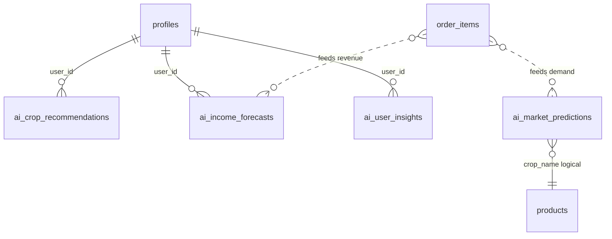

# AgroElevate AI Data Model

**Phase:** B1 — Data Foundation  
**Migration:** `supabase/migrations/production/20250625100005_prod_ai_tables.sql`

---

## 1. Entity Relationship



AI tables are **downstream** of marketplace data. No foreign keys to `orders`/`products` enforce hard coupling — `crop_name` and `user_id` (TEXT = `auth.uid()::text`) link logically.

---

## 2. Table Definitions

### `ai_crop_recommendations`

Personalized crop ranking for a user/session.

| Column | Type | Description |
|--------|------|-------------|
| `id` | UUID | Primary key |
| `user_id` | TEXT | `profiles.id::text` |
| `role` | TEXT | `farmer`, `middleman`, `industrialist`, `admin` |
| `location` | TEXT | User region (from profile address or input) |
| `season` | TEXT | `kharif`, `rabi`, `zaid` |
| `month` | INTEGER | 1–12 |
| `crop_name` | TEXT | Recommended crop |
| `rank` | INTEGER | 1 = top recommendation (max 5 stored) |
| `confidence_score` | NUMERIC(5,4) | 0–1 |
| `expected_profitability` | NUMERIC | ₹/acre proxy or margin score |
| `risk_score` | NUMERIC(5,4) | 0–1 (higher = riskier) |
| `model_version` | TEXT | e.g. `v1` |
| `created_at` | TIMESTAMPTZ | Generation timestamp |

**Indexes:** `(user_id, created_at DESC)`, `(crop_name)`

---

### `ai_income_forecasts`

Multi-horizon revenue projections.

| Column | Type | Description |
|--------|------|-------------|
| `id` | UUID | Primary key |
| `user_id` | TEXT | Owner |
| `role` | TEXT | User role |
| `horizon_years` | INTEGER | `1`, `3`, `5`, or `10` |
| `forecast_year` | INTEGER | Calendar year of projection |
| `projected_revenue` | NUMERIC | ₹ projected |
| `baseline_revenue` | NUMERIC | Current annual run-rate |
| `growth_rate` | NUMERIC | Annualized growth used |
| `confidence_score` | NUMERIC(5,4) | Decreases with longer horizons |
| `model_version` | TEXT | Model tag |
| `created_at` | TIMESTAMPTZ | Generated at |

**Indexes:** `(user_id, horizon_years, created_at DESC)`

---

### `ai_market_predictions`

Crop-level market intelligence (shared across users).

| Column | Type | Description |
|--------|------|-------------|
| `id` | UUID | Primary key |
| `crop_name` | TEXT | Crop identifier |
| `region` | TEXT | Default `India` |
| `demand_score` | NUMERIC | 0–100 |
| `trend` | TEXT | `rising`, `stable`, `falling` |
| `price_min` | NUMERIC | ₹/kg lower bound |
| `price_max` | NUMERIC | ₹/kg upper bound |
| `demand_confidence` | NUMERIC(5,4) | 0–1 |
| `prediction_month` | DATE | Month this prediction applies to |
| `model_version` | TEXT | Model tag |
| `created_at` | TIMESTAMPTZ | Generated at |

**Indexes:** `(crop_name, prediction_month DESC)`, `(region, prediction_month DESC)`

**RLS:** Readable by all `authenticated` users.

---

### `ai_user_insights`

Actionable insight feed.

| Column | Type | Description |
|--------|------|-------------|
| `id` | UUID | Primary key |
| `user_id` | TEXT | Target user |
| `role` | TEXT | Role context |
| `insight_type` | TEXT | e.g. `production`, `risk`, `opportunity`, `demand_spike` |
| `title` | TEXT | Short headline |
| `message` | TEXT | Detail text |
| `priority` | TEXT | `high`, `medium`, `low` |
| `crop_name` | TEXT | Optional related crop |
| `confidence_score` | NUMERIC(5,4) | Optional |
| `is_read` | BOOLEAN | User dismiss/read state |
| `expires_at` | TIMESTAMPTZ | Optional TTL |
| `model_version` | TEXT | Model tag |
| `created_at` | TIMESTAMPTZ | Created at |

**Indexes:** `(user_id, is_read, created_at DESC)`

---

## 3. Source Data Mapping

| AI Feature | Marketplace Source |
|------------|-------------------|
| Historical demand | `order_items.quantity`, `order_items.cropName`, `orders.createdAt` |
| Price signals | `order_items.pricePerUnit`, `products.price_per_unit` |
| User sales (farmer) | `order_items` where `farmerId` = user |
| User purchases (trader/industrialist) | `orders.buyerId` = user |
| Supplier identity | `order_items.farmerId` → `profiles` |
| Location proxy | `profiles.address` |
| Available crops | `products.name`, `DISTINCT order_items.cropName` |

---

## 4. Synthetic Data Fallback

When marketplace rows &lt; threshold (e.g. &lt; 10 order lines), merge `ai-service/data/synthetic_ag_market.csv`:

| Field | Purpose |
|-------|---------|
| `crop_name` | Crop catalog |
| `month` | Seasonality |
| `region` | Regional demand |
| `demand_index` | Baseline demand 0–100 |
| `avg_price` | ₹/kg |
| `volatility` | Risk input |
| `season` | kharif/rabi/zaid suitability |

---

## 5. Retention Policy

On each `/refresh` for a user:

1. Delete prior `ai_crop_recommendations` where `user_id` = X and `created_at` &lt; today  
2. Delete prior `ai_income_forecasts` for user  
3. Delete prior `ai_user_insights` for user (unread optional keep — v1 deletes all)  
4. `ai_market_predictions`: replace global batch for current `prediction_month`

---

## 6. Apply Instructions

Run in Supabase SQL Editor after Phase A migrations:

```
supabase/migrations/production/20250625100005_prod_ai_tables.sql
```

Verify:

```sql
SELECT table_name FROM information_schema.tables
WHERE table_schema = 'public' AND table_name LIKE 'ai_%';
```

Expected: 4 tables.

---

*Data model v1 — Phase B*
