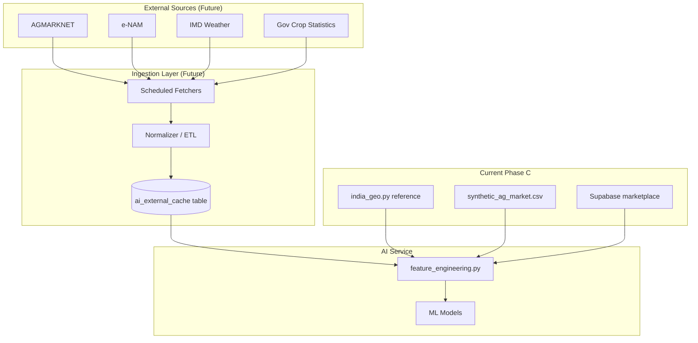

# India Data Integration Plan

**Project:** AgroElevate Intelligence Platform  
**Phase:** C — Architecture preparation only (no ingestion implemented)  
**Budget:** ₹0 — free/public data sources only

---

## 1. Purpose

Prepare a clean integration architecture for authoritative Indian agricultural data sources. Phase C uses **internal reference data** (`india_geo.py`) and **marketplace transactions**. Future phases will replace synthetic baselines with live government feeds without rewriting dashboards.

---

## 2. Target Architecture



---

## 3. AGMARKNET Integration Strategy

**Source:** [AGMARKNET](https://agmarknet.gov.in/) — Ministry of Agriculture mandi prices

### Planned use
- Daily modal/min/max prices per commodity per mandi  
- Replace synthetic `avg_price` in `build_crop_demand_features`  
- Improve `price_trend` in `demand_intelligence.py`

### Integration design

| Layer | Design |
|-------|--------|
| Fetch | Python cron / GitHub Action weekly scrape of public price tables (no API key) |
| Storage | `ai_external_prices (crop_name, mandi, state, modal_price, min_price, max_price, price_date)` |
| Normalizer | Map AGMARKNET commodity names → AgroElevate `CROPS` catalog |
| Feature hook | `get_mandi_price(crop, state)` in `data_loader.py` |
| Fallback | Existing synthetic CSV if fetch fails |

### Mapping example
| AGMARKNET | AgroElevate |
|-----------|-------------|
| Wheat (FAQ) | Wheat |
| Paddy (Basmati) | Rice |
| Onion (Red) | Onion |

---

## 4. e-NAM Integration Strategy

**Source:** [e-NAM](https://enam.gov.in/) — National Agriculture Market portal

### Planned use
- National traded volume signals  
- Cross-mandi arbitrage hints for **Trader Intelligence**  
- Supply availability index

### Integration design

| Layer | Design |
|-------|--------|
| Fetch | Public lot/trade summaries by commodity (scheduled) |
| Storage | `ai_enam_trades (crop_name, state, volume_qtl, trade_date, avg_price)` |
| Feature hook | `enam_volume_index` added to `demand_intelligence.py` |
| Trader output | `best_buy_opportunities` enriched with e-NAM spread |

### Risk
- e-NAM page structure may change — isolate scraper in `ai-service/ingestion/enam_fetcher.py`

---

## 5. IMD Weather Integration Strategy

**Source:** [India Meteorological Department](https://mausam.imd.gov.in/) — public forecasts

### Planned use
- Rainfall deviation → crop risk adjustment  
- Temperature stress → suitability penalty in `district_suitability`  
- Season onset → Kharif/Rabi timing alerts

### Integration design

| Layer | Design |
|-------|--------|
| Fetch | District-level rainfall forecast (free government bulletins or Open-Meteo as free fallback for demo) |
| Storage | `ai_weather_forecast (district, state, rainfall_mm, temp_max, forecast_date)` |
| Feature hook | `weather_risk_multiplier` in `crop_recommender.py` |
| Copilot | "Should I plant now?" uses rainfall gate rules |

### Note
IMD has no official free REST API — plan uses **structured bulletin parsing** or **Open-Meteo** (free, no key) as interim for FYP demo.

---

## 6. Government Crop Statistics Integration Strategy

**Sources:**
- Ministry of Agriculture & Farmers Welfare — area/production/yield reports  
- DES (Directorate of Economics and Statistics) handbooks  
- State agriculture department PDFs

### Planned use
- Calibrate `CROP_YIELD_QTL_PER_ACRE` in `india_geo.py`  
- Validate income forecast baselines  
- State production rankings for copilot answers

### Integration design

| Layer | Design |
|-------|--------|
| Fetch | Annual CSV downloads (public reports) |
| Storage | `ai_gov_crop_stats (crop, state, year, area_ha, production_tonnes, yield_qtl_ha)` |
| Feature hook | `expected_yield_quintals()` uses gov yield when available |
| Versioning | `data_version` column for audit trail |

---

## 7. Proposed Database Tables (Future Migration)

```sql
-- Not applied in Phase C — specification only

CREATE TABLE ai_external_prices (...);
CREATE TABLE ai_enam_trades (...);
CREATE TABLE ai_weather_forecast (...);
CREATE TABLE ai_gov_crop_stats (...);
CREATE TABLE ai_ingestion_log (source, status, rows_inserted, ran_at);
```

All tables **read-only** for frontend; writes via AI service ingestion jobs only.

---

## 8. Code Extension Points (Already Prepared)

| File | Extension |
|------|-----------|
| `app/data_loader.py` | Add `load_external_prices()` merge step |
| `app/feature_engineering.py` | Prefer external price over synthetic when present |
| `app/india_geo.py` | Override yields from `ai_gov_crop_stats` |
| `app/config.py` | `USE_EXTERNAL_DATA=true` feature flag |
| `ai-service/ingestion/` | **Future** — one module per source |

---

## 9. Ingestion Schedule (Recommended)

| Source | Frequency | Priority |
|--------|-----------|----------|
| AGMARKNET | Weekly | P1 |
| e-NAM | Weekly | P2 |
| IMD / weather | Daily | P2 |
| Gov statistics | Annually | P3 |

---

## 10. Compliance & Ethics

- Use only **public** government data  
- Attribute sources in UI ("Prices: AGMARKNET")  
- No farmer PII in external tables  
- Cache aggressively to respect government server load  

---

## 11. Phase C Status

| Item | Status |
|------|--------|
| Architecture documented | ✅ |
| Extension points in code | ✅ |
| Ingestion jobs | ❌ Not implemented |
| External DB tables | ❌ Not migrated |
| UI source attribution | ❌ Future |

---

*Integration plan v1 — ready for Phase D implementation when external data access is approved.*
