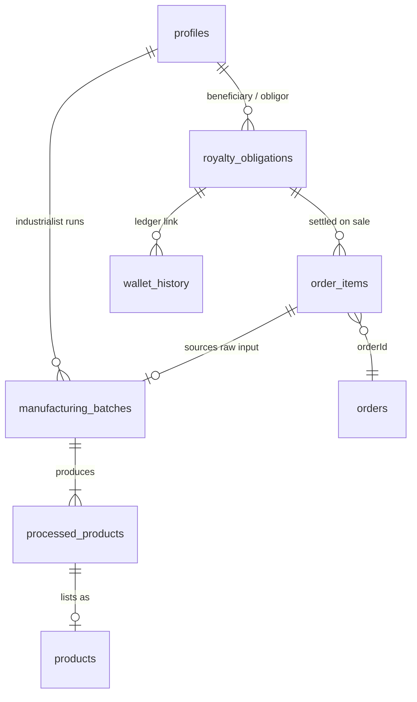

# Option B — Royalty Architecture

**Date:** 2025-06-25  
**Status:** Design only — **do not apply SQL yet**  
**Chosen model:** Option B (role-aware royalty matrix + deferred manufacturing royalty)  
**Shared database:** Android app + React website on one Supabase project

---

## 1. Business rules (authoritative)

| # | Sale path | Buyer | Seller | Royalty at checkout | Downstream royalty |
|---|-----------|-------|--------|---------------------|-------------------|
| 1 | Farmer → Customer | `customer` | `farmer` | **0** | None |
| 2 | Farmer → Trader | `middleman` / `trader` | `farmer` | **0** | None |
| 3 | Trader → Industrialist | `industrialist` | `middleman` / `trader` | **10–12.5%** to original farmer | None (settled immediately) |
| 4 | Farmer → Industrialist | `industrialist` | `farmer` | **0** at purchase | **Deferred** — obligation created for future processed-goods sales |
| 5 | Processed goods sale | any eligible buyer | `industrialist` | Per obligation | **10–12.5%** to original farmer on each downstream sale |

### Clarifications

- **`customer`** never participates in the royalty chain (rules 1, and buyer-side exclusion for all paths).
- **Farmer → Industrialist** is a raw-material procurement: industrialist pays 100% to farmer at checkout; royalty is **not** withheld upfront.
- **Manufacturing** converts procured raw material into `processed_products`; each finished unit carries a **royalty obligation** back to the source farmer.
- **Trader → Industrialist** is the only path where royalty is **immediate at checkout** (rule 3).
- Royalty rate: default **12.5%**, clamped **10% – 12.5%** per product/batch/obligation.

---

## 2. What `CUSTOMER_ROLE_PATCH.sql` covers vs Option B

### 2.1 Adequate for Phase 1 (wallet + customer)

| Section | Content | Option B fit |
|---------|---------|--------------|
| §1 Role helpers | `_role_for_users_table`, `_is_valid_*`, customer pass-through | ✓ Required |
| §2 Constraints | Full role union on `profiles` + `users` | ✓ Required |
| §3 Provisioning | `_resolve_user_identity`, `_ensure_users_row`, backfill | ✓ Required |

### 2.2 Partially adequate for Phase 2

| Section | Content | Gap |
|---------|---------|-----|
| §4 `order_items` columns | `royaltyAmount`, `ownershipChain`, etc. | ✓ Additive, usable |
| §5 `_commerce_settle_sale` | Immediate split logic | Works for rule 3 only |
| §6 `checkout_order` | Role-gated royalty | **Wrong trigger matrix** — see §2.3 |

### 2.3 Missing or incorrect for Option B

| Gap | Detail |
|-----|--------|
| **No role-pair matrix** | Patch triggers royalty when `buyer ∈ chain` AND `original_farmer ≠ seller`. Rule 3 requires **seller = trader AND buyer = industrialist** explicitly. |
| **Rule 4 not implemented** | Farmer → Industrialist creates no `manufacturing_batch` or `royalty_obligation`. |
| **Rule 5 not implemented** | No `processed_products`, no deferred settlement, no downstream ledger. |
| **Phase coupling** | Patch bundles wallet fix + commerce rewrite in one file — Option B requires **phased apply**. |
| **Product metadata only** | Relies on `products.description` JSON; manufacturing needs **normalized tables** for audit and Android/Web parity. |
| **Dashboard** | No pending vs settled obligation views; farmer royalty KPIs only read `wallet_history.royalty_income` (immediate). |
| **Android** | Web `Marketplace.tsx` blocks `customer` checkout — Phase 1 frontend gap (documented, not SQL). |

---

## 3. Royalty decision engine (target design)

```
checkout_order(line)
  │
  ├─ buyer_role = customer ──────────────────► royalty = 0, no chain
  │
  ├─ seller_role = farmer
  │    ├─ buyer = trader/middleman ─────────► royalty = 0 (rule 2)
  │    ├─ buyer = customer ─────────────────► royalty = 0 (rule 1)
  │    └─ buyer = industrialist ────────────► royalty = 0 at checkout
  │                                           + CREATE manufacturing_batch (draft)
  │                                           + CREATE royalty_obligation (deferred)
  │
  ├─ seller_role = trader/middleman
  │    └─ buyer = industrialist ────────────► royalty = immediate % (rule 3)
  │                                           + SETTLE via wallet now
  │                                           + optional obligation row (settled)
  │
  └─ seller_role = industrialist
       └─ product is processed ─────────────► royalty = deferred SETTLE (rule 5)
                                              + link royalty_obligation(s)
                                              + wallet: royalty_income + royalty_paid
```

Helper functions (planned, not implemented):

| Function | Purpose |
|----------|---------|
| `_resolve_sale_royalty_mode(buyer_role, seller_role, product_kind)` | Returns `none` \| `immediate` \| `deferred_create` \| `deferred_settle` |
| `_product_kind(product)` | `raw_farmer` \| `trader_relist` \| `processed` |
| `_settle_immediate_royalty(...)` | Phase 2 — wraps `_commerce_settle_sale` |
| `_create_deferred_obligation(...)` | Phase 3 — on farmer→industrialist |
| `_settle_deferred_obligations(...)` | Phase 3 — on processed product sale |

---

## 4. Entity model

### 4.1 Existing (preserved, not modified destructively)

| Table | Role in Option B |
|-------|------------------|
| `profiles` | Canonical role (`customer`, `middleman`, etc.) |
| `users` | Wallet identity; `trader` alias for `middleman` |
| `products` | Marketplace listings (raw + processed); `description` JSON for lightweight meta |
| `orders` / `order_items` | Sale headers/lines; additive royalty columns |
| `wallet_history` | All money movements |
| `transactions` | Optional audit log |

### 4.2 New (Phase 3)

See `OPTION_B_DATABASE_CHANGES.md` for column-level detail.



---

## 5. Table purposes

### 5.1 `manufacturing_batches`

Tracks industrialist conversion of procured raw material into finished goods.

| Concern | Design |
|---------|--------|
| **Created when** | Farmer → Industrialist order line completes (rule 4) |
| **Owner** | Industrialist (`industrialist_id`) |
| **Source trace** | `source_order_item_id`, `source_product_id`, `original_farmer_id` |
| **Quantities** | `input_qty`, `output_qty`, `waste_qty` |
| **Status** | `draft` → `in_progress` → `completed` \| `cancelled` |
| **Android/Web** | Same table; RPC `create_manufacturing_batch` / `complete_manufacturing_batch` |

### 5.2 `processed_products`

Catalog row for a finished good tied to a batch and royalty obligation.

| Concern | Design |
|---------|--------|
| **Created when** | Batch completed |
| **Links** | `manufacturing_batch_id`, `royalty_obligation_id`, optional `product_id` (when listed on marketplace) |
| **Royalty** | Inherits `royalty_percent` from batch/obligation |
| **Listing** | Industrialist creates `products` row pointing to `processed_product_id` in JSON meta |

### 5.3 `royalty_obligations`

Durable record of farmer entitlement — immediate or deferred.

| Field concept | Purpose |
|---------------|---------|
| `obligation_type` | `immediate` (rule 3) \| `deferred` (rules 4–5) |
| `status` | `pending` \| `partially_settled` \| `settled` \| `cancelled` |
| `beneficiary_farmer_id` | Original farmer |
| `obligor_id` | Who remits (trader or industrialist) |
| `royalty_percent` | 10–12.5 |
| `source_order_item_id` | Line that created the obligation |
| `settled_amount` / `pending_amount` | Running totals |
| `wallet_settlement_ids` | JSON array of `wallet_history.id` for audit |

---

## 6. Wallet ledger integration

### 6.1 Existing types (preserved)

`deposit`, `withdrawal`, `purchase`, `sale_income`, `royalty_income`, `royalty_paid`, `transfer_in`, `transfer_out`, `refund`

### 6.2 Phase 2 — immediate royalty (rule 3)

Unchanged from current `_commerce_settle_sale`:

```
Buyer:  purchase        −line_total
Seller: sale_income     +(line_total − royalty)
Farmer: royalty_income  +royalty
Seller: royalty_paid    −royalty
```

`order_items.royaltyAmount` populated; optional `royalty_obligations` row with `obligation_type = immediate`, `status = settled`.

### 6.3 Phase 3 — deferred royalty (rules 4–5)

**At farmer → industrialist (procurement):**

```
Buyer (industrialist): purchase     −line_total
Seller (farmer):        sale_income  +line_total
-- NO royalty wallet entries
-- CREATE royalty_obligation (pending, deferred)
-- CREATE manufacturing_batch (draft)
```

**At processed product sale:**

```
Buyer:          purchase        −sale_total
Seller (ind):   sale_income     +(sale_total − royalty)
Farmer:         royalty_income  +royalty
Seller (ind):   royalty_paid      −royalty
-- UPDATE royalty_obligation (partially_settled or settled)
-- LINK wallet_history rows to obligation
```

### 6.4 Optional future type

`royalty_deferred_accrual` — informational ledger row (no balance change) for farmer “pending royalty” UI. **Not required for MVP**; obligations table can drive dashboard without new wallet type.

---

## 7. `products` bridge strategy

**Do not replace `products`.** Extend usage:

| Product kind | `seller_id` role | `description` JSON flags |
|--------------|------------------|--------------------------|
| Raw farmer listing | `farmer` | `product_kind: raw_farmer` |
| Trader relist | `middleman` | `product_kind: trader_relist`, `source_order_item_id` |
| Processed listing | `industrialist` | `product_kind: processed`, `processed_product_id`, `royalty_obligation_id` |

Normalized tables hold source of truth; JSON is a **read cache** for checkout RPC and existing frontend parsers.

---

## 8. Dashboard integration

### 8.1 Farmer

| KPI | Phase | Source |
|-----|-------|--------|
| Direct sales revenue | 1 | `order_items` where `farmerId` = self, `royaltyAmount` = 0 |
| Immediate royalty income | 2 | `wallet_history` type `royalty_income` |
| Pending downstream royalty | 3 | `SUM(pending_amount)` on `royalty_obligations` where beneficiary = self |
| Settled downstream royalty | 3 | `wallet_history` linked to deferred obligations |
| Total earnings | 2+ | direct + immediate + settled deferred |

### 8.2 Trader

| KPI | Phase | Source |
|-----|-------|--------|
| Purchases / inventory | 1 | Existing `marketplaceData.ts` |
| Resales to industrialist | 2 | Orders + royalty on lines where seller = self |
| Royalty remitted | 2 | `wallet_history` type `royalty_paid` |

### 8.3 Industrialist

| KPI | Phase | Source |
|-----|-------|--------|
| Raw procurement | 1 | `orders` as buyer |
| Active manufacturing batches | 3 | `manufacturing_batches` |
| Processed listings | 3 | `processed_products` + `products` |
| Open royalty obligations | 3 | `royalty_obligations` where obligor = self, status pending |
| Royalty paid on processed sales | 3 | `wallet_history` `royalty_paid` |

### 8.4 Customer

| KPI | Phase | Source |
|-----|-------|--------|
| Purchase history | 1 | `orders` as buyer |
| Wallet balance | 1 | `users` + `wallet_history` |
| No royalty UI | all | — |

### 8.5 Android parity

- Android already uses `customer` role and shared `checkout_order` RPC.
- Phase 1 must not change checkout semantics beyond customer-safe zero royalty.
- Phase 3 manufacturing UI may ship on Android first; web reads same tables via Supabase client.

---

## 9. RLS considerations

| Table | Policy pattern |
|-------|----------------|
| `manufacturing_batches` | Industrialist CRUD own; farmer read batches where `original_farmer_id` = self |
| `processed_products` | Industrialist CRUD own; public read when linked to active `products` listing |
| `royalty_obligations` | Beneficiary farmer read; obligor read/update settlement fields; admin all |
| Existing tables | Unchanged; seller/buyer policies from migration 007 |

All new tables: **additive RLS**; no changes to existing order/wallet policies that would hide historical data.

---

## 10. Ownership chain vs obligations

| Mechanism | Use |
|-----------|-----|
| `order_items.ownershipChain` JSONB | Phase 2 audit trail for trader resales (rules 2–3) |
| `royalty_obligations` | Phase 3 durable entitlement for manufacturing (rules 4–5) |

**Customer purchases:** `ownershipChain = NULL`, no obligation rows.

**Farmer → Trader:** extend chain optionally for traceability; no obligation.

**Trader → Industrialist:** chain snapshot + immediate obligation (settled).

**Farmer → Industrialist:** obligation (pending) + batch; chain records procurement only.

---

## 11. Compatibility guarantees

| Asset | Guarantee |
|-------|-----------|
| `customer` role | Preserved in constraints and bridge functions |
| Android accounts | Same `profiles` / `users` / RPCs |
| Existing `orders` | Untouched; new columns default 0 / NULL |
| Existing `wallet_history` | Append-only; no retroactive type changes |
| Existing `products` | Untouched; new listings add JSON keys only |
| Failed migration 009 | Phase 1 replaces provisioning without re-running 009 |

---

## 12. Document map

| Document | Contents |
|----------|----------|
| `OPTION_B_ROYALTY_ARCHITECTURE.md` | This file — business rules, flows, integrations |
| `OPTION_B_MIGRATION_PLAN.md` | Phased rollout, testing, apply order |
| `OPTION_B_DATABASE_CHANGES.md` | Table/column/RPC specifications (no SQL) |
| `CUSTOMER_ROLE_PATCH.sql` | **Hold** — split into Phase 1 / 2 / 3 deliverables |
| `ROLE_COMPATIBILITY_AUDIT.md` | Customer + role bridge context for Phase 1 |

---

## 13. Success criteria by phase

### Phase 1
- [ ] Every profile has `users` wallet row (including `customer`)
- [ ] `add_funds` works for all roles
- [ ] Customer checkout: farmer listing, royalty = 0
- [ ] No change to royalty on existing completed orders

### Phase 2
- [ ] Farmer → Trader: seller receives 100%
- [ ] Trader → Industrialist: farmer receives 10–12.5% immediately
- [ ] Customer / farmer buyers never trigger royalty on any listing
- [ ] Farmer dashboard splits direct vs immediate royalty

### Phase 3
- [ ] Farmer → Industrialist creates batch + pending obligation (no checkout royalty)
- [ ] Processed product listing links to obligation
- [ ] Processed sale settles obligation + wallet royalty entries
- [ ] Farmer dashboard shows pending vs settled downstream royalty
- [ ] Android + Web read consistent obligation state
