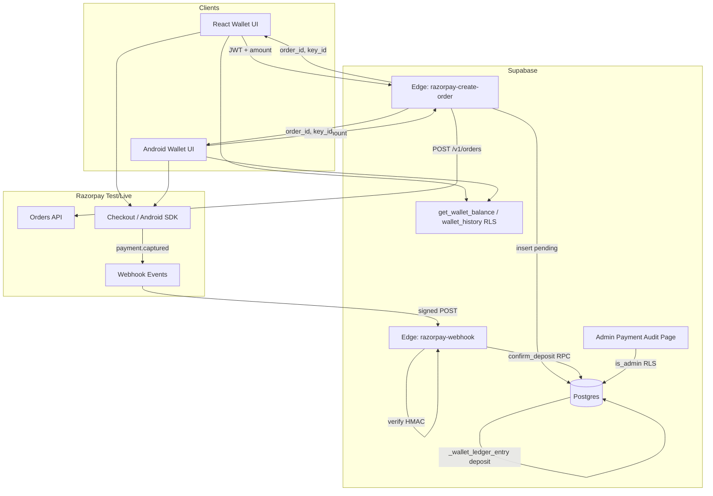
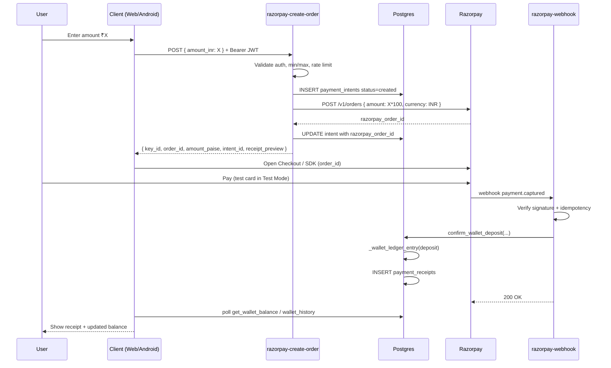
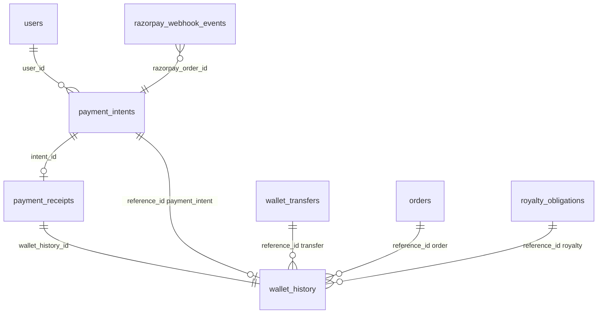

# Razorpay Integration Architecture — Phase G

**Project:** AgroElevate  
**Phase:** G — Payment Gateway (Razorpay)  
**Status:** Architecture updated (pre RG-001) — wallet references, IST compliance, admin audit  
**Prerequisite:** Commerce E2E verification **21/21 passed**  
**Mode:** Razorpay **Test Mode** first; Live Mode gated behind separate rollout checklist  
**Shared database:** React web + Android native app on one Supabase project

---

## 1. Executive summary

Phase G replaces the mock `add_funds` RPC path with a **server-authoritative wallet top-up** flow:

1. Client requests a **Razorpay Order** from the backend (never creates payment alone).
2. User completes payment in Razorpay Checkout (web) or Razorpay Android SDK.
3. Razorpay sends a **signed webhook** to our backend.
4. Backend **verifies signature + amount + order state**, then credits the wallet **once** via `_wallet_ledger_entry`.
5. Client **polls or subscribes** for balance/history updates — it never credits itself.

Marketplace checkout (`checkout_order`) continues to debit the **wallet balance** only. Razorpay funds the wallet; it does not pay sellers directly at checkout time. This preserves the existing royalty engine, `wallet_history` semantics, and Android/Web parity.

---

## 2. Design principles

| # | Principle | Rationale |
|---|-----------|-----------|
| P1 | **No client-side wallet credits** | Prevents balance forgery; aligns with Phase A SECURITY DEFINER ledger |
| P2 | **Webhook is source of truth** | Client-side payment success callbacks are hints only, not settlement |
| P3 | **Idempotent settlement** | Razorpay retries webhooks; duplicate events must not double-credit |
| P4 | **Preserve `wallet_history`** | Android dashboards, farmer royalty KPIs, and audits read existing ledger; extend with `reference_type` / `reference_id` |
| P5 | **Additive schema only** | No changes to `orders`, `order_items`, royalty tables, or `users` PK model |
| P6 | **Secrets server-side only** | `RAZORPAY_KEY_SECRET` and webhook secret never in web bundle or Android APK logic |
| P7 | **Test Mode parity** | Test keys + test cards mirror production flow without real money |
| P8 | **Android/Web contract** | Same Edge Functions + RPC reads; platform-specific UI only |
| P9 | **Polymorphic ledger references** | Every `wallet_history` row links to its source entity via `reference_type` + `reference_id` |
| P10 | **India audit trail** | Razorpay IDs, IST payment timestamp, and receipt number stored immutably |

---

## 3. Current state (baseline)

### 3.1 Mock flow (to be retired)

```
Wallet UI / Android
    → supabase.rpc('add_funds', { p_amount })
        → _ensure_users_row
        → _wallet_ledger_entry(userId, 'deposit', +amount, NULL, 'Mock wallet deposit')
        → users.walletBalance += amount
```

**Problems:** Any authenticated client can mint balance; no payment proof; no receipts; unsuitable for production.

### 3.2 Existing assets

| Asset | Location | Notes |
|-------|----------|-------|
| Wallet ledger | `_wallet_ledger_entry` | Internal; correct credit mechanism |
| Balance read | `get_wallet_balance()` | Read-only; keep unchanged |
| History read | `wallet_history` RLS | `userId` = auth user |
| Wallet UI | `src/pages/Wallet.tsx` | Calls `addFunds()` → mock RPC |
| Wallet lib | `src/lib/wallet.ts` | `addFunds`, `getWalletInfo`, `transferFunds` |
| Edge stub | `supabase/functions/razorpay-create-order/` | Creates Razorpay order; **no auth, no DB, no webhook** |
| Commerce types | `commerceMeta.ts` | `deposit` wallet type already defined |
| E2E | `commerce:verify` | Uses `add_funds`; needs Phase G test harness |

### 3.3 Production `wallet_history` shape (extended, backward compatible)

| Column | Type | Phase G usage |
|--------|------|---------------|
| `id` | uuid | Ledger row PK |
| `userId` | text | Unchanged |
| `type` | text | `deposit`, `purchase`, `royalty_income`, `transfer_in`, etc. |
| `amount` | numeric | Signed amount in INR |
| `orderId` | uuid | **Legacy** — marketplace `orders.id` on checkout debits; kept for Android readers |
| `description` | text | Human-readable summary (receipt #, Razorpay refs) |
| `createdAt` | timestamptz | UTC storage; display in IST for India compliance |
| `royaltyObligationId` | uuid nullable | **Legacy** royalty link — superseded by `reference_*` for new rows |
| **`reference_type`** | text nullable | **New** — polymorphic source type (see §6.6) |
| **`reference_id`** | uuid nullable | **New** — UUID of the source entity |

**Android compatibility:** Existing clients that read `userId`, `type`, `amount`, `orderId`, `description`, `createdAt` continue to work. New columns are nullable on historical rows; backfill is optional and non-destructive.

---

## 4. Target architecture

### 4.1 High-level component diagram



### 4.2 Trust boundaries

| Zone | Trust level | Allowed operations |
|------|-------------|-------------------|
| Browser / Android | **Untrusted** | Request order creation; open Razorpay UI; read own wallet |
| Edge Functions (service role) | **Trusted** | Call Razorpay API; verify webhooks; call settlement RPC |
| Postgres RPC `confirm_wallet_deposit` | **Trusted** | Credit ledger; idempotent by `razorpay_payment_id` |
| Postgres RPC `add_funds` | **Revoked** | Remove `GRANT` to `authenticated` (keep internal/test only) |
| Razorpay webhook | **Verified** | HMAC-SHA256 with `RAZORPAY_WEBHOOK_SECRET` |

---

## 5. Payment flows

### 5.1 Happy path — wallet top-up



### 5.2 Failure paths

| Scenario | Client behavior | Server behavior |
|----------|-----------------|-----------------|
| User closes Checkout | Show "Payment cancelled"; intent stays `created` | No credit; intent expires after TTL (e.g. 30 min) |
| Payment fails at Razorpay | Show failure message | Webhook `payment.failed` → intent `failed`; no credit |
| Webhook delayed | Poll wallet/history for up to 60s | Webhook eventually settles or manual reconcile |
| Duplicate webhook | N/A | Idempotent: same `razorpay_payment_id` → no second credit |
| Amount mismatch | N/A | Reject settlement; log alert; intent `failed` |
| Forged client callback | **Ignored** | Only webhook + server verify credits wallet |

### 5.3 What does **not** change

| Flow | Phase G behavior |
|------|------------------|
| `checkout_order` | Still debits `users.walletBalance` |
| `transfer_funds` | Unchanged |
| Royalty settlement | Unchanged |
| `transactions` table (marketplace) | Unchanged; separate from wallet top-up receipts |

---

## 6. Data model (additive)

### 6.1 New table: `payment_intents`

Tracks each top-up attempt from order creation through settlement.

| Column | Type | Notes |
|--------|------|-------|
| `id` | uuid PK | Internal intent ID returned to client |
| `user_id` | text NOT NULL | `auth.uid()::text` / `users.uid` |
| `amount_inr` | numeric NOT NULL | Display amount (rupees) |
| `amount_paise` | integer NOT NULL | Razorpay amount (`INR * 100`) |
| `currency` | text DEFAULT `'INR'` | |
| `razorpay_order_id` | text UNIQUE | From Razorpay Orders API |
| `razorpay_payment_id` | text UNIQUE NULL | Set on capture |
| `status` | text | `created` \| `paid` \| `failed` \| `expired` |
| `receipt_number` | text UNIQUE | Server-generated `AGR-YYYY-000001` (see §11.1) |
| `wallet_history_id` | uuid NULL | FK → `wallet_history.id` after credit |
| `paid_at` | timestamptz NULL | UTC capture time from Razorpay |
| `paid_at_ist` | timestamptz NULL | `paid_at AT TIME ZONE 'Asia/Kolkata'` stored for India audit exports |
| `idempotency_key` | text UNIQUE | `{user_id}:{razorpay_order_id}` |
| `metadata` | jsonb | Client platform (`web`/`android`), IP hash, etc. |
| `created_at` | timestamptz | |
| `updated_at` | timestamptz | |
| `expires_at` | timestamptz | `created_at + 30 minutes` |
| `failure_reason` | text NULL | Razorpay error / webhook reject reason |

**RLS:** Users `SELECT` own rows only. Inserts/updates via Edge Functions + settlement RPC only.

### 6.2 New table: `payment_receipts`

Immutable audit record for successful top-ups (receipt UI + support).

| Column | Type | Notes |
|--------|------|-------|
| `id` | uuid PK | |
| `intent_id` | uuid UNIQUE FK | → `payment_intents` |
| `user_id` | text | Denormalized for queries |
| `receipt_number` | text UNIQUE | Same as intent, displayed to user |
| `amount_inr` | numeric | |
| `razorpay_order_id` | text NOT NULL | India compliance — immutable after capture |
| `razorpay_payment_id` | text UNIQUE NOT NULL | India compliance — primary payment reference |
| `razorpay_signature` | text NULL | Webhook verification artifact |
| `payment_method` | text NULL | `card`, `upi`, `netbanking`, etc. |
| `paid_at` | timestamptz NOT NULL | UTC from Razorpay `created_at` |
| `paid_at_ist` | timestamptz NOT NULL | IST wall-clock for receipts and admin audit |
| `wallet_history_id` | uuid FK | Link to ledger row |
| `issued_at` | timestamptz | Receipt generation time (defaults to `paid_at`) |

### 6.3 New table: `razorpay_webhook_events` (idempotency log)

| Column | Type | Notes |
|--------|------|-------|
| `id` | uuid PK | |
| `event_id` | text UNIQUE | Razorpay `event.id` or `x-razorpay-event-id` |
| `event_type` | text | e.g. `payment.captured` |
| `razorpay_payment_id` | text NULL | |
| `razorpay_order_id` | text NULL | |
| `payload` | jsonb | Raw event (redact PAN if ever present) |
| `processed_at` | timestamptz | |
| `status` | text | `processed` \| `ignored` \| `failed` \| `duplicate` |
| `failure_reason` | text NULL | Signature invalid, amount mismatch, etc. |
| `duplicate_of_event_id` | text NULL | Original `event_id` when `status=duplicate` |

### 6.4 New table: `wallet_transfers` (transfer reference target)

Peer transfers currently lack a durable correlation ID. Phase G introduces a lightweight transfer record so `wallet_history` can reference a stable UUID.

| Column | Type | Notes |
|--------|------|-------|
| `id` | uuid PK | **Transfer UUID** — `reference_id` for transfer ledger rows |
| `sender_id` | text NOT NULL | `users.uid` |
| `receiver_id` | text NOT NULL | `users.uid` |
| `amount_inr` | numeric NOT NULL | |
| `status` | text | `completed` \| `failed` |
| `created_at` | timestamptz | |

Created inside `_wallet_transfer` before ledger entries. **No change** to transfer business rules or amounts.

### 6.5 `wallet_history` reference model

**Additive columns** (migration 016):

| Column | Type | Constraint |
|--------|------|------------|
| `reference_type` | text NULL | CHECK in (`payment_intent`, `royalty_obligation`, `order`, `transfer`) |
| `reference_id` | uuid NULL | Polymorphic FK enforced in application/RPC layer |

**Mapping by wallet event:**

| `wallet_history.type` | `reference_type` | `reference_id` | Notes |
|-----------------------|------------------|----------------|-------|
| `deposit` | `payment_intent` | `payment_intents.id` | Razorpay top-up only |
| `royalty_income`, `royalty_paid` | `royalty_obligation` | `royalty_obligations.id` | When obligation exists |
| `purchase` | `order` | `orders.id` | Buyer debit at checkout |
| `sale_income` | `order` | `orders.id` | Seller credit at checkout |
| `transfer_in`, `transfer_out` | `transfer` | `wallet_transfers.id` | Both legs share same transfer UUID |

**Legacy column coexistence:**

| Column | Phase G rule |
|--------|--------------|
| `orderId` | Still populated on checkout rows (`purchase` / `sale_income`) for Android clients that join on `orderId` |
| `royaltyObligationId` | Still populated when applicable; new rows **also** set `reference_type` / `reference_id` |

**Deposit settlement example:**

```text
type:           deposit
amount:         +5000
orderId:        NULL
reference_type: payment_intent
reference_id:   <payment_intents.id>
description:    Razorpay deposit · Receipt AGR-2025-000001 · order_Rx… · pay_Ry…
```

**`_wallet_ledger_entry` extension (conceptual):**

```sql
_wallet_ledger_entry(
  p_user_id, p_type, p_amount,
  p_order_id, p_description,
  p_reference_type TEXT DEFAULT NULL,
  p_reference_id UUID DEFAULT NULL
)
```

All existing callers pass `NULL` for new params until backfilled; Razorpay settlement always sets `payment_intent`.

### 6.6 Entity relationship



---

## 7. Razorpay object mapping

| Razorpay object | AgroElevate record | Notes |
|-----------------|-------------------|-------|
| Order (`order_xxx`) | `payment_intents.razorpay_order_id` | Created server-side; `payment_capture=1` |
| Payment (`pay_xxx`) | `payment_intents.razorpay_payment_id`, `payment_receipts` | Idempotency key for settlement |
| Receipt (Razorpay) | `payment_intents.receipt_number` | Our receipt passed as Razorpay `receipt` field |
| Webhook event | `razorpay_webhook_events` | Dedup by `event_id` |
| Invoice (future) | Out of Phase G scope | Receipts only |

### 7.1 Amount handling

| Layer | Unit |
|-------|------|
| UI / `amount_inr` | Rupees (₹5000) |
| Razorpay API | Paise (500000) |
| `wallet_history.amount` | Rupees (consistent with existing ledger) |
| `users.walletBalance` | Rupees |

Server validates: `razorpay_order.amount === intent.amount_paise` before credit.

---

## 8. Backend services

### 8.1 Edge Function: `razorpay-create-order`

**Responsibilities:**

- Authenticate Supabase JWT (`Authorization: Bearer`)
- Validate amount (min ₹1, max configurable e.g. ₹100,000)
- Ensure `users` row exists (`ensure_profile_from_auth` pattern)
- Generate `receipt_number` via `generate_receipt_number()` → `AGR-YYYY-000001` format
- Insert `payment_intents` (`status=created`)
- Call Razorpay `POST /v1/orders` with Basic auth
- Return **only** `{ key_id, order_id, amount_paise, currency, intent_id, receipt_number }`

**Must NOT:** Credit wallet; expose `key_secret`; accept `razorpay_payment_id` from client.

### 8.2 Edge Function: `razorpay-webhook`

**Responsibilities:**

- Verify `X-Razorpay-Signature` using `RAZORPAY_WEBHOOK_SECRET`
- Parse `payment.captured` (primary) and optionally `payment.failed`
- Insert `razorpay_webhook_events` (dedup)
- Call `confirm_wallet_deposit(...)` SECURITY DEFINER RPC
- Return `200` quickly; heavy work in RPC transaction

**Events subscribed (Test Mode):**

- `payment.captured` — settle wallet
- `payment.failed` — mark intent failed
- `order.paid` — optional redundant guard

### 8.3 Postgres RPC: `confirm_wallet_deposit`

**Signature (conceptual):**

```sql
confirm_wallet_deposit(
  p_razorpay_order_id TEXT,
  p_razorpay_payment_id TEXT,
  p_amount_paise INTEGER,
  p_payment_method TEXT DEFAULT NULL
) RETURNS jsonb
```

**Logic:**

1. `SELECT ... FROM payment_intents WHERE razorpay_order_id = p_razorpay_order_id FOR UPDATE`
2. If `status = paid` → return existing receipt (idempotent)
3. Validate `amount_paise` matches intent
4. Compute `paid_at` (UTC) and `paid_at_ist` (`AT TIME ZONE 'Asia/Kolkata'`)
5. `_ensure_users_row(user_id)`
6. `_wallet_ledger_entry(user_id, 'deposit', amount_inr, NULL, description, 'payment_intent', intent.id)`
7. Insert `payment_receipts` with India compliance fields (§12)
8. Update intent `status=paid`, link `wallet_history_id`, set `paid_at` / `paid_at_ist`
9. Return `{ receipt_number, wallet_history_id, balance, paid_at_ist }`

**Access:** `REVOKE ALL FROM PUBLIC`; callable only by `service_role` (Edge webhook).

### 8.4 Deprecate `add_funds`

| Action | Detail |
|--------|--------|
| `REVOKE EXECUTE ON add_funds FROM authenticated` | Blocks client minting |
| Replace body with `RAISE EXCEPTION 'Use Razorpay wallet top-up'` | Safety if grant leaks |
| CI / `commerce:verify` | Switch to webhook simulation harness (see Implementation Plan) |

---

## 9. Client architecture

### 9.1 Web (React)

| Step | Implementation |
|------|----------------|
| Load Razorpay.js | `https://checkout.razorpay.com/v1/checkout.js` |
| Create order | `supabase.functions.invoke('razorpay-create-order', { body: { amount_inr } })` |
| Open Checkout | `new Razorpay({ key, order_id, handler })` — handler **does not credit**; triggers poll |
| Poll | `get_wallet_balance` + `wallet_history` every 2s × 30 |
| Receipt UI | Fetch `payment_receipts` by `intent_id` or latest deposit |

**Env (public):** `VITE_RAZORPAY_KEY_ID` (test key_id only — safe to expose)

### 9.2 Android

| Step | Implementation |
|------|----------------|
| Create order | Same Edge Function with Supabase Kotlin SDK + user JWT |
| Pay | Razorpay Android Standard SDK with server `order_id` |
| Success callback | Show "Processing…"; poll `get_wallet_balance` |
| Receipt | Query `payment_receipts` via Supabase client (RLS) |

**Parity rule:** Android never calls `add_funds`; never writes `wallet_history` directly.

### 9.3 Realtime (optional enhancement)

Subscribe to `payment_intents` row changes (`status → paid`) for instant UI update instead of polling. Not required for Phase G MVP.

---

## 10. Security

### 10.1 Threat model

| Threat | Mitigation |
|--------|------------|
| Client calls `add_funds` | Revoke grant; RPC raises |
| Client fakes payment success | Wallet credits only via webhook RPC |
| Webhook replay | `razorpay_webhook_events.event_id` UNIQUE |
| Double capture credit | `razorpay_payment_id` UNIQUE on intents/receipts |
| Amount tampering | Server compares Razorpay payload to stored intent |
| Stolen JWT creating orders | Rate limit; max amount; audit log |
| Secret leakage | Keys only in Supabase Edge secrets |

### 10.2 Webhook verification

```
expected_signature = HMAC_SHA256(webhook_secret, raw_request_body)
verify expected_signature == X-Razorpay-Signature
```

Use raw body; reject if secret unset.

### 10.3 Test Mode

| Item | Test | Live |
|------|------|------|
| `RAZORPAY_KEY_ID` | `rzp_test_…` | `rzp_live_…` |
| Dashboard webhooks | Test mode URL | Separate live URL |
| Cards | Razorpay test cards | Real instruments |

---

## 11. Receipts and transaction references

### 11.1 Receipt number format

**Canonical format:** `AGR-YYYY-000001`

| Segment | Rule | Example |
|---------|------|---------|
| Prefix | Fixed `AGR` | `AGR` |
| Year | 4-digit calendar year (IST) | `2025` |
| Sequence | 6-digit zero-padded, **per-year** counter | `000001` |

**Generation:** `generate_receipt_number()` uses a Postgres sequence scoped per year (e.g. `payment_receipt_seq_2025`). Passed to Razorpay Orders API as the `receipt` field.

**Examples:** `AGR-2025-000001`, `AGR-2025-000042`, `AGR-2026-000001`

### 11.2 User-visible receipt fields

| Field | Source |
|-------|--------|
| Receipt # | `payment_receipts.receipt_number` (`AGR-YYYY-000001`) |
| Date & time (IST) | `payment_receipts.paid_at_ist` |
| Amount | `amount_inr` (₹) |
| Razorpay order | `razorpay_order_id` |
| Razorpay payment | `razorpay_payment_id` |
| Method | `payment_method` |
| Wallet txn | `wallet_history_id` + `reference_type=payment_intent` |

### 11.3 Wallet history description convention

```text
Razorpay deposit · Receipt AGR-2025-000001 · order_Rx… · pay_Ry…
```

Human-readable fallback for Android clients that do not yet read `reference_type` / `reference_id`. Structured joins use `reference_*` columns as primary.

### 11.4 Ledger reference quick reference

| Event | `type` | `reference_type` | `reference_id` |
|-------|--------|------------------|----------------|
| Razorpay top-up | `deposit` | `payment_intent` | `payment_intents.id` |
| Marketplace buy | `purchase` | `order` | `orders.id` |
| Marketplace sell | `sale_income` | `order` | `orders.id` |
| Royalty credit/debit | `royalty_income` / `royalty_paid` | `royalty_obligation` | `royalty_obligations.id` |
| Peer transfer | `transfer_in` / `transfer_out` | `transfer` | `wallet_transfers.id` |

---

## 12. India compliance and audit storage

Phase G stores the minimum fields required for payment reconciliation, user receipts, and admin audit under Indian operations (IST timezone, INR currency, Razorpay as payment aggregator).

### 12.1 Mandatory stored fields (per successful payment)

| Field | Storage location | Notes |
|-------|------------------|-------|
| Razorpay `order_id` | `payment_intents.razorpay_order_id`, `payment_receipts.razorpay_order_id` | Immutable after creation |
| Razorpay `payment_id` | `payment_intents.razorpay_payment_id`, `payment_receipts.razorpay_payment_id` | UNIQUE; idempotency key |
| Payment timestamp (IST) | `payment_intents.paid_at_ist`, `payment_receipts.paid_at_ist` | Derived from Razorpay capture time |
| Receipt number | `payment_intents.receipt_number`, `payment_receipts.receipt_number` | `AGR-YYYY-000001` format |
| Amount (INR) | `amount_inr` | Rupees, 2 decimal places |
| UTC timestamp | `paid_at`, `created_at` | Internal consistency |

**Receipt display rule:** User-facing PDF/UI always shows **IST** (`paid_at_ist`). Database stores both UTC and IST denormalized columns to avoid runtime TZ bugs in reports.

### 12.2 Retention

| Record | Retention |
|--------|-----------|
| `payment_receipts` | Immutable; never deleted |
| `payment_intents` | Immutable status history |
| `razorpay_webhook_events` | Retain ≥ 7 years for dispute audit (configurable) |
| `wallet_history` | Append-only (existing policy) |

### 12.3 Out of scope (Phase G)

GST line items, TDS, formal tax invoices, and e-invoicing (IRN) — deferred to a future compliance phase. Receipts are **payment acknowledgements**, not tax invoices.

---

## 13. Admin payment audit page

### 13.1 Purpose

Provide operators (`role = admin`) a single view of payment health across Razorpay top-ups, webhook processing, and ledger settlement — without exposing secrets or allowing manual balance edits.

**Route:** `/admin/payments` (web only; admin RLS required)

### 13.2 Data sources

| View | Primary table(s) | Filter |
|------|------------------|--------|
| Successful payments | `payment_receipts` JOIN `payment_intents` | `payment_intents.status = paid` |
| Failed payments | `payment_intents` | `status IN (failed, expired)` |
| Webhook failures | `razorpay_webhook_events` | `status = failed` |
| Duplicate webhook attempts | `razorpay_webhook_events` | `status = duplicate` |

### 13.3 Tab definitions

#### Tab A — Successful payments

| Column | Source |
|--------|--------|
| Receipt # | `receipt_number` |
| User | `user_id` → `profiles.name` |
| Amount | `amount_inr` |
| Razorpay order | `razorpay_order_id` |
| Razorpay payment | `razorpay_payment_id` |
| Paid at (IST) | `paid_at_ist` |
| Wallet txn | Link to `wallet_history` via `wallet_history_id` |
| Reference | `reference_type=payment_intent`, `reference_id` |

**Actions:** Export CSV (IST dates); view raw webhook payload (redacted).

#### Tab B — Failed payments

| Column | Source |
|--------|--------|
| Intent ID | `payment_intents.id` |
| User | `user_id` |
| Amount | `amount_inr` |
| Razorpay order | `razorpay_order_id` (if created) |
| Status | `failed` \| `expired` |
| Reason | `failure_reason` |
| Created at (IST) | `created_at AT TIME ZONE 'Asia/Kolkata'` |

**No wallet credit** on this tab — confirms guardrails.

#### Tab C — Webhook failures

| Column | Source |
|--------|--------|
| Event ID | `event_id` |
| Event type | `event_type` |
| Razorpay order | `razorpay_order_id` |
| Razorpay payment | `razorpay_payment_id` |
| Failure reason | `failure_reason` |
| Received at (IST) | `processed_at` |
| Payload | Truncated JSON viewer |

**Typical causes:** Invalid signature, amount mismatch, unknown order, DB error during settlement.

#### Tab D — Duplicate webhook attempts

| Column | Source |
|--------|--------|
| Event ID | `event_id` |
| Duplicate of | `duplicate_of_event_id` |
| Razorpay payment | `razorpay_payment_id` |
| Received at (IST) | `processed_at` |
| Outcome | `status = duplicate` — no second wallet credit |

Confirms idempotency is working; useful when Razorpay retries delivery.

### 13.4 Access control

| Rule | Implementation |
|------|----------------|
| Admin only | `is_admin()` on RLS policies for `payment_intents`, `payment_receipts`, `razorpay_webhook_events` |
| No manual credit | Admin UI is **read-only** — no buttons to adjust `walletBalance` |
| Service role | Edge Functions retain write access |

**RLS addition:**

```text
payment_intents_admin_select   → is_admin()
payment_receipts_admin_select  → is_admin()
webhook_events_admin_select    → is_admin()
```

Users retain `SELECT` on own rows only; admins see all rows.

### 13.5 Admin RPC (optional)

`get_payment_audit_summary()` — `SECURITY DEFINER`, admin-only counts for dashboard KPI cards:

- paid today (IST)
- failed today
- webhook failures (24h)
- duplicate webhooks (24h)

---

## 14. Android compatibility matrix

| Concern | Approach |
|---------|----------|
| Shared `users` / `wallet_history` | Same tables; same `deposit` type |
| Existing column reads | `userId`, `type`, `amount`, `orderId`, `description`, `createdAt` — **unchanged** |
| New `reference_*` columns | Nullable; Android may ignore until SDK update — no breaking change |
| `userId` TEXT | Edge Function uses `auth.uid()::text` |
| Role bridge (`middleman`/`trader`) | Unaffected; top-up is role-agnostic |
| Legacy app calling `add_funds` | **Breaking** when revoked — coordinate app release |
| Customer role wallet | Supported; same top-up flow |
| Offline / retry | Poll + webhook idempotency handles delayed settlement |
| Receipt screen | Query `payment_receipts` RLS `user_id = auth.uid()::text` |
| Transfer history | `reference_type=transfer` optional on Android; `transfer_in`/`transfer_out` types unchanged |

**Release strategy:** Deploy backend first (webhook + revoke `add_funds`); ship Android update within same release window; keep feature flag `wallet_topup_v2` if staggered rollout needed.

**Android unchanged guarantee:** No removal of existing columns; no change to `checkout_order`, `transfer_funds`, or `get_wallet_balance` contracts. Only `add_funds` is retired.

---

## 15. Observability and operations

| Signal | Tool |
|--------|------|
| Webhook failures | Edge Function logs + `razorpay_webhook_events.status=failed` |
| Stuck intents | Cron/query: `status=created AND expires_at < now()` |
| Reconciliation | Admin payment audit page + SQL: intents `paid` without `wallet_history_id` |
| Duplicate webhooks | Admin audit Tab D + `razorpay_webhook_events.status=duplicate` |
| Alerts | Slack/email on settlement exception (future) |

---

## 16. Environment and secrets

| Secret / config | Where | Exposed to client? |
|-----------------|-------|------------------|
| `RAZORPAY_KEY_ID` | Edge secrets + `VITE_RAZORPAY_KEY_ID` | key_id only — yes |
| `RAZORPAY_KEY_SECRET` | Edge secrets only | **Never** |
| `RAZORPAY_WEBHOOK_SECRET` | Edge webhook only | **Never** |
| `SUPABASE_SERVICE_ROLE_KEY` | Edge Functions only | **Never** |

---

## 17. Out of scope (Phase G)

| Item | Phase |
|------|-------|
| Direct Razorpay at marketplace checkout | Future — wallet-first model retained |
| Withdrawals / payouts to bank | Future |
| Refunds to wallet | Future (`refund` type exists in `commerceMeta`) |
| GST invoices | Future |
| Razorpay Route / split settlements | Future |
| Live Mode go-live | After Test Mode E2E + security review |

---

## 18. Success criteria

- [ ] Mock `add_funds` unreachable from `authenticated` role
- [ ] Wallet credits only after verified `payment.captured` webhook
- [ ] `wallet_history` rows use `type=deposit` with `reference_type=payment_intent` and `reference_id`
- [ ] Checkout / royalty / transfer rows populate `reference_type` + `reference_id` per §11.4
- [ ] Receipt format `AGR-YYYY-000001` generated sequentially per year
- [ ] India compliance fields stored: `razorpay_order_id`, `razorpay_payment_id`, `paid_at_ist`, `receipt_number`
- [ ] `payment_receipts` queryable by user
- [ ] Admin payment audit page: successful, failed, webhook failures, duplicate webhooks
- [ ] Web Test Mode top-up E2E passes
- [ ] Android reads unchanged columns; no contract break on `checkout_order` / `transfer_funds`
- [ ] `commerce:verify` updated; still green with payment harness
- [ ] No regression on `checkout_order`, royalty, or transfer flows

---

## 19. Related documents

| Document | Purpose |
|----------|---------|
| `RAZORPAY_IMPLEMENTATION_PLAN.md` | Phased delivery, tickets, migrations, test plan |
| `COMMERCE_E2E_FIX_V2_REPORT.md` | Commerce baseline (21/21) |
| `OPTION_B_ROYALTY_ARCHITECTURE.md` | Marketplace settlement (unchanged) |
| `SCHEMA_COMPATIBILITY_REPORT.md` | Legacy camelCase tables |
