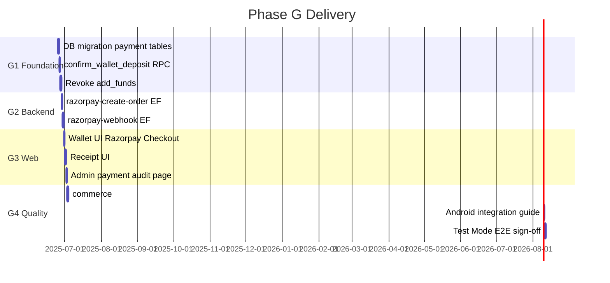

# Razorpay Implementation Plan — Phase G

**Project:** AgroElevate  
**Phase:** G — Razorpay Integration (Test Mode)  
**Companion:** `RAZORPAY_ARCHITECTURE.md`  
**Status:** Planning only — aligned with architecture update (pre RG-001)  
**Prerequisite:** Commerce verification **21/21 passed**  
**Estimated duration:** 5–8 working days (1–2 developers)

---

## 1. Objectives

| # | Requirement | Deliverable |
|---|-------------|-------------|
| R1 | Replace mock `add_funds` | Revoked RPC + Razorpay top-up flow |
| R2 | Create Razorpay order from backend | `razorpay-create-order` Edge Function (hardened) |
| R3 | Verify payment through webhook | `razorpay-webhook` Edge Function |
| R4 | Credit wallet only after verification | `confirm_wallet_deposit` RPC |
| R5 | Never allow client-side wallet credits | RLS + REVOKE + no ledger INSERT grants |
| R6 | Maintain `wallet_history` structure | Extend with `reference_type` + `reference_id`; legacy columns preserved |
| R7 | Payment receipts + transaction refs | `payment_receipts` + `AGR-YYYY-000001` + ledger references |
| R8 | Razorpay Test Mode first | `rzp_test_*` keys, test cards |
| R9 | Preserve Android compatibility | Shared Edge Functions + additive nullable columns only |
| R10 | India compliance | Store Razorpay IDs, IST timestamp, receipt number |
| R11 | Admin payment audit | `/admin/payments` — success, failed, webhook errors, duplicates |

---

## 2. Delivery phases



---

## 3. Work breakdown

### G1 — Database and settlement RPC (Day 1–2)

#### G1.1 Migration: `20250625100016_phase_g_razorpay_wallet.sql`

**Create tables:**

1. `payment_intents` — see Architecture §6.1 (includes `paid_at_ist`, `failure_reason`)
2. `payment_receipts` — see Architecture §6.2 (India compliance fields)
3. `razorpay_webhook_events` — see Architecture §6.3 (`status=duplicate`, `duplicate_of_event_id`)
4. `wallet_transfers` — see Architecture §6.4 (transfer UUID for ledger references)

**Extend `wallet_history` (additive, nullable):**

```sql
ALTER TABLE public.wallet_history
  ADD COLUMN IF NOT EXISTS "reference_type" TEXT
    CHECK ("reference_type" IN ('payment_intent', 'royalty_obligation', 'order', 'transfer')),
  ADD COLUMN IF NOT EXISTS "reference_id" UUID;
```

**Extend `_wallet_ledger_entry`:**

Add optional parameters `p_reference_type TEXT`, `p_reference_id UUID`; populate on INSERT. Existing callers unchanged (pass NULL).

**Receipt sequence:**

- `generate_receipt_number()` → `AGR-YYYY-000001` (6-digit zero-padded, per-year sequence)

**Backfill existing ledger references (optional, non-blocking):**

| Existing data | Backfill |
|---------------|----------|
| Rows with `orderId` set | `reference_type='order'`, `reference_id=orderId` |
| Rows with `royaltyObligationId` set | `reference_type='royalty_obligation'`, `reference_id=royaltyObligationId` |

**Update commerce RPCs to set references on new rows:**

| RPC | `reference_type` | `reference_id` |
|-----|------------------|----------------|
| `confirm_wallet_deposit` | `payment_intent` | `payment_intents.id` |
| `checkout_order` / `_commerce_settle_sale` | `order` | `orders.id` |
| Royalty ledger writes | `royalty_obligation` | `royalty_obligations.id` when present |
| `_wallet_transfer` | `transfer` | `wallet_transfers.id` (create row first) |

**Indexes:**

- `payment_intents (user_id, created_at DESC)`
- `payment_intents (razorpay_order_id)` UNIQUE
- `payment_intents (razorpay_payment_id)` UNIQUE WHERE NOT NULL
- `payment_intents (receipt_number)` UNIQUE
- `payment_receipts (user_id, paid_at_ist DESC)`
- `payment_receipts (razorpay_payment_id)` UNIQUE
- `razorpay_webhook_events (event_id)` UNIQUE
- `razorpay_webhook_events (status, processed_at DESC)`
- `wallet_history ("reference_type", "reference_id")`
- `wallet_transfers (sender_id, created_at DESC)`

**RLS policies:**

| Table | Policy |
|-------|--------|
| `payment_intents` | `SELECT` own rows OR `is_admin()` |
| `payment_receipts` | `SELECT` own rows OR `is_admin()` |
| `razorpay_webhook_events` | `SELECT` `is_admin()` only |
| `wallet_transfers` | `SELECT` sender or receiver OR `is_admin()` |

**Grants:**

- No `INSERT`/`UPDATE` on payment tables for `authenticated`
- Edge Functions use `service_role`

#### G1.2 RPC: `confirm_wallet_deposit`

| Property | Value |
|----------|-------|
| Language | `plpgsql` |
| Security | `SECURITY DEFINER` |
| Callable by | `service_role` only |
| Idempotency | Return existing receipt if `razorpay_payment_id` already settled |

**Pseudologic:**

```
LOCK payment_intents BY razorpay_order_id
IF intent.status = 'paid' → RETURN cached result
ASSERT intent.amount_paise = p_amount_paise
SET paid_at (UTC), paid_at_ist from Razorpay capture timestamp
_wallet_ledger_entry(..., reference_type='payment_intent', reference_id=intent.id)
INSERT payment_receipts (razorpay_order_id, razorpay_payment_id, paid_at_ist, receipt_number, ...)
UPDATE payment_intents SET status='paid', wallet_history_id, paid_at, paid_at_ist
RETURN jsonb { receipt_number, wallet_history_id, new_balance, paid_at_ist }
```

#### G1.3 RPC: `get_payment_audit_summary` (admin)

`SECURITY DEFINER`, `is_admin()` guard. Returns counts for admin dashboard KPIs (paid/failed/webhook errors/duplicates, IST day boundary).

#### G1.4 Deprecate `add_funds`

```sql
-- Replace function body OR revoke
REVOKE EXECUTE ON FUNCTION public.add_funds(NUMERIC) FROM authenticated;

CREATE OR REPLACE FUNCTION public.add_funds(p_amount NUMERIC)
RETURNS VOID AS $$
BEGIN
  RAISE EXCEPTION 'Direct wallet credits disabled. Use Razorpay wallet top-up.';
END;
$$ LANGUAGE plpgsql;
```

**Preserve** `_wallet_ledger_entry` — still used by `confirm_wallet_deposit`, `checkout_order`, transfers, royalty.

#### G1.5 Verification (G1)

| Check | Method |
|-------|--------|
| Migration applies cleanly | SQL Editor on staging |
| `confirm_wallet_deposit` idempotent | SQL test: call twice, one ledger row |
| `add_funds` blocked for authenticated | `commerce:verify` will fail until G4 harness updated |

---

### G2 — Edge Functions (Day 3–4)

#### G2.1 Harden `razorpay-create-order`

**File:** `supabase/functions/razorpay-create-order/index.ts`

| Task | Detail |
|------|--------|
| Auth | Verify Supabase JWT; extract `user_id` |
| Input validation | `amount_inr` number, min 1, max 100000, 2 decimal places |
| User provisioning | Call `ensure_profile_from_auth` equivalent via admin client if needed |
| DB insert | `payment_intents` with `status=created`, `receipt_number` |
| Razorpay API | `POST https://api.razorpay.com/v1/orders` |
| Request body | `{ amount, currency: 'INR', receipt, payment_capture: 1, notes: { intent_id, user_id } }` |
| Response | `{ key_id, order_id, amount_paise, currency, intent_id, receipt_number }` |
| Errors | 401 unauth, 400 validation, 502 Razorpay down |
| CORS | Restrict to app origin in production |

**Remove:** Hardcoded `{ port: 8000 }` serve option (use Supabase runtime default).

#### G2.2 Create `razorpay-webhook`

**File:** `supabase/functions/razorpay-webhook/index.ts`

| Task | Detail |
|------|--------|
| Method | `POST` only |
| Auth | **No** JWT — signature verification only |
| Verify | `X-Razorpay-Signature` HMAC-SHA256 |
| Dedup | Insert `razorpay_webhook_events`; if `event_id` exists → `status=duplicate`, `duplicate_of_event_id` |
| Handle `payment.captured` | Extract `order_id`, `payment_id`, `amount`, `method` |
| Settle | `supabaseAdmin.rpc('confirm_wallet_deposit', { ... })` |
| Handle `payment.failed` | Update intent `status=failed` |
| Response | Always `200` for processed/duplicate; `400` only on bad signature |

#### G2.3 Supabase secrets (Dashboard → Edge Functions)

| Secret | Value (Test Mode) |
|--------|-------------------|
| `RAZORPAY_KEY_ID` | `rzp_test_…` |
| `RAZORPAY_KEY_SECRET` | From Razorpay Dashboard |
| `RAZORPAY_WEBHOOK_SECRET` | From webhook setup |
| `SUPABASE_URL` | Auto |
| `SUPABASE_SERVICE_ROLE_KEY` | Auto in hosted |

#### G2.4 Razorpay Dashboard setup (Test Mode)

1. **API Keys** → generate Test keys  
2. **Webhooks** → URL: `https://<project-ref>.supabase.co/functions/v1/razorpay-webhook`  
3. **Events:** `payment.captured`, `payment.failed`  
4. Copy webhook secret to Supabase  
5. **Settings** → enable payment methods needed for demo (Cards, UPI)

#### G2.5 Local webhook testing

| Tool | Usage |
|------|-------|
| `supabase functions serve` | Local EF development |
| `ngrok` / Cloudflare tunnel | Expose webhook to Razorpay test dashboard |
| Razorpay webhook tester | Send sample `payment.captured` payload |

#### G2.6 Verification (G2)

| Check | Method |
|-------|--------|
| Create order returns valid `order_id` | curl with user JWT |
| Webhook test event credits wallet | Razorpay dashboard → check `wallet_history` |
| Duplicate webhook no double credit | Replay same event |
| Invalid signature rejected | Tampered body → 400 |

---

### G3 — Web frontend (Day 5–6)

#### G3.1 Dependencies

| Package | Purpose |
|---------|---------|
| None required | Razorpay.js loaded via script tag |

#### G3.2 `src/lib/wallet.ts` changes

| Function | Change |
|----------|--------|
| `addFunds()` | **Remove** or replace with `initiateWalletTopUp(amount_inr)` |
| `initiateWalletTopUp()` | Invoke `razorpay-create-order` EF |
| `pollWalletAfterPayment(intentId)` | Poll balance/history until deposit appears or timeout |
| `fetchPaymentReceipts()` | Query `payment_receipts` ordered by `issued_at` |

#### G3.3 `src/pages/Wallet.tsx` changes

| UI element | Change |
|------------|--------|
| "Add Funds" dialog | Rename to "Add Money via Razorpay" |
| Submit | Call `initiateWalletTopUp` → open Razorpay Checkout |
| Success handler | Show "Processing payment…" + poll (not instant success toast) |
| Receipt link | New section or modal listing `payment_receipts` |
| History row | Show receipt number from description or joined receipt |

| Receipt link | New section listing `payment_receipts`; show `AGR-YYYY-000001`, IST time, Razorpay refs |

#### G3.4 Admin payment audit page

**Route:** `/admin/payments` (protected by `RoleRoute` admin)

| Tab | Data source | Architecture ref |
|-----|-------------|----------------|
| Successful payments | `payment_receipts` ⋈ `payment_intents` | §13.3 Tab A |
| Failed payments | `payment_intents` where `failed`/`expired` | §13.3 Tab B |
| Webhook failures | `razorpay_webhook_events` where `failed` | §13.3 Tab C |
| Duplicate webhooks | `razorpay_webhook_events` where `duplicate` | §13.3 Tab D |

**Features:** IST date columns, CSV export, read-only (no manual credits), link to `wallet_history` via `reference_type`/`reference_id`.

**Files:** `src/pages/admin/AdminPayments.tsx`, `src/lib/paymentAudit.ts`

#### G3.5 Razorpay Checkout integration

```text
1. const { data } = await supabase.functions.invoke('razorpay-create-order', { body: { amount_inr } })
2. const rzp = new Razorpay({
     key: data.key_id,
     order_id: data.order_id,
     amount: data.amount_paise,
     currency: 'INR',
     name: 'AgroElevate',
     description: `Wallet top-up · ${data.receipt_number}`,
     handler: () => pollWalletAfterPayment(data.intent_id),
   })
3. rzp.open()
```

**Critical:** `handler` does **not** call any credit RPC.

#### G3.6 Environment

| Variable | Location |
|----------|----------|
| `VITE_RAZORPAY_KEY_ID` | `.env` (test key_id — mirrors server for display only) |

#### G3.7 `commerceMeta.ts`

Optional: add `razorpay_deposit` label or keep `deposit` type (recommended: keep `deposit`).

#### G3.8 Verification (G3)

| Check | Method |
|-------|--------|
| Manual Test Mode payment | ₹100 test card → balance increases |
| Receipt visible | UI shows `AGR-…` receipt |
| `wallet_history` row | `type=deposit`, description contains refs |
| Failed payment | No balance change |

---

### G4 — Testing, Android, and sign-off (Day 7–8)

#### G4.1 Update `commerce:verify` harness

**Problem:** Script calls `add_funds` directly (lines 184, 246).

**Solution:** Add `scripts/commerce-payment-harness.mjs` or extend verify:

| Mode | Behavior |
|------|----------|
| `COMMERCE_PAYMENT_MODE=simulate` (CI default) | Service role calls `confirm_wallet_deposit` with test fixtures |
| `COMMERCE_PAYMENT_MODE=live` (optional) | Full Razorpay test card flow (manual/semi-auto) |

**Simulate path:**

1. Create `payment_intents` row via service role insert or test RPC  
2. Call `confirm_wallet_deposit` with fake `pay_test_…` IDs  
3. Assert `wallet_history` deposit + balance  

**Keep** checkout/royalty/transfer tests unchanged.

#### G4.2 New npm scripts

| Script | Purpose |
|--------|---------|
| `commerce:verify` | Updated to use payment simulate mode |
| `commerce:payment-smoke` | Optional live Razorpay test (manual) |

#### G4.3 Android integration guide (documentation deliverable)

**File:** `ANDROID_RAZORPAY_INTEGRATION.md` (created during implementation)

| Topic | Content |
|-------|---------|
| SDK | Razorpay Android Standard SDK |
| Order creation | `supabase.functions.invoke("razorpay-create-order")` |
| Checkout | Pass `order_id` from server response only |
| Post-pay | Poll `get_wallet_balance` / `wallet_history` |
| Breaking change | Remove `add_funds` RPC calls from legacy Android code |
| Receipt screen | Query `payment_receipts` |

#### G4.4 Android release coordination

| Step | Owner |
|------|-------|
| Deploy G1 + G2 to Supabase | Backend |
| Verify web Test Mode E2E | Web |
| Ship Android build with Razorpay SDK | Mobile |
| Revoke `add_funds` only after both clients ready OR use feature flag | Backend |

**Feature flag option:** Keep `add_funds` for `service_role` only; Android old versions break on wallet add — coordinate version gate.

#### G4.5 Test Mode E2E checklist

| # | Test | Pass criteria |
|---|------|---------------|
| T1 | Create order unauthenticated | 401 |
| T2 | Create order ₹100 | Returns `order_id`, intent in DB |
| T3 | Pay with test card `4111…` | Webhook fires |
| T4 | Balance after T3 | +₹100 in `users.walletBalance` |
| T5 | History after T3 | One `deposit` row with receipt refs |
| T6 | Receipt query | `AGR-YYYY-000001` format; `paid_at_ist` populated |
| T7 | Ledger reference | `wallet_history.reference_type=payment_intent` |
| T8 | Duplicate webhook | `razorpay_webhook_events.status=duplicate`; balance unchanged |
| T9 | `checkout_order` after top-up | Still works; `reference_type=order` on purchase rows |
| T10 | `transfer_funds` | Still works; `reference_type=transfer` |
| T11 | Royalty flow | `reference_type=royalty_obligation` when applicable |
| T12 | Admin audit page | All four tabs render |
| T13 | `commerce:verify` | 21/21 exit 0 |
| T14 | Android column reads | `orderId`, `type`, `amount` unchanged on history fetch |

#### G4.6 Razorpay test cards (reference)

| Card | Result |
|------|--------|
| `4111 1111 1111 1111` | Success |
| `4000 0000 0000 0002` | Declined |

(Verify current Razorpay test card docs at implementation time.)

---

## 4. File change manifest (implementation reference)

### New files

| Path | Purpose |
|------|---------|
| `supabase/migrations/production/20250625100016_phase_g_razorpay_wallet.sql` | Schema + RPCs |
| `supabase/functions/razorpay-webhook/index.ts` | Webhook handler |
| `src/lib/razorpayWallet.ts` | Client top-up + poll helpers |
| `src/components/wallet/PaymentReceiptList.tsx` | Receipt UI (`AGR-YYYY-000001`, IST) |
| `src/pages/admin/AdminPayments.tsx` | Admin audit page (4 tabs) |
| `src/lib/paymentAudit.ts` | Admin queries + CSV export |
| `scripts/commerce-payment-simulate.mjs` | CI wallet credit without Razorpay |
| `ANDROID_RAZORPAY_INTEGRATION.md` | Android guide |
| `PHASE_G_REPORT.md` | Implementation completion report |

### Modified files

| Path | Change |
|------|--------|
| `supabase/functions/razorpay-create-order/index.ts` | Auth, DB, validation |
| `src/lib/wallet.ts` | Remove mock `addFunds` |
| `src/pages/Wallet.tsx` | Razorpay Checkout UI |
| `src/pages/admin/AdminPayments.tsx` | Admin payment audit |
| `src/App.tsx` | Route `/admin/payments` |
| `scripts/commerce-verify.mjs` | Payment simulate instead of `add_funds` |
| `.env.example` | `VITE_RAZORPAY_KEY_ID`, webhook notes |
| `supabase/migrations/production/README.md` | Add migration 016 |
| `package.json` | Optional `commerce:payment-smoke` |

### Deprecated / restricted

| Path | Action |
|------|--------|
| `add_funds` RPC | Revoked from `authenticated` |
| Mock deposit description | Replaced by Razorpay receipt format |

---

## 5. Rollout plan

### Stage 0 — Prerequisites ✓

- [x] Commerce E2E 21/21
- [ ] Razorpay Test account created
- [ ] Supabase Edge Functions enabled on project

### Stage 1 — Backend only (soft launch)

- Deploy migration 016  
- Deploy Edge Functions  
- Configure webhook (ngrok for staging)  
- **Do not** revoke `add_funds` yet  
- Internal team tests webhook settlement

### Stage 2 — Web client

- Ship Wallet UI with Razorpay  
- Test Mode payments end-to-end  
- Revoke `add_funds` from `authenticated`  
- Update `commerce:verify`

### Stage 3 — Android

- Publish integration guide  
- Ship Android wallet update  
- Confirm shared DB top-up from Android Test Mode

### Stage 4 — Live Mode (future phase)

- Separate checklist: live keys, live webhook, PCI review, amount limits, refund policy  
- Not part of Phase G scope

---

## 6. Risk register

| Risk | Impact | Mitigation |
|------|--------|------------|
| Android still calls `add_funds` after revoke | Users cannot top up on old app | Coordinate release; temporary dual support via feature flag |
| Webhook delivery delay | User sees stale balance | Poll UI; show "processing" state |
| Razorpay downtime | Cannot top up | Graceful error; marketplace still works if balance exists |
| Double credit bug | Financial loss | Idempotency keys; UNIQUE constraints; tests T7 |
| Secret in frontend bundle | Account compromise | Only `key_id` in Vite env |
| `commerce:verify` regression | CI red | Payment simulate harness before revoke |
| Amount float rounding | Settlement mismatch | Store paise as integer; validate in RPC |

---

## 7. Acceptance criteria (Phase G complete)

| Criterion | Verification |
|-----------|--------------|
| Mock `add_funds` replaced | No authenticated path to credit wallet |
| Razorpay order from backend | Network trace shows EF → Razorpay API |
| Webhook verification | Invalid signature rejected; duplicates logged |
| Wallet credited post-webhook only | `paid_at_ist` after webhook timestamp |
| `wallet_history` references | `reference_type` + `reference_id` on all new ledger rows |
| Receipt format | `AGR-YYYY-000001` |
| India compliance | `razorpay_order_id`, `razorpay_payment_id`, `paid_at_ist`, `receipt_number` stored |
| Admin audit page | 4 tabs: success, failed, webhook failures, duplicates |
| Android compatible | Existing history columns unchanged; nullable new columns |
| Regression | `npm run commerce:verify` exit 0 |

---

## 8. Ticket backlog (implementation order)

| ID | Title | Phase | Est. |
|----|-------|-------|------|
| RG-001 | Migration 016: payment tables + `wallet_history` references + `wallet_transfers` | G1 | 6h |
| RG-002 | `confirm_wallet_deposit` RPC + IST fields | G1 | 3h |
| RG-003 | Extend `_wallet_ledger_entry` + commerce RPC reference writes | G1 | 3h |
| RG-004 | Revoke / guard `add_funds` | G1 | 1h |
| RG-005 | Harden `razorpay-create-order` EF | G2 | 4h |
| RG-006 | `razorpay-webhook` EF (incl. duplicate logging) | G2 | 4h |
| RG-007 | Razorpay Dashboard + secrets setup | G2 | 2h |
| RG-008 | `razorpayWallet.ts` client lib | G3 | 3h |
| RG-009 | Wallet.tsx Razorpay UI | G3 | 4h |
| RG-010 | Payment receipt UI | G3 | 2h |
| RG-011 | Admin payment audit page | G3 | 4h |
| RG-012 | `commerce:verify` payment harness | G4 | 3h |
| RG-013 | Android integration guide | G4 | 2h |
| RG-014 | Test Mode E2E sign-off + PHASE_G_REPORT | G4 | 4h |

**Total:** ~45 hours

---

## 9. Dependencies

| Dependency | Status |
|------------|--------|
| Supabase Edge Functions | Required |
| Razorpay Test account | Required |
| Commerce migrations 001–015 v2 | Applied (21/21) |
| `_wallet_ledger_entry` | Exists |
| `get_wallet_balance` read-only | Exists |
| Android app repo access | For coordinated release |

---

## 10. Document outputs (this phase)

| Document | Status |
|----------|--------|
| `RAZORPAY_ARCHITECTURE.md` | ✅ Complete |
| `RAZORPAY_IMPLEMENTATION_PLAN.md` | ✅ Complete (this file) |

**Next phase:** Implementation (RG-001 onward) — begin with migration 016 after approval.
