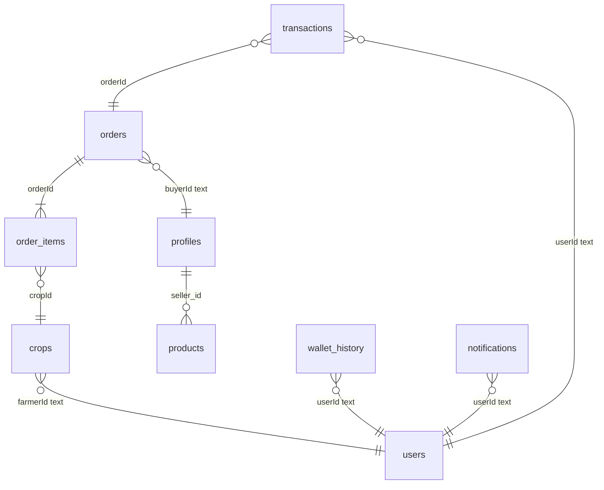

# Schema Compatibility Report

**Project:** AgroElevate (Student Edition — Phase A)  
**Date:** 2025-06-24  
**Authority:** Production Supabase schema export (user-provided CSV)  
**Status:** Analysis complete — **awaiting approval before any apply or frontend work**

---

## 1. Actual Production Schema Summary

### 1.1 Tables overview (11 tables)

| Table | Naming style | Primary purpose |
|-------|--------------|-----------------|
| `crops` | **camelCase** | Farmer crop listings (legacy/native marketplace catalog) |
| `products` | **snake_case** | Alternate product listings (used by current React app) |
| `orders` | **camelCase** | Marketplace order headers |
| `order_items` | **camelCase** | Line items per order (normalized) |
| `profiles` | **snake_case** | Supabase Auth-linked user profiles (current app auth) |
| `users` | **camelCase** | Legacy/parallel user store with **wallet balance** |
| `wallet_history` | **camelCase** | Wallet ledger entries |
| `transactions` | **camelCase** | Financial transaction log (order-linked) |
| `notifications` | **camelCase** | User notifications |

### 1.2 Entity relationships (inferred)



**Note:** `buyerId`, `userId`, `farmerId` are **TEXT**, not UUID — likely storing `auth.users.id` or `users.uid` as strings.

### 1.3 Column reference (production)

#### `orders`
| Column | Type |
|--------|------|
| id | uuid |
| buyerId | text |
| buyerName | text |
| buyerRole | text |
| totalAmount | numeric |
| shippingAddress | text |
| status | text |
| createdAt | timestamptz |
| updatedAt | timestamptz |

**No** `items`, **no** `buyer_id`, **no** `total_amount`, **no** `metadata`, **no** `wallet_tx` status semantics in schema.

#### `order_items`
| Column | Type |
|--------|------|
| id | uuid |
| orderId | uuid |
| cropId | uuid |
| farmerId | text |
| cropName | text |
| quantity | numeric |
| unit | text |
| pricePerUnit | numeric |
| totalPrice | numeric |
| originalFarmerId | text |

**No** `product_id`, **no** `order_id`, **no** snake_case variants.

#### `products` (app target today)
| Column | Type |
|--------|------|
| id | uuid |
| seller_id | uuid |
| name, crop_type, price_per_unit, unit, description | text/numeric |
| quantity | bigint |
| image_url | text |
| created_at | timestamptz |

#### `crops` (parallel catalog)
| Column | Type |
|--------|------|
| id | uuid |
| farmerId, farmerName | text |
| name, quantity, unit, pricePerUnit | … |
| originalFarmerId, originalPrice | text/numeric |
| status, soldQuantity, rating, category, location | … |
| harvestDate, description, imageBase64 | text |
| createdAt | timestamptz |

#### `wallet_history` + `users` (wallet system)
| `wallet_history` | `users` |
|------------------|---------|
| userId, type, amount, orderId, description, createdAt | uid (PK text), walletBalance, role, name, … |

Wallet is **not** stored as `orders` rows with `status = 'wallet_tx'`.

#### `transactions`
Parallel financial log: `userId`, `type`, `amount`, `orderId`, `description`, `createdAt`.

#### `profiles` (Supabase auth)
`id` uuid, `email`, `name`, `role`, `address`, `phone`, `bank_account`, `created_at` — matches current `Register.tsx` / `useAuth.tsx`.

---

## 2. Expected Schema vs Production Schema

| Area | Phase A migrations / app assumed | Production actual | Match |
|------|----------------------------------|-------------------|-------|
| Order header user FK | `buyer_id` UUID | `buyerId` TEXT | **NO** |
| Order line items | `orders.items` JSONB | `order_items` table | **NO** |
| Order item FK columns | `product_id`, snake_case | `cropId`, `orderId`, camelCase | **NO** |
| Order amounts | `total_amount` | `totalAmount` | **NO** |
| Timestamps | `created_at` | `createdAt` | **NO** (on orders) |
| Wallet ledger | `orders` + `status='wallet_tx'` | `wallet_history` + `users.walletBalance` | **NO** |
| Wallet metadata | `orders.metadata` JSONB | `wallet_history.type`, `description` | **NO** |
| Product catalog | `products` only | `products` **and** `crops` | **Partial** |
| User identity | `profiles` only | `profiles` **and** `users` | **Partial** |
| Auth user ID type | UUID in RPCs | TEXT in orders/wallet (`buyerId`, `userId`) | **NO** |
| Order status | `completed`, `wallet_tx` | `pending` (+ others unknown) | **Partial** |
| Fresh install | `CREATE TABLE IF NOT EXISTS` | Tables already exist | **N/A** |

---

## 3. Column Name Mismatches

### `orders`
| Expected (migrations/app) | Production | Impact |
|---------------------------|------------|--------|
| `buyer_id` | `buyerId` | All queries/RPCs fail |
| `total_amount` | `totalAmount` | Checkout/insert fails |
| `created_at` | `createdAt` | Sort/filter fails |
| `items` | *(does not exist)* | Patch migration error |
| `metadata` | *(does not exist)* | Upgrade 10/12 invalid |

### `order_items`
| Expected | Production | Impact |
|----------|------------|--------|
| `order_id` | `orderId` | Join/insert fails |
| `product_id` | `cropId` | Insert fails |
| `price_per_unit` / `unit_price` | `pricePerUnit` | Insert fails |
| `seller_id` | `farmerId` | Insert fails |
| `original_farmer_id` | `originalFarmerId` | Royalty chain fails |

### Wallet
| Expected | Production | Impact |
|----------|------------|--------|
| `orders.status = 'wallet_tx'` | `wallet_history.type` | Balance logic wrong |
| `orders.total_amount` sign | `wallet_history.amount` | History display wrong |
| `get_wallet_balance` SUM orders | `users.walletBalance` | Wrong balance source |

### Unchanged (app-aligned)
| Table | Columns |
|-------|---------|
| `profiles` | `id`, `email`, `name`, `role`, `bank_account`, etc. |
| `products` | `seller_id`, `price_per_unit`, `crop_type`, etc. |

---

## 4. Table Design Mismatches

| Design aspect | Migration assumption | Production design |
|---------------|---------------------|-------------------|
| **Order modeling** | Single table dual-purpose (commerce + wallet) | Split: `orders` + `order_items` + `wallet_history` |
| **Catalog** | One `products` table | `crops` (native) + `products` (app layer) |
| **Users** | `profiles` ↔ `auth.users` | `profiles` + separate `users` with `walletBalance` |
| **Financial audit** | Wallet rows in `orders` | `wallet_history` and `transactions` |
| **ID conventions** | UUID FKs everywhere | TEXT user references on orders/wallet |
| **Royalty tracking** | JSON in `products.description` | `crops.originalFarmerId` + `order_items.originalFarmerId` |
| **Notifications** | Not modeled | `notifications` table exists |

### Implication for React app
- **Listing/buying** uses `products` — OK for `products` table.
- **Checkout** must write `orders` + `order_items` with **camelCase** and map `products.id` → `order_items.cropId`.
- **Wallet UI** must read `wallet_history` (and/or `users.walletBalance`), not `orders`.

---

## 5. RPC Incompatibilities

| RPC (generated) | Fatal assumption | Production fix |
|-----------------|------------------|----------------|
| `get_wallet_balance()` | `SUM(orders.total_amount) WHERE status='wallet_tx'` | Read `users.walletBalance` or `SUM(wallet_history.amount)` |
| `add_funds()` | `INSERT orders (..., status='wallet_tx', metadata=...)` | `INSERT wallet_history` + `UPDATE users.walletBalance` |
| `_wallet_transfer()` | Double `INSERT` into `orders` | Two `wallet_history` rows + update both `users` balances |
| `checkout_order()` | `INSERT orders (buyer_id, total_amount, items, ...)` | `INSERT orders ("buyerId", "totalAmount", ...)` + `INSERT order_items (...)` |
| `checkout_order()` | `FOR UPDATE products` | OK — `products` exists |
| `checkout_order()` | `auth.uid()` UUID vs `buyerId` text | Cast: `auth.uid()::text` |
| `_insert_order_item()` | snake_case column detection | Use production camelCase columns only |
| All RPCs | `profiles.id` UUID parameters | Compare with `text` via `::text` where needed |

**Existing production data:** `orders.status = 'pending'` — checkout should set `completed` (or production convention), never overwrite pending rows.

---

## 6. RLS Policy Incompatibilities

| Generated policy | Problem | Production-aware rule |
|----------------|---------|----------------------|
| `orders.buyer_id = auth.uid()` | Column does not exist | `"buyerId" = auth.uid()::text` |
| `orders` wallet reads | No wallet rows in orders | Policies on `wallet_history` |
| `order_items` via `order_id` | Wrong column name | Via `order_items."orderId"` → `orders.id` |
| `products.seller_id` | OK | Keep |
| `profiles.id` | OK | Keep |
| No RLS on `wallet_history` | Wallet exposed or blocked | `"userId" = auth.uid()::text` |
| No RLS on `users` | Balance tampering risk | Read own row: `uid = auth.uid()::text` |
| `is_admin()` on `profiles.role` | OK if `admin` role added | Keep |

**PostgreSQL note:** camelCase columns require double quotes in SQL (`"buyerId"`).

---

## 7. Migration Failures — Root Cause Analysis

| Failure | Root cause |
|---------|------------|
| `orders_status_check` violated | Constraint allowed only `completed`/`wallet_tx`; production has `pending` |
| `column "items" does not exist` | Patch assumed JSONB line items on `orders` |
| Upgrade 10 `metadata` column | Additive but wrong layer — wallet belongs in `wallet_history` |
| Upgrade 12 wallet RPCs | Insert into non-existent `buyer_id`, `metadata`, `wallet_tx` pattern |
| Upgrade 13 checkout | `order_items` snake_case + `orders.items` |
| Baseline 00001 | `CREATE TABLE` + `buyer_id` on existing divergent schema |
| Frontend `wallet.ts` | Queries `orders` with `buyer_id`, `wallet_tx` |
| Frontend `Marketplace.tsx` | Joins `order_items` with snake_case columns |

**Meta-cause:** Migrations were written from **application inference** and **greenfield Supabase tutorials**, not from **exported production DDL**.

---

## 8. Recommended Upgrade Strategy

### Principles
1. **Production schema is canonical** — adapt app + RPCs, not the reverse.
2. **Additive only** — no `DROP TABLE`, no `DELETE`, no column renames.
3. **Use existing wallet tables** — `wallet_history` + `users.walletBalance`.
4. **Use existing order model** — `orders` + `order_items` (camelCase).
5. **Keep `products` for app marketplace** — map `products.id` → `order_items."cropId"`.
6. **Preserve `crops`, `users`, `transactions`, `notifications`** — do not merge or drop.
7. **Bridge identity** — `auth.uid()::text` ↔ `profiles.id::text` ↔ `users.uid`.

### Phased approach

| Step | Action | Risk |
|------|--------|------|
| A1 | Production RLS (quoted camelCase) | Low |
| A2 | Wallet RPCs → `wallet_history` + `users` | Medium — verify `users` row exists per auth user |
| A3 | Checkout RPC → `orders` + `order_items` | Medium — verify `cropId` accepts `products.id` |
| A4 | Status constraint additive: allow `pending`, `completed` | Low — no data mutation |
| A5 | Frontend column renames (separate PR, after approval) | Required for E2E |
| A6 | Optional: sync `Register` to create `users` row | Medium |

### Do **not** run
- `20250624000001_baseline_schema.sql`
- `20250624000001_patch_orders_status.sql`
- `20250624000010` through `20250624000013` (superseded)
- Any migration referencing `buyer_id`, `orders.items`, `wallet_tx`, `metadata`

---

## 9. New Phase A Plan (Production-Aligned)

### Scope (unchanged goals)
- Secure RLS
- Server-side wallet (mock deposit)
- Server-side atomic checkout with 12.5% royalty
- Route guards (already in frontend)
- Razorpay deferred

### Data flow (corrected)

```
Wallet deposit:
  add_funds RPC → wallet_history INSERT + users.walletBalance UPDATE

Checkout:
  checkout_order RPC → validate products
                    → debit buyer wallet_history / users
                    → credit sellers + farmer royalty
                    → INSERT orders (status completed)
                    → INSERT order_items per line
                    → INSERT transactions (optional audit)
                    → decrement products.quantity
```

### Tables touched by Phase A RPCs
| Table | Operation |
|-------|-----------|
| `products` | READ, UPDATE quantity |
| `profiles` | READ (buyer name/role) |
| `orders` | INSERT (checkout) |
| `order_items` | INSERT (checkout) |
| `wallet_history` | INSERT (deposit, transfer, purchase) |
| `users` | UPDATE walletBalance |
| `transactions` | INSERT (checkout audit) — optional |

### Tables preserved untouched
`crops`, `notifications`, existing `pending` orders, all historical `wallet_history` / `transactions` rows.

### Frontend changes required (post-migration approval)
| File | Change |
|------|--------|
| `src/lib/wallet.ts` | Query `wallet_history` by `"userId"`; balance from RPC or `users` |
| `src/pages/Marketplace.tsx` | `order_items` select with `"orderId"`, `"cropId"`, `"pricePerUnit"`, `orders."buyerId"` |
| `src/pages/Register.tsx` | Optional: upsert `users` row on signup |

### Success criteria
- [ ] `add_funds` increases `users.walletBalance` and appends `wallet_history`
- [ ] `checkout_order` creates `orders` + `order_items` without touching `orders.items`
- [ ] Existing `pending` orders unchanged
- [ ] Royalty writes `wallet_history` + `order_items."originalFarmerId"`
- [ ] RLS blocks cross-user wallet/order reads

---

## 10. Corrected Migration Files (generated, not applied)

**Location:** `supabase/migrations/production/`

| File | Purpose |
|------|---------|
| `20250625100001_prod_rls.sql` | RLS for profiles, products, orders, order_items, wallet_history, users |
| `20250625100002_prod_wallet_rpc.sql` | `get_wallet_balance`, `add_funds`, `_wallet_transfer`, `transfer_funds` |
| `20250625100003_prod_checkout_rpc.sql` | `checkout_order` using orders + order_items |
| `20250625100004_prod_status_constraint.sql` | Additive status CHECK (pending + completed) |

**Apply order:** 001 → 002 → 003 → 004  
**Await approval before running or implementing frontend changes.**

---

## Appendix A — Identity mapping checklist

Before apply, verify in SQL Editor:

```sql
-- Do profiles.id and users.uid align?
SELECT p.id::text AS profile_id, u.uid AS user_uid
FROM profiles p
LEFT JOIN users u ON u.uid = p.id::text
LIMIT 10;

-- What order statuses exist?
SELECT status, COUNT(*) FROM orders GROUP BY status;

-- What wallet_history types exist?
SELECT type, COUNT(*) FROM wallet_history GROUP BY type;
```

---

## Appendix B — Superseded files (do not apply to production)

- `supabase/migrations/20250624000001_baseline_schema.sql`
- `supabase/migrations/20250624000001_patch_orders_status.sql`
- `supabase/migrations/20250624000003_schema_extensions.sql` through `00005`
- `supabase/migrations/20250624000010_upgrade_schema_alter.sql` through `00013`

---

*End of report — pending team approval.*
