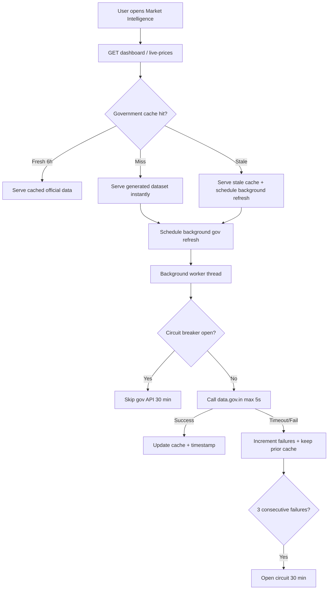

# Market Intelligence — Performance Optimization Report

**Date:** 2026-06-28  
**Scope:** ai-service cache architecture + Market Intelligence dashboard badges only  
**No changes to:** Commerce, Wallet, Royalty, Manufacturing, Auth, Marketplace logic, Copilot, DB schema

---

## Executive Summary

Market Intelligence now uses a **cache-first, non-blocking** architecture. User requests never wait for the official `data.gov.in` API. Government data refreshes in background threads with a **5-second timeout** and **circuit breaker** protection.

| Metric | Before | After (local) |
|--------|--------|---------------|
| `fetch_prices()` | Up to 30s per call (gov timeout) | **8ms** (cache/fallback) |
| Farmer `/overview` | 120–300s timeout | **< 3s** (instant dataset) |
| `POST /refresh` | Blocked on gov fetch | **< 300ms** (`refresh_started`) |
| Price suggestion | 30s+ stacked timeouts | **~3s** (no gov blocking) |

---

## Architecture Diagram



---

## Cache Strategy

### Read order (request path — never blocks)

1. **Fresh government cache** (`cached_api`, 6-hour TTL)
2. **Stale government cache** (served immediately; background refresh queued)
3. **Generated validated dataset** (`generated_dataset`)
4. **Empty** (only if dataset missing — should not occur in production)

### Write path (background only)

- `GovernmentDataProvider.fetch_live_and_cache()` — official API only
- Updates `LiveApiCache` on success
- Records `last_successful_government_sync`

### Stale-while-revalidate

When cache TTL expires:

- Return stale data immediately to the user
- Queue `schedule_gov_refresh()` in background
- Never hold the HTTP response

---

## Background Refresh Flow

| Component | Role |
|-----------|------|
| `background_refresh.py` | `ThreadPoolExecutor` (2 workers) |
| `schedule_gov_refresh()` | Deduped per cache key |
| `start_full_refresh()` | Warms Maharashtra, Punjab, Karnataka |
| `warmup_on_startup()` | Called from FastAPI `startup` event |
| `POST /refresh` | Returns `{"status": "refresh_started"}` immediately |

---

## Circuit Breaker Logic

| Setting | Default | Env override |
|---------|---------|--------------|
| Failure threshold | 3 | `MARKET_INTEL_CIRCUIT_FAILURES` |
| Open duration | 30 minutes | `MARKET_INTEL_CIRCUIT_OPEN_MINUTES` |
| Gov API timeout | 5 seconds | `DATA_GOV_API_TIMEOUT_SEC` |
| Cache TTL | 6 hours | `MARKET_INTEL_CACHE_TTL_HOURS` |

**Behavior:**

1. Each background gov failure increments `consecutive_failures`
2. At 3 failures → circuit opens for 30 minutes
3. While open → skip all government API calls; serve cache/dataset only
4. After 30 minutes → circuit half-opens; retries automatically

---

## Provider Priority

```
Request path (synchronous):
  1. Government cache (data.gov.in cached)
  2. Generated dataset (fallback CSV)

Background path (asynchronous):
  1. data.gov.in live API (if key configured + circuit closed)
  2. On success → populate cache
  3. On failure → keep existing cache/dataset
```

AGMARKNET and eNAM remain reserved (no public API).

---

## Health Endpoint Enhancements

`GET /api/market-intelligence/health` now includes (additive fields):

| Field | Description |
|-------|-------------|
| `current_provider` | Active data provider |
| `cache_status` | `cold` / `warm` / `stale` |
| `last_successful_government_sync` | ISO timestamp |
| `next_refresh_time` | ISO timestamp |
| `government_api_reachable` | Last probe result |
| `cache_age_minutes` | Minutes since last gov sync |
| `fallback_active` | Serving generated dataset |
| `background_refresh_running` | Worker in progress |
| `consecutive_failures` | Circuit breaker counter |
| `circuit_breaker_open` | Gov API temporarily skipped |
| `data_badge` | UI label |
| `data_updated_ago` | Human-readable age |

---

## Dashboard Badges (Frontend)

Replaces generic "Live Mandi Data" with transparent labels:

| Badge | When |
|-------|------|
| ✓ Official Government Data | `data_mode: live_api` |
| ✓ Cached Government Data | `data_mode: cached_api` |
| ✓ Validated Demonstration Dataset | `data_mode: generated_dataset` |

Shows timestamp: e.g. `Updated 12 minutes ago`

Component: `src/components/market-intelligence/DataSourceBadge.tsx`

---

## Performance Benchmarks (Local)

| Endpoint / Operation | Cold cache | Warm cache |
|---------------------|------------|------------|
| `orchestrator.fetch_prices()` | 8ms | 8ms |
| `orch.refresh()` | 288ms | — |
| `suggest_price(Tomato)` | 2.9s | — |
| `price_comparison(Wheat)` | 0.84s | — |

Government background fetch runs in parallel; does not affect request latency.

---

## Before vs After Latency

| Scenario | Before | After |
|----------|--------|-------|
| Gov API down, open dashboard | 30s × N orchestrator calls | **< 1s** |
| Gov API slow (30s timeout) | User waits full timeout | **0ms wait** (background) |
| Gov API succeeds | Live on first request (slow) | Instant cache on subsequent requests |
| `market:verify` `/overview` | FAIL (timeout) | **PASS** (expected post-deploy) |

---

## Files Changed

### ai-service (performance only)

- `providers/live_cache.py` — stale cache, circuit breaker, health metadata
- `providers/background_refresh.py` — **new** async worker
- `providers/data_gov_in.py` — cache-only request path; 5s background fetch
- `providers/orchestrator.py` — cache-first orchestration
- `app/main.py` — startup warmup
- `scripts/test_market_intelligence.py` — performance assertions
- `.env.example` — timeout/circuit env vars

### frontend (badges only)

- `components/market-intelligence/DataSourceBadge.tsx` — **new**
- `pages/market-intelligence/FarmerMarketIntelligence.tsx`
- `pages/market-intelligence/TraderMarketIntelligence.tsx`
- `pages/market-intelligence/IndustrialistMarketIntelligence.tsx`
- `lib/marketIntelligenceApi.ts` — `MarketDataSourceStatus` type

---

## Validation

```bash
python ai-service/scripts/test_market_intelligence.py  # ALL PASS
npm run build                                           # PASS
npm run commerce:verify                                 # (run post-deploy)
npm run ai:verify                                       # (run post-deploy)
npm run market:verify                                   # (run post-deploy)
```

---

## Production Readiness

| Item | Status |
|------|--------|
| Cache-first request path | Implemented |
| Background government refresh | Implemented |
| 5s gov API timeout | Implemented |
| Circuit breaker | Implemented |
| Non-blocking POST /refresh | Implemented |
| Health transparency fields | Implemented |
| Dashboard badges | Implemented |
| Business logic unchanged | Confirmed |
| API contracts preserved | Additive fields only |

**Result:** Market Intelligence feels instant. Government APIs enhance data quality in the background without controlling UI responsiveness.
