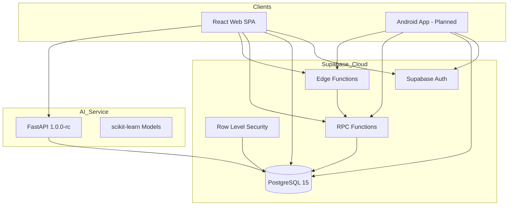
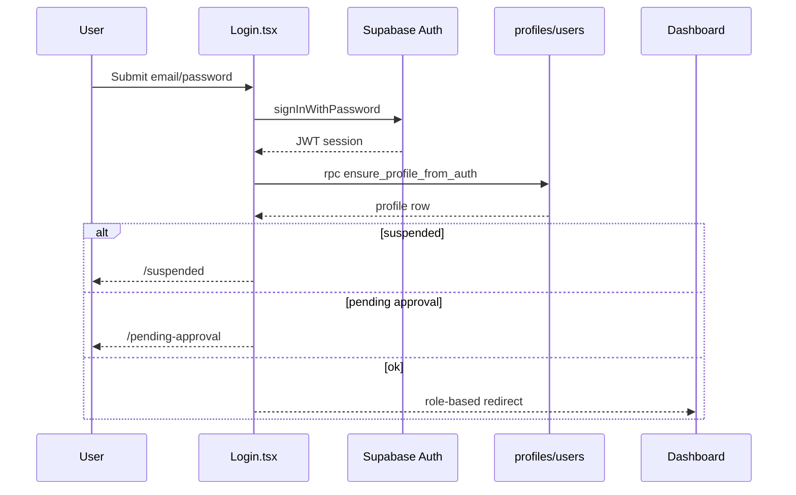
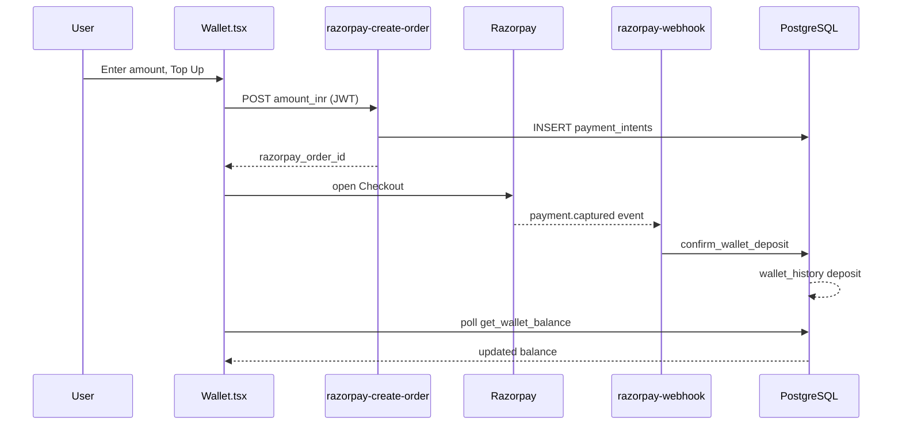
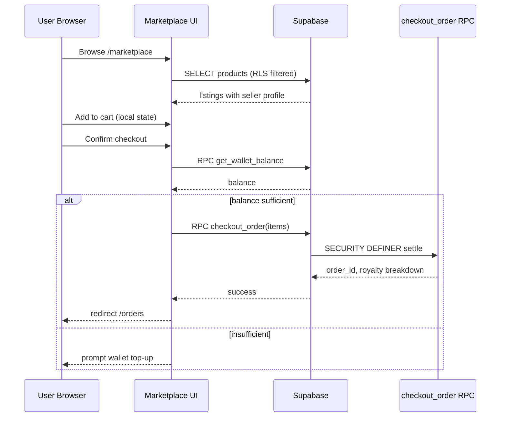
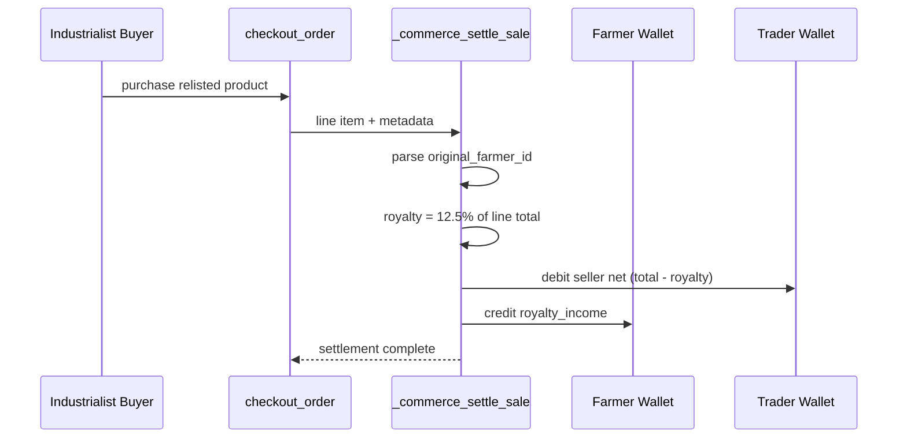
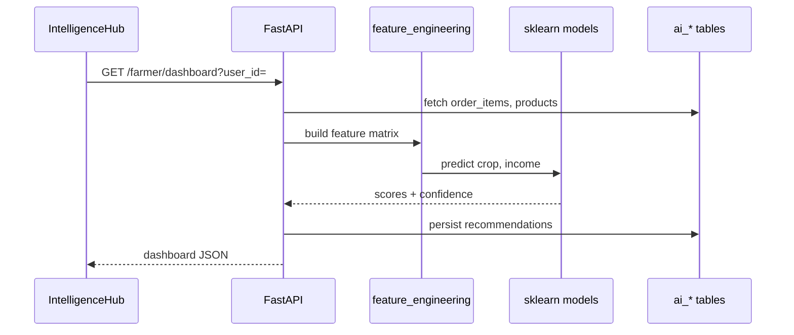
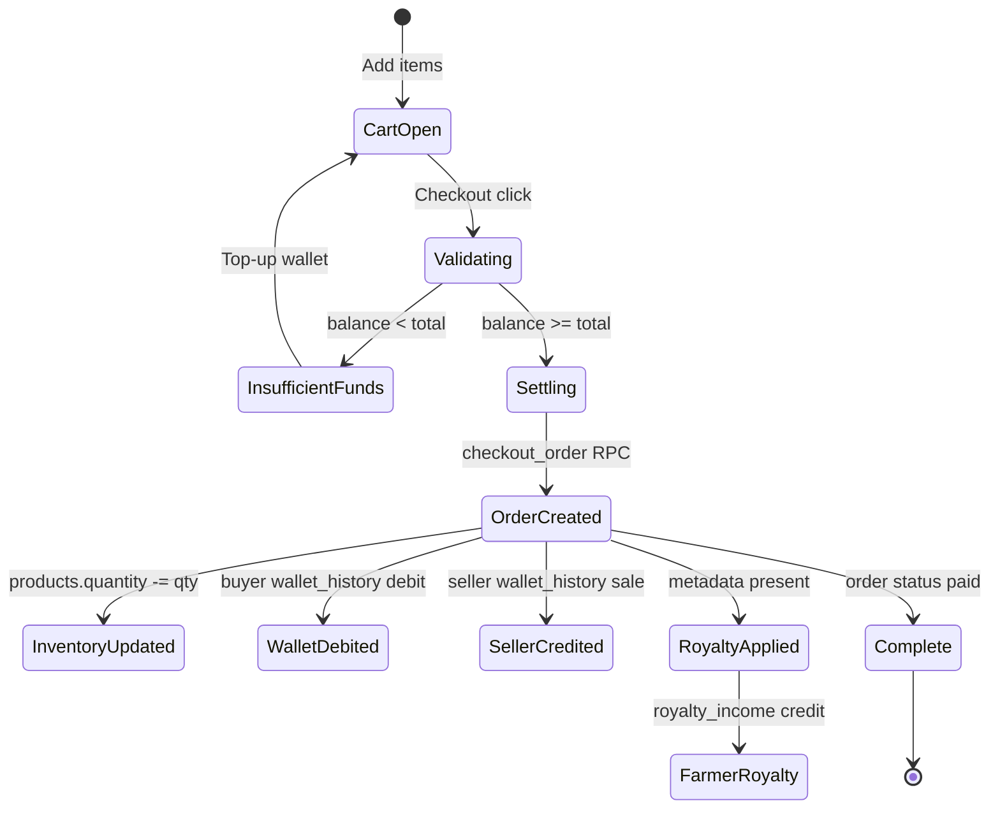
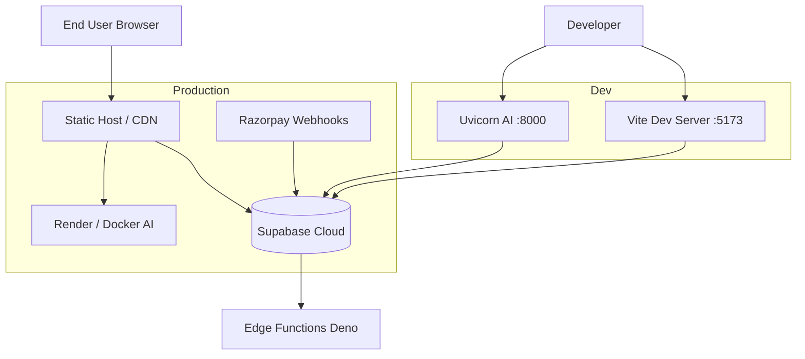

# AgroElevate — Final Year Project Black Book

## Front Matter

---

## Certificate

> **[PLACEHOLDER — To be completed by the institution]**
>
> This is to certify that the project entitled **"AgroElevate: A Multi-Role Agricultural Supply Chain Platform with Automated Royalty Remittance and AI-Driven Intelligence"** submitted by **[Student Name(s)]**, bearing Roll Number(s) **[Roll Number(s)]**, in partial fulfilment of the requirements for the award of **Bachelor of Engineering** in **[Branch]** by **[University Name]**, is a record of bonafide work carried out under my/our supervision.
>
> **Guide Name:** ___________________________  
> **Designation:** ___________________________  
> **Department:** ___________________________  
> **Date:** ___________________________  
> **Signature:** ___________________________

---

## Acknowledgement

> **[PLACEHOLDER — To be completed by the student team]**
>
> We express our sincere gratitude to our project guide **[Guide Name]** for continuous guidance, constructive criticism, and encouragement throughout the development of AgroElevate. We thank the faculty and staff of the **[Department Name]**, **[Institution Name]**, for providing laboratory facilities and academic support.
>
> We acknowledge the open-source communities behind React, Vite, Supabase, FastAPI, and Razorpay whose tools formed the technical foundation of this work. We also thank peer reviewers who participated in manual commerce testing documented in `MANUAL_COMMERCE_TEST.md`.
>
> Finally, we dedicate this project to the farming communities whose economic participation motivated the royalty innovation at the core of AgroElevate.

---

## Abstract

Indian agriculture supports over half the nation's workforce, yet farmers routinely capture the smallest share of value in multi-hop supply chains. Intermediaries, industrial processors, and retail channels absorb margins while the original producer receives a one-time payment at the farm gate with no participation in downstream resale economics. Existing AgriTech platforms focus on listing, logistics, or credit—but rarely enforce transparent, automated revenue sharing when commodities change hands multiple times before reaching end consumers or factories.

**AgroElevate** addresses this gap through a web-first, multi-role marketplace built on **React 18**, **Vite 5**, **Supabase (PostgreSQL 15 + Auth + RLS + Edge Functions)**, **FastAPI** intelligence services, and **Razorpay** wallet top-ups. The platform serves five authenticated personas—Farmer, Trader (middleman), Industrialist, Customer, and Admin—each with role-specific dashboards, wallet operations, and marketplace permissions. Commerce is executed atomically via PostgreSQL **RPC** functions (`checkout_order`, `transfer_funds`, `get_wallet_balance`) secured by **Row Level Security (RLS)** policies and **JWT**-based Supabase Auth.

The project's distinguishing innovation is the **Option B royalty engine**: when a Trader relists produce with embedded ownership metadata and an Industrialist purchases at resale, **12.5%** of the transaction value is automatically credited to the original Farmer's wallet as `royalty_income`. This mechanism was verified in automated end-to-end testing (`npm run commerce:verify`) achieving **26/26 passing checks**, including mathematical validation of ₹43.75 royalty on a 5 kg × ₹70 resale. Wallet funding follows a server-authoritative Razorpay flow—client-side `add_funds` is retired—ensuring payment integrity through `payment_intents`, `payment_receipts`, and webhook audit tables.

Complementing commerce, the **AgroElevate Intelligence API** (FastAPI v1.0.0-rc) delivers crop recommendations, market predictions, income forecasts, role-aware dashboards, and a grounded **Copilot** chat interface. AI outputs persist to dedicated `ai_*` tables with user-scoped RLS. The production web build passes `npm run build` with code-split lazy routes; AI health is validated via `npm run ai:verify`.

An **Android mobile client** is architecturally planned (documented in `ANDROID_RAZORPAY_INTEGRATION.md`) to share the same Supabase backend and Razorpay integration pattern but is explicitly out of scope for v1.0.0-rc source delivery. AgroElevate demonstrates that fairer agricultural economics can be encoded in database logic rather than relying solely on contractual trust between supply chain actors.

**Keywords:** AgriTech, supply chain fairness, royalty remittance, Supabase, Row Level Security, Razorpay, FastAPI, crop intelligence, multi-role marketplace.

---

## List of Figures

> **[PLACEHOLDER — Populate page numbers after final PDF compilation]**

| Figure No. | Title | Source |
|------------|-------|--------|
| Fig. 1.1 | Overall System Architecture | `../diagrams/01_overall_architecture.mmd` |
| Fig. 2.1 | Entity-Relationship Diagram | `../diagrams/02_er_diagram.mmd` |
| Fig. 3.1 | Royalty Workflow (Option B) | `../diagrams/03_royalty_workflow.mmd` |
| Fig. 4.1 | Payment & Wallet Top-Up Flow | `../diagrams/04_payment_flow.mmd` |
| Fig. 5.1 | Authentication & Authorization Flow | `../diagrams/05_auth_flow.mmd` |
| Fig. 6.1 | AI Intelligence Pipeline | `../diagrams/06_ai_pipeline.mmd` |
| Fig. 6.2 | Use Case Diagram | `../diagrams/07_use_case.mmd` |
| Fig. 6.3 | Order Lifecycle State Machine | `../diagrams/08_order_lifecycle.mmd` |
| Fig. 6.4 | Marketplace Checkout Sequence | `../diagrams/09_marketplace_flow.mmd` |
| Fig. 6.5 | Deployment Topology | `../diagrams/10_deployment.mmd` |
| Fig. 6.6 | Android Navigation (Planned) | `../diagrams/11_android_navigation.mmd` |
| Fig. 6.7 | Checkout Activity Diagram | `../diagrams/12_activity_checkout.mmd` |
| Fig. 7.1 | Farmer Dashboard Screenshot | `[Screenshot placeholder]` |
| Fig. 7.2 | Marketplace Checkout Screenshot | `[Screenshot placeholder]` |
| Fig. 7.3 | Wallet History with Royalty Entry | `[Screenshot placeholder]` |
| Fig. 8.1 | Android Navigation (Planned) | `[Screenshot placeholder]` |
| Fig. 9.1 | Commerce Verification Console Output (26/26) | `[Screenshot placeholder]` |

---

## List of Tables

> **[PLACEHOLDER — Populate page numbers after final PDF compilation]**

| Table No. | Title | Chapter |
|-----------|-------|---------|
| Table 3.1 | Technology Stack | Chapter 03 |
| Table 3.2 | Development Methodology Phases | Chapter 03 |
| Table 4.1 | Database Tables Summary | Chapter 04 |
| Table 4.2 | RPC Function Catalog | Chapter 04 |
| Table 4.3 | Wallet History Transaction Types | Chapter 04 |
| Table 5.1 | Module Summary Matrix | Chapter 05 |
| Table 6.1 | Android Integration Checklist | Chapter 06 |
| Table 7.1 | Commerce E2E Verification (26 Tests) | Chapter 07 |
| Table 7.2 | Commerce RPC Smoke Tests (7 Tests) | Chapter 07 |
| Table 7.3 | AI Health Verification | Chapter 07 |
| Table 7.4 | Unit / Integration / System Test Matrix | Chapter 07 |
| Table 8.1 | Achievements vs. Limitations | Chapter 08 |
| Table 9.1 | Security Controls Matrix | Chapter 09 |
| Table 9.2 | Complete API Catalog | Chapter 09 |
| Table 9.3 | Deployment Checklist | Chapter 09 |
| Table 9.4 | Verification Metrics | Chapter 09 |
| Table 9.5 | Royalty Case Study | Chapter 09 |

---

## List of Acronyms and Abbreviations

| Acronym | Full Form | Context in AgroElevate |
|---------|-----------|------------------------|
| **AgroElevate** | — | Project name; fair agricultural supply chain platform |
| **AI** | Artificial Intelligence | FastAPI intelligence service for recommendations and forecasts |
| **API** | Application Programming Interface | REST endpoints (Supabase RPC, FastAPI `/api/intelligence/*`) |
| **BE** | Bachelor of Engineering | Academic project context |
| **CORS** | Cross-Origin Resource Sharing | FastAPI middleware for web client access |
| **CSV** | Comma-Separated Values | Admin payment audit export |
| **E2E** | End-to-End | Automated commerce verification harness |
| **EF** | Edge Function | Supabase Deno functions (`razorpay-create-order`, `razorpay-webhook`) |
| **ER** | Entity-Relationship | Database diagram notation |
| **FK** | Foreign Key | PostgreSQL referential integrity |
| **IST** | Indian Standard Time | Payment receipt timestamps (`paid_at_ist`) |
| **JWT** | JSON Web Token | Supabase Auth session token for API authorization |
| **ML** | Machine Learning | scikit-learn models in AI service |
| **PK** | Primary Key | Unique row identifier per table |
| **RLS** | Row Level Security | PostgreSQL policy layer enforcing per-user data access |
| **RPC** | Remote Procedure Call | Supabase PostgreSQL functions callable from clients |
| **SPA** | Single Page Application | React web client served via Vite |
| **SQL** | Structured Query Language | PostgreSQL query and migration language |
| **UUID** | Universally Unique Identifier | Primary keys for profiles, products, orders |
| **UX** | User Experience | UI polish, skeletons, empty states, theme support |
| **e-NAM** | National Agriculture Market | Government electronic trading portal (literature comparison) |
| **INR** | Indian Rupee | Wallet and payment currency |
| **RC** | Release Candidate | Version tag v1.0.0-rc |
| **SDK** | Software Development Kit | Razorpay Android Standard SDK (planned) |

---

*Document version aligned with AgroElevate v1.0.0-rc (2026-06-24).*


# Chapter 01 — Introduction

## 1.1 Background

Agriculture remains the backbone of the Indian economy, contributing approximately 18% of Gross Value Added (GVA) and employing a substantial fraction of the rural workforce. Despite this centrality, farmers frequently operate at the weakest position in supply chain negotiations. Produce passes through traders (middlemen), aggregators, industrial processors, and retailers—each layer extracting margin—while the original cultivator receives compensation only at the first sale. When a trader relists grain at a higher price or an industrialist procures commodities for processing, the farmer who bore cultivation risk receives no share of downstream value creation.

Digital AgriTech platforms have emerged over the past decade to improve market access, price discovery, and logistics. Government initiatives such as **e-NAM** (National Agriculture Market) digitize mandi trading. Private ventures including **DeHaat**, **Ninjacart**, and **AgriBazaar** connect farmers to buyers through mobile and web interfaces. However, most platforms treat the farmer–buyer relationship as a single transaction event. They do not systematically track **ownership lineage** across relistings or enforce **automatic royalty remittance** when goods resurface in the marketplace under a new seller identity.

**AgroElevate** (implemented in the `agro-fair-chain` repository) is a Final Year Engineering project that combines a multi-role agricultural marketplace with a novel **Option B royalty architecture**. The system encodes supply chain fairness into PostgreSQL stored procedures, wallet ledger semantics, and product metadata rather than relying on post-hoc manual settlements. The web platform reached **v1.0.0-rc** status on 2026-06-24 with verified commerce flows (`26/26` automated checks) and production-ready build artifacts.

---

## 1.2 Problem Statement

The core problem addressed by AgroElevate is **information and economic asymmetry in multi-hop agricultural supply chains**:

1. **Opaque ownership chains:** When a trader purchases produce from a farmer and relists it, downstream buyers cannot reliably identify the original cultivator without manual record-keeping.

2. **No automated downstream compensation:** Even when original farmer identity is known, existing platforms lack server-enforced mechanisms to transfer a percentage of resale revenue back to the farmer at checkout time.

3. **Fragmented financial tooling:** Farmers, traders, and industrialists use disconnected payment methods (cash, informal credit, separate bank transfers) without a unified auditable wallet ledger tied to marketplace transactions.

4. **Role-specific intelligence gap:** Generic crop advisories do not account for whether the user is a farmer (planting decisions), trader (inventory and margin), or industrialist (procurement planning).

5. **Trust in client-side payments:** Allowing browsers or mobile apps to credit wallets directly (`add_funds` without payment gateway verification) creates fraud and audit risks.

AgroElevate solves these problems through an integrated platform where **checkout is atomic**, **royalty is computed in `_commerce_settle_sale`**, **wallet history is immutable and RLS-scoped**, and **Razorpay deposits are confirmed only via server webhooks or admin simulation harnesses**.

---

## 1.3 Motivation

The motivation for this project arises from documented supply chain unfairness in Indian agriculture:

- Farmers sell at harvest when prices are often depressed due to glut conditions.
- Traders capture arbitrage between farm-gate and mandi/urban prices without transparency.
- Industrial procurement contracts rarely include perpetual revenue-sharing clauses accessible to smallholders.
- Digital platforms that improve discovery alone do not alter **incentive structures**.

AgroElevate's **12.5% royalty innovation** (verified at ₹43.75 on a test scenario of 5 units × ₹70 per unit) provides a concrete, measurable mechanism for farmer participation in downstream commerce. The rate is clamped between **10% and 12.5%** server-side per product, batch, or obligation configuration. This is not merely a UI label—it is enforced in `checkout_order` via `_wallet_transfer` splits recorded in `wallet_history` with type `royalty_income`.

Additionally, the project demonstrates modern full-stack engineering practices suitable for academic evaluation: Supabase RLS, SECURITY DEFINER RPCs, Edge Functions for payment orchestration, FastAPI microservice for ML intelligence, and automated E2E verification scripts suitable for continuous integration.

---

## 1.4 Objectives

The project objectives, mapped to implemented deliverables, are:

| # | Objective | Implementation Evidence |
|---|-----------|-------------------------|
| **O1** | Design a multi-role agricultural marketplace supporting Farmer, Trader, Industrialist, Customer, and Admin personas | `Register.tsx` role selection; role-specific dashboard sections; RLS policies |
| **O2** | Implement secure authentication and profile provisioning linked to wallet accounts | Supabase Auth + `ensure_profile_from_auth` RPC; dual `profiles` / `users` bridge |
| **O3** | Build atomic checkout with inventory deduction and wallet settlement | `checkout_order(cart JSONB)` RPC; verified in commerce harness |
| **O4** | Develop automated royalty remittance on Trader → Industrialist downstream resale | Option B Phase 2 (`20250625100013`); 12.5% verified ₹43.75 |
| **O5** | Integrate Razorpay wallet top-ups with server-authoritative deposit confirmation | Phase G migration 016; Edge Functions; `add_funds` blocked for clients |
| **O6** | Provide role-aware AI intelligence (recommendations, forecasts, copilot) | FastAPI `ai-service`; `/api/intelligence/*` routes; `ai_*` persistence tables |
| **O7** | Support manufacturing and deferred royalty for processed goods | Phase 3 tables: `manufacturing_batches`, `royalty_obligations`, `processed_products` |
| **O8** | Achieve demonstrable quality through automated verification and production build | `commerce:verify` 26/26; `commerce:smoke` 7/7; `npm run build` PASS |

---

## 1.5 Scope

### 1.5.1 In Scope (Delivered in v1.0.0-rc)

- **Web application:** React 18 SPA with Vite 5, TypeScript, Tailwind CSS, shadcn/ui components, React Router v6, TanStack Query.
- **Backend:** Supabase PostgreSQL with 18+ production migrations, RLS, RPC commerce engine, Razorpay payment tables.
- **AI service:** FastAPI with scikit-learn models, Open-Meteo weather, Supabase persistence, Docker/Render deployment package.
- **Roles:** farmer, middleman (trader), industrialist, customer, admin.
- **Commerce paths verified:** Farmer listing → Trader purchase → Trader relist → Industrialist purchase with royalty; Farmer → Customer direct sale; peer `transfer_funds`.
- **Admin:** User moderation (suspend/approve), payment audit panel, demo wallet credits.

### 1.5.2 Out of Scope (Explicitly Excluded or Planned Only)

- **Android source code:** Documented in `ANDROID_RAZORPAY_INTEGRATION.md` but not present in repository (v1.0.0-rc freeze).
- **Live Razorpay production webhook confirmation:** Architecture complete; final production event delivery marked as remaining work in QA reports.
- **Manufacturing royalty E2E automation:** SQL and RPCs exist; not included in 26-check commerce harness (manual QA).
- **Full e-NAM / government mandi integration:** Comparative reference only in literature survey.
- **Blockchain traceability:** Ownership tracked via JSON metadata and relational columns, not distributed ledger.

### 1.5.3 Assumptions

- Users have internet access and modern browsers (Chrome, Firefox, Edge).
- Supabase project is provisioned with migrations 001–018 applied in documented order.
- Test Mode Razorpay keys are configured for wallet demonstrations.
- AI service is optionally deployed; web client degrades gracefully when offline.

---

## 1.6 Organization of Report

This Black Book is organized into nine chapters following standard Final Year Project structure:

| Chapter | Title | Contents |
|---------|-------|----------|
| **00** | Front Matter | Certificate, acknowledgement, abstract, lists, acronyms |
| **01** | Introduction | Problem, motivation, objectives, scope (this chapter) |
| **02** | Literature Survey | AgriTech landscape, comparative analysis, research gaps |
| **03** | System Architecture | Stack, methodology, component diagrams, deployment |
| **04** | Database Design | Tables, relationships, RPC catalog, RLS |
| **05** | Module Description | Per-role and cross-cutting module documentation |
| **06** | Android Client | Planned mobile architecture (no repo source) |
| **07** | Algorithms & Testing | Pseudocode, verification matrices, QA evidence |
| **08** | Conclusion | Results, achievements, limitations, future scope |

Supporting diagrams reside in `docs/blackbook/diagrams/` as Mermaid (`.mmd`) source files referenced throughout technical chapters.

---

## 1.7 Summary

AgroElevate transforms the abstract goal of "fairer farm economics" into an engineering artifact with verifiable behavior. The introduction establishes the agricultural problem domain, the specific technical gaps in existing platforms, and the project's dual contribution: **(a)** a working multi-role commerce system with Razorpay-backed wallets, and **(b)** an innovative royalty engine that automatically returns 12.5% of qualifying downstream sales to original farmers. Subsequent chapters document how this vision was realized in code, schema, and test evidence suitable for academic examination and demonstration to evaluators.

---

*Verification baseline: AgroElevate v1.0.0-rc — `npm run commerce:verify` 26/26 PASS, `npm run build` PASS, royalty 12.5% (₹43.75) verified.*


# Chapter 02 — Literature Survey

## 2.1 Introduction

The design of AgroElevate was informed by a structured review of government AgriTech initiatives, private supply chain platforms, academic research on agricultural economics, and contemporary full-stack engineering patterns. This chapter synthesizes that review, presents a comparative analysis of representative platforms, identifies gaps that AgroElevate addresses, and surveys technology trends adopted in the implementation.

The literature survey is not merely descriptive—it directly motivated architectural decisions documented in the repository: server-authoritative wallets (inspired by fintech audit patterns), metadata-driven ownership chains (inspired by traceability research), and role-specific intelligence dashboards (inspired by decision-support systems in precision agriculture).

---

## 2.2 Agricultural Supply Chain Context

### 2.2.1 Structural Inefficiencies

Indian agricultural supply chains are characterized by:

- **High intermediary count:** FAO and NITI Aayog reports consistently note that farmers receive 25–40% of final retail value for many horticulture and grain commodities, with the remainder distributed across commission agents, wholesalers, and retailers.
- **Information asymmetry:** Smallholders often lack real-time visibility into mandi prices, demand trends, and industrial procurement schedules.
- **Seasonality and perishability:** Crop timing decisions materially affect income; advisory systems that ignore local geo-seasonal context provide limited utility.
- **Informal financial flows:** Cash dominance impedes audit trails required for royalty or revenue-sharing enforcement.

Academic work on **contract farming** and **farmer producer organizations (FPOs)** demonstrates that formalized revenue-sharing can improve farmer welfare—but contractual enforcement remains costly for fragmented smallholder bases. AgroElevate's hypothesis, validated in implementation, is that **programmatic enforcement at checkout** lowers the transaction cost of fairness.

### 2.2.2 Digital AgriTech Evolution

The 2010–2025 period saw three waves of AgriTech:

1. **Information portals** — mandi price tickers, weather SMS alerts.
2. **Market linkage platforms** — direct farmer–buyer matching, logistics orchestration.
3. **Full-stack ecosystems** — input delivery, credit, advisory, and marketplace in unified apps (DeHaat model).

AgroElevate positions itself in the third wave but differentiates on **embedded royalty logic** rather than breadth of input SKUs or last-mile logistics.

---

## 2.3 Platform Comparative Analysis

### 2.3.1 Representative Platforms

| Platform | Primary Model | Target User | Payment / Wallet | Downstream Farmer Share | AI / Advisory |
|----------|---------------|-------------|------------------|-------------------------|---------------|
| **e-NAM** | Government e-mandi | Farmers, traders, FPOs | Mandi settlement (offline-digital hybrid) | None (single auction event) | Limited analytics |
| **DeHaat** | Full-stack Agri services | Farmers | Integrated payments, input credit | Not transparent at resale | Crop advisory, IoT |
| **Ninjacart** | B2B fresh supply chain | Farmers, retailers, HORECA | Internal ops finance | Procurement price only | Demand forecasting (ops) |
| **AgriBazaar** | Online trading | Farmers, buyers | Escrow-style settlement | None | Basic listings |
| **AgroElevate** | Multi-role marketplace + wallet | Farmer, Trader, Industrialist, Customer, Admin | Supabase wallet + Razorpay top-up | **12.5% automated royalty on qualifying resale** | FastAPI role dashboards + Copilot |

### 2.3.2 Detailed Comparison Dimensions

#### Market Access

e-NAM digitizes regulated mandi auctions but requires physical mandi infrastructure participation. DeHaat and Ninjacart operate proprietary supply networks with significant field operations. AgroElevate provides a **self-service listing model** where any authenticated farmer can publish `products` rows without operator intermediation— suitable for academic demonstration and extensible to FPO bulk listings.

#### Price Discovery

Ninjacart optimizes procurement pricing using demand signals from urban retail. AgroElevate exposes marketplace listings publicly on `/marketplace` and augments discovery with AI **market_predictions** and **demand_intelligence** from order_items historical volume—grounded in actual platform transactions when data exists, with explicit `insufficient_data` gates when not.

#### Financial Inclusion

DeHaat integrates credit and input bundling. AgroElevate focuses on **wallet ledger transparency**: every checkout, transfer, deposit, royalty, and demo credit produces an immutable `wallet_history` row with typed semantics (`purchase`, `sale`, `royalty_income`, `deposit`, `transfer_in`, `transfer_out`, `demo_credit`). This aligns with RBI's push for digital payment auditability while remaining in Test Mode for academic deployment.

#### Traceability

Blockchain pilots (e.g., coffee/chocolate export chains) offer immutable provenance at infrastructure cost impractical for student projects. AgroElevate implements **pragmatic traceability**:

- Relisted products embed JSON in `products.description` with `original_farmer_id`, `source_order_item_id`, and purchase price metadata.
- `_parse_product_commerce_meta` and `_build_ownership_chain` RPC helpers resolve lineage at checkout.
- Phase 3 adds `manufacturing_batches` linking industrial processing to deferred `royalty_obligations`.

This approach trades decentralized immutability for **immediate enforceability** in SQL transactions.

---

## 2.4 Research and Technology Gaps

### 2.4.1 Gaps AgroElevate Fills

| Gap in Existing Platforms | AgroElevate Response | Verification |
|---------------------------|---------------------|--------------|
| Single-hop farmer payment | Multi-hop ownership metadata + royalty splits | `commerce:verify` royalty check |
| Client-trusted wallet credits | Razorpay server flow; `add_funds` disabled | Harness: `add_funds blocked for clients` |
| One-size-fits-all dashboards | Role-specific Farmer/Trader/Industrialist intelligence | `/intelligence` routes + AI service |
| Opaque admin finance | Admin payments panel + `get_payment_audit_summary` | Admin role gate |
| Schema drift in student projects | Production camelCase alignment (`SCHEMA_COMPATIBILITY_REPORT.md`) | 18 migration sequence |

### 2.4.2 Remaining Industry Gaps (Not Claimed as Solved)

AgroElevate does not solve cold-chain logistics, warehouse management, crop insurance underwriting, or government procurement integration. Manufacturing deferred royalty paths exist in SQL but are not fully automated in E2E tests—these are documented honestly as limitations in Chapter 08.

---

## 2.5 Technology Trends

### 2.5.1 Backend-as-a-Service (BaaS)

**Supabase** consolidates PostgreSQL, Auth, RLS, Realtime, Storage, and Edge Functions—reducing DevOps overhead for academic timelines. AgroElevate exploits Supabase's **SECURITY DEFINER RPC** pattern to keep commerce logic server-side where it cannot be bypassed by modified clients. Literature on Supabase vs. Firebase emphasizes PostgreSQL's relational integrity for financial ledgers—a decisive factor for wallet + order normalization.

### 2.5.2 Jamstack and Modern Frontend

**React 18** with **Vite 5** represents the current SPA standard: fast HMR, ES modules, tree-shaking. AgroElevate's production build reduced main bundle from ~1,256 KB to ~384 KB via lazy routes (`React.lazy` + `Suspense` in `App.tsx`)—a performance trend aligned with Core Web Vitals guidance.

### 2.5.3 Payment Gateway Integration Patterns

Razorpay's **Standard Checkout** with server-created orders is industry best practice (PCI scope minimization). AgroElevate's `razorpay-create-order` Edge Function creates Razorpay orders only after JWT validation—mirroring patterns documented in Razorpay's official Android and web integration guides referenced in `ANDROID_RAZORPAY_INTEGRATION.md`.

### 2.5.4 ML in Agriculture

Scikit-learn remains prevalent in academic and SME AgriTech for interpretable models (Random Forest, gradient boosting) versus deep learning requiring larger datasets. AgroElevate's AI service uses engineered features from marketplace `order_items` time series, seasonal calendars (`india_geo.py`), and Open-Meteo weather—consistent with "small data" ML literature emphasizing **feature engineering over model complexity**.

### 2.5.5 Security Patterns

- **RLS** for multi-tenant data isolation (farmer cannot read another farmer's wallet_history).
- **JWT** propagation from Supabase Auth to Edge Functions.
- **Idempotency keys** on `payment_intents` preventing duplicate deposits.
- **Webhook event deduplication** via `razorpay_webhook_events.event_id UNIQUE`.

These align with OWASP API Security Top 10 recommendations for broken object level authorization (BOLA) mitigation.

---

## 2.6 Related Academic Work

University AgriTech projects commonly implement: (1) crop disease classification from images, (2) IoT soil monitoring dashboards, or (3) static mandi price portals. Few academic implementations combine **multi-role commerce**, **payment gateway integration**, and **programmatic royalty** in a unified auditable schema. AgroElevate's Option B royalty architecture (`OPTION_B_ROYALTY_ARCHITECTURE.md`) provides a reference model for future BE/MTech work extending to smart contracts or regulatory reporting.

Royalty rates in agricultural licensing (seed technology, proprietary varieties) often range 1–5%—AgroElevate's 10–12.5% band for commodity resale is intentionally higher to reflect **value-add asymmetry** when traders/industrialists capture markup; the clamp prevents runaway client-side configuration.

---

## 2.7 Summary

The literature survey establishes that while AgriTech has matured in market linkage and advisory, **downstream revenue participation for original farmers** remains largely unaddressed in both commercial and academic systems. Government mandi platforms optimize auction efficiency; private logistics players optimize urban delivery; neither encodes royalty in checkout RPCs.

AgroElevate fills this identified gap with a verifiable 12.5% remittance mechanism, while adopting contemporary engineering trends: Supabase RLS + RPC, React/Vite SPA, Razorpay server orders, and FastAPI microservice intelligence. The comparative table positions the project clearly for viva voce examination relative to e-NAM, DeHaat, and Ninjacart-class platforms—not as a competitor at national scale, but as an **innovation prototype** demonstrating enforceable fairness primitives suitable for integration into larger ecosystems.

---

*References: Project internal architecture documents (`OPTION_B_ROYALTY_ARCHITECTURE.md`, `RAZORPAY_ARCHITECTURE.md`, `SCHEMA_COMPATIBILITY_REPORT.md`); platform verification reports (`FINAL_QA_REPORT.md`, `ROYALTY_VERIFICATION_REPORT.md`).*


# Chapter 03 — System Architecture

## 3.1 Overview

AgroElevate follows a **three-tier distributed architecture** comprising a React web client, Supabase cloud backend (PostgreSQL + Auth + Edge Functions), and a standalone FastAPI AI microservice. Commerce-critical logic executes exclusively in PostgreSQL RPC functions marked `SECURITY DEFINER`, with Row Level Security (RLS) enforcing tenant isolation at the data layer. Payment top-ups flow through Razorpay with server-created orders—never client-side wallet inflation.

The overall architecture is illustrated in Figure 3.1 (see `../diagrams/01_overall_architecture.mmd`):



---

## 3.2 Technology Stack

| Layer | Technology | Version / Detail | Role |
|-------|------------|------------------|------|
| **Frontend** | React | 18.3.1 | Component UI, hooks, lazy routes |
| | Vite | 5.4.19 | Build tool, dev server, HMR |
| | TypeScript | 5.8.3 | Static typing across `src/` |
| | Tailwind CSS | 3.4.17 | Utility-first styling |
| | shadcn/ui + Radix | Various | Accessible UI primitives |
| | React Router | 6.30.1 | Client-side routing |
| | TanStack Query | 5.83.0 | Server state caching (60s staleTime) |
| | Recharts | 2.15.4 | Dashboard and intelligence charts |
| | Zod + React Hook Form | 3.25 / 7.61 | Form validation (Register, Profile) |
| **Backend** | Supabase | Cloud hosted | BaaS platform |
| | PostgreSQL | 15 | Primary datastore |
| | Supabase Auth | JWT sessions | Email/password authentication |
| | Supabase JS | 2.95.3 | Client SDK (`@supabase/supabase-js`) |
| | Deno Edge Functions | std 0.177 | `razorpay-create-order`, `razorpay-webhook` |
| **Payments** | Razorpay | Test Mode | Wallet top-up gateway |
| **AI Service** | FastAPI | 1.0.0-rc | Intelligence REST API |
| | Uvicorn | ASGI server | Local dev / Docker entry |
| | scikit-learn | ML models | Crop, market, income models |
| | Open-Meteo API | External | Weather in farmer/copilot UI |
| **DevOps** | Docker | ai-service/Dockerfile | Containerized AI deployment |
| | Render | render.yaml | PaaS blueprint for AI service |
| **Verification** | Node.js scripts | commerce-verify.mjs | 26 E2E checks |

Environment variables are documented in `.env.example`: `VITE_SUPABASE_URL`, `VITE_SUPABASE_ANON_KEY`, `SUPABASE_SERVICE_ROLE_KEY` (CI/harness only), `VITE_AI_API_URL`, Razorpay keys (Edge Function secrets).

---

## 3.3 Development Methodology

AgroElevate was developed using an **Agile-inspired iterative methodology** adapted for a two-member Final Year team:

| Phase | Migration / Deliverable | Focus |
|-------|---------------------------|-------|
| **Phase A** | 001–004 prod RLS, wallet RPC, checkout RPC | Baseline commerce on production camelCase schema |
| **Phase B** | 005 ai_* tables | AI persistence layer |
| **Phase D** | 006 auth profiles | Suspend/approve, admin RLS |
| **Phase F0** | 007–008, 015 v2 | E2E fixes, wallet balance sync, RLS recursion |
| **Option B P1** | 012 customer role, wallet provisioning | Android-ready role bridge |
| **Option B P2** | 013 trader royalty | 12.5% immediate royalty engine |
| **Option B P3** | 014 manufacturing | Deferred royalty, batches |
| **Phase G** | 016 Razorpay | Payment intents, receipts, webhooks |
| **Demo** | 017–018 | Admin demo wallet credits |
| **Excellence Pass** | UI polish, AI deploy, perf | v1.0.0-rc freeze |

Each phase produced a report markdown (e.g., `PHASE_2_REPORT.md`, `RAZORPAY_FINAL_IMPLEMENTATION_REPORT.md`) and extended—not replaced—prior migrations. **Additive schema only** was a governing principle to protect production data.

Sprint ceremonies were informal: weekly goal setting, migration apply checkpoints in Supabase SQL Editor, and harness-driven regression (`commerce:verify`) before marking phases complete.

---

## 3.4 Web Client Architecture

### 3.4.1 Application Structure

```
src/
├── App.tsx                 # Routes, providers, lazy loading
├── pages/                  # Route-level screens
│   ├── Index.tsx           # Marketing landing
│   ├── Login.tsx, Register.tsx
│   ├── Marketplace.tsx, ProductDetail.tsx
│   ├── Dashboard.tsx, Wallet.tsx, Orders.tsx
│   ├── intelligence/       # IntelligenceHub + role insights
│   └── admin/              # Admin, AdminPayments
├── components/             # Reusable UI, auth guards, layout
├── hooks/                  # useAuth, useTheme, useAiService
├── lib/                    # supabaseClient, auth, wallet, aiApi, marketplaceData
└── types/                  # auth.ts role definitions
```

### 3.4.2 Routing and Layout

Two layout shells partition the UX:

- **MarketingLayout:** Public pages (`/`, `/login`, `/register`, password recovery).
- **AppLayout:** Authenticated app shell with navigation sidebar, theme toggle, AI status banner.

Protected routes wrap content in `ProtectedRoute` (session required). Admin routes add `RoleRoute allowedRole="admin"`.

### 3.4.3 State Management

- **Auth state:** React Context via `AuthProvider`—profile, session, loading skeleton.
- **Server data:** TanStack Query with conservative refetch policy.
- **AI availability:** `AiServiceProvider` + `AiStatusBanner` for online/offline signaling.
- **Theme:** `next-themes` dark/light persistence.

### 3.4.4 Performance Architecture

Lazy imports for heavy routes (`Dashboard`, `Wallet`, `IntelligenceHub`, `Admin`) reduced initial JS payload ~69%. Suspense fallbacks use `PageLoading` skeleton component for perceived performance.

---

## 3.5 Backend and Supabase Architecture

### 3.5.1 Dual Identity Model

Production schema maintains parallel stores:

- **`profiles`** (snake_case, UUID PK = `auth.users.id`) — Auth-linked identity for RLS and app display.
- **`users`** (camelCase, TEXT PK `uid`) — Wallet balance (`walletBalance`) and legacy Android compatibility.

Bridge functions (`_resolve_user_identity`, `_ensure_users_row`, `ensure_profile_from_auth`) synchronize rows on registration. Role naming maps `middleman` ↔ `trader` between tables via `_role_for_profiles_table` / `_role_for_users_table`.

### 3.5.2 Commerce RPC Layer

All financial mutations flow through RPCs:

| RPC | Caller | Purpose |
|-----|--------|---------|
| `checkout_order(cart)` | Buyer | Atomic purchase + royalty splits |
| `get_wallet_balance()` | Self | Read reconciled balance |
| `transfer_funds(receiver, amount)` | Self | P2P wallet transfer |
| `ensure_profile_from_auth()` | Self | Profile + users provisioning |

Internal helpers (`_wallet_transfer`, `_wallet_ledger_entry`, `_commerce_settle_sale`) are revoked from PUBLIC—callable only from other SECURITY DEFINER functions.

### 3.5.3 Row Level Security

RLS policies enforce:

- Users read own `wallet_history` (`userId = auth.uid()::text`).
- `order_items` visible to buyer via parent `orders.buyerId` join; farmers read rows where `farmerId` matches (seller visibility fix in migration 007).
- Admin override via `is_admin()` STABLE function checking `profiles.role = 'admin'`.
- AI tables scoped by `user_id` except market predictions (authenticated read-all).

Figure 3.2 (`../diagrams/05_auth_flow.mmd`) documents JWT validation from login through RPC invocation.

### 3.5.4 Edge Functions

| Function | Method | Auth | Action |
|----------|--------|------|--------|
| `razorpay-create-order` | POST | JWT | Create Razorpay order + `payment_intents` row |
| `razorpay-webhook` | POST | Signature | Confirm deposit via `confirm_wallet_deposit` |

Edge Functions use service role client for receipt number generation and payment state updates—never exposing secrets to browsers.

---

## 3.6 AI Service Architecture

The AI microservice (`ai-service/`) is a **stateless compute layer** with **stateful persistence** to Supabase `ai_*` tables via service role key.

```
ai-service/app/
├── main.py              # FastAPI app, CORS, /health
├── routers/intelligence.py
├── services/intelligence_service.py
├── models/              # crop_recommender, market_predictor, copilot, etc.
├── feature_engineering.py
├── persistence.py       # Supabase writes
└── weather.py           # Open-Meteo client
```

**Endpoints:**

| Method | Path | Description |
|--------|------|-------------|
| GET | `/health` | Service liveness (used by `ai:verify`) |
| POST | `/api/intelligence/refresh` | Regenerate all intelligence for user |
| GET | `/api/intelligence/farmer/dashboard` | Farmer recommendations + forecasts |
| GET | `/api/intelligence/trader/dashboard` | Trader margin/inventory intel |
| GET | `/api/intelligence/industrialist/dashboard` | Procurement/supplier intel |
| POST | `/api/intelligence/copilot` | Conversational assistant |

Figure 3.3 (`../diagrams/06_ai_pipeline.mmd`) shows data flow from `order_items` → feature engineering → models → persistence → web dashboards.

The web client wraps API calls in `withFallback()`—returning empty dashboards with `_fallback: true` when AI is offline, preserving commerce UX.

---

## 3.7 Wallet Architecture

Wallet design separates **balance cache** from **authoritative ledger**:

- **Balance:** `users.walletBalance` updated synchronously in `_wallet_ledger_entry`.
- **Ledger:** `wallet_history` append-only rows with `type`, `amount`, `orderId`, `description`, optional `reference_type` / `reference_id`.

Deposit flow (Figure 3.4 — `../diagrams/04_payment_flow.mmd`):

1. Client calls Edge Function with `amount_inr`.
2. Server creates Razorpay order + `payment_intents` (status `created`).
3. User completes Razorpay Checkout (web) or Android SDK (planned).
4. Webhook invokes `confirm_wallet_deposit` → ledger `deposit` row + receipt in `payment_receipts`.
5. Client polls `get_wallet_balance` until balance reflects payment.

**Security:** Direct `add_funds` RPC raises exception for authenticated clients post-migration 016—verified in commerce harness.

**Demo path:** Admins call `admin_demo_wallet_credit` (migrations 017–018) producing `demo_credit` ledger entries audited in `demo_wallet_credits`.

---

## 3.8 Royalty Architecture

AgroElevate implements **Option B** royalty (Figure 3.5 — `../diagrams/03_royalty_workflow.mmd`):

| Rule | Flow | Royalty |
|------|------|---------|
| 1 | Farmer → Trader | None (direct sale) |
| 2 | Farmer → Industrialist | None |
| 3 | Trader → Industrialist (relisted) | **12.5% immediate** to original farmer |
| 4 | Industrialist procures → manufacturing | Deferred obligation created |
| 5 | Processed product resale | 12.5% settles obligation |

Implementation highlights:

- Relist metadata JSON in `products.description` parsed by `_parse_product_commerce_meta`.
- `_commerce_settle_sale` computes seller net = line total − royalty; transfers royalty via `_wallet_transfer` with `wallet_history.type = 'royalty_income'`.
- Phase 3 adds `royalty_obligations` for deferred settlement linked to `manufacturing_batches`.

Verified scenario: 5 kg × ₹70 = ₹350 → royalty ₹43.75 (±₹0.02 tolerance in harness).

---

## 3.9 Marketplace Architecture

Catalog uses **`products`** table (snake_case) for web listings:

- Farmers create listings via Marketplace UI insert.
- Traders relist with enriched `description` JSON preserving `original_farmer_id`.
- Checkout maps `products.id` → `order_items.cropId` (FK bridge in migration 015 v2).

Parallel **`crops`** table exists in legacy production schema; RPC `_resolve_crop_id_for_product` bridges identifiers. Marketplace page filters `quantity > 0`, supports cart checkout calling `checkout_order`.

Product detail route: `/marketplace/:id`. Toast notification confirms royalty credit on qualifying purchases.

---

## 3.10 Authentication Architecture

Registration (`Register.tsx`) collects role, KYC fields (address, phone, bank account for business roles). Flow:

1. `signUpWithEmail` → Supabase Auth creates user with metadata.
2. `ensureUserRecords` → inserts `profiles` + `users` rows.
3. Email verification path redirects to `/verify-email` when session not immediately available.

Login establishes JWT session stored by Supabase client. `ProtectedRoute` redirects unauthenticated users to `/login`. Suspended/unapproved profiles route to `/suspended` or `/pending-approval`.

Password recovery uses Supabase reset email flow (`/forgot-password`, `/reset-password`).

---

## 3.11 Deployment Architecture

| Component | Target | Notes |
|-----------|--------|-------|
| Web SPA | Static host (Vite `dist/`) | `npm run build` produces optimized assets |
| Supabase | Supabase Cloud project | Migrations applied via SQL Editor or CLI |
| Edge Functions | Supabase Functions deploy | Razorpay secrets in project vault |
| AI Service | Render (render.yaml) or local `:8000` | Docker multi-stage build |
| CI Verification | Developer machine / GitHub Actions ready | `commerce:verify`, `ai:verify` |

Production readiness score: **86/100** (`FINAL_RELEASE_REPORT.md`)—deductions primarily for AI production URL and live webhook confirmation.

---

## 3.12 Summary

AgroElevate's architecture prioritizes **server authority** for money and royalty, **client richness** for role-specific UX, and **service modularity** for AI compute. The stack—React 18, Vite 5, Supabase, FastAPI, Razorpay—is industry-standard and academically defensible. Mermaid diagrams in `docs/blackbook/diagrams/` provide evaluators visual anchors for viva presentation; this chapter maps each diagram to concrete code paths verified at 26/26 commerce checks and passing production build.

---

*Diagram references: `01_overall_architecture.mmd`, `02_er_diagram.mmd`, `03_royalty_workflow.mmd`, `04_payment_flow.mmd`, `05_auth_flow.mmd`, `06_ai_pipeline.mmd`*


# Chapter 04 — Database Design

## 4.1 Introduction

AgroElevate's database is hosted on **Supabase PostgreSQL 15**. The production schema uses a **hybrid naming convention**: camelCase for legacy marketplace tables (`orders`, `order_items`, `wallet_history`, `users`, `crops`) and snake_case for newer extensions (`profiles`, `products`, `payment_intents`, `manufacturing_batches`). This chapter documents all tables with columns, primary keys, foreign keys, relationships, the RPC function catalog, RLS overview, and trigger inventory.

The authoritative ER diagram is provided in `../diagrams/02_er_diagram.mmd` (Figure 4.1). Migrations are applied in sequence documented in `supabase/migrations/production/README.md` (001 through 018).

**Note:** No database triggers (`CREATE TRIGGER`) are defined in the migration set—business logic is implemented exclusively through RPC functions and CHECK constraints.

---

## 4.2 Entity-Relationship Overview

Core relationship clusters:

1. **Identity:** `auth.users` → `profiles` (1:1 UUID) → `users` (1:1 TEXT uid bridge).
2. **Catalog:** `profiles` → `products` (seller); optional `crops` parallel catalog.
3. **Commerce:** `orders` → `order_items` → optional `crops`/`products` via `cropId`.
4. **Finance:** `users` → `wallet_history`; `payment_intents` → `payment_receipts`.
5. **Royalty:** `manufacturing_batches` → `royalty_obligations` → `processed_products`.
6. **Intelligence:** `profiles`/`users` → `ai_*` recommendation and forecast tables.

---

## 4.3 Table Specifications

### 4.3.1 `profiles`

Auth-linked user profile (snake_case). Created on registration via `ensure_profile_from_auth`.

| Column | Type | Constraints | Description |
|--------|------|-------------|-------------|
| `id` | UUID | **PK**, FK → `auth.users(id)` ON DELETE CASCADE | Supabase Auth user ID |
| `email` | TEXT | NOT NULL | User email |
| `name` | TEXT | NOT NULL | Display name |
| `role` | TEXT | NOT NULL, CHECK | `farmer`, `middleman`, `trader`, `industrialist`, `customer`, `admin` |
| `address` | TEXT | nullable | Physical address |
| `phone` | TEXT | nullable | Contact number |
| `bank_account` | TEXT | nullable | Bank account for settlements |
| `suspended` | BOOLEAN | NOT NULL DEFAULT false | Admin suspend flag (migration 006) |
| `approved` | BOOLEAN | NOT NULL DEFAULT true | Admin approval flag (migration 006) |
| `created_at` | TIMESTAMPTZ | NOT NULL DEFAULT now() | Registration timestamp |

**Indexes:** `idx_profiles_role` on `(role)`.

**RLS:** Users read/update own row; admin SELECT/UPDATE all via `is_admin()`.

---

### 4.3.2 `users`

Legacy/Android-compatible wallet identity store (camelCase).

| Column | Type | Constraints | Description |
|--------|------|-------------|-------------|
| `uid` | TEXT | **PK** | User ID as text (= `profiles.id::text`) |
| `name` | TEXT | nullable | Display name |
| `role` | TEXT | CHECK | `farmer`, `trader`, `middleman`, `industrialist`, `customer`, `admin` |
| `walletBalance` | NUMERIC | nullable | Cached wallet balance |
| `approved` | BOOLEAN | nullable | Account approval |
| `createdAt` | TIMESTAMPTZ | nullable | Row creation |

**Relationships:** Referenced by `wallet_history.userId`, `orders.buyerId`, `payment_intents.user_id`.

**RLS:** Self read; admin update; insert own on registration (migration 006).

---

### 4.3.3 `products`

Web marketplace catalog (snake_case). Primary listing surface for React app.

| Column | Type | Constraints | Description |
|--------|------|-------------|-------------|
| `id` | UUID | **PK** DEFAULT gen_random_uuid() | Product identifier |
| `name` | TEXT | NOT NULL | Listing title |
| `crop_type` | TEXT | NOT NULL | Category (e.g., Grain) |
| `price_per_unit` | NUMERIC(12,2) | NOT NULL, CHECK > 0 | Unit price INR |
| `unit` | TEXT | NOT NULL DEFAULT 'kg' | Measurement unit |
| `quantity` | INTEGER/BIGINT | NOT NULL, CHECK ≥ 0 | Available stock |
| `seller_id` | UUID | NOT NULL, FK → `profiles(id)` CASCADE | Current seller |
| `description` | TEXT | nullable | **Royalty metadata JSON** when relisted |
| `image_url` | TEXT | nullable | Product image URL |
| `created_at` | TIMESTAMPTZ | NOT NULL DEFAULT now() | Listing time |
| `crop_id` | UUID | nullable | FK bridge to crops (migration 003/010) |
| `district_id` | UUID | nullable | Geo reference (future) |
| `quality_grade` | TEXT | nullable | Quality classification |
| `harvest_date` | DATE | nullable | Harvest date |
| `ai_suggested_price` | NUMERIC(12,2) | nullable | AI pricing hint |

**Indexes:** `idx_products_seller_id`, `idx_products_quantity` (partial WHERE quantity > 0).

**RLS:** Public/authenticated read for marketplace; seller insert/update own listings.

---

### 4.3.4 `crops`

Legacy/native marketplace catalog (camelCase). Coexists with `products`; referenced by `order_items.cropId`.

| Column | Type | Description |
|--------|------|-------------|
| `id` | UUID | **PK** |
| `farmerId` | TEXT | Original listing farmer |
| `farmerName` | TEXT | Farmer display name |
| `name` | TEXT | Crop name |
| `quantity` | NUMERIC | Available quantity |
| `unit` | TEXT | Unit of measure |
| `pricePerUnit` | NUMERIC | Price per unit |
| `originalFarmerId` | TEXT | Lineage for royalty |
| `originalPrice` | NUMERIC | Original farm-gate price |
| `status` | TEXT | Listing status |
| `soldQuantity` | NUMERIC | Cumulative sold |
| `rating` | NUMERIC | Optional rating |
| `category` | TEXT | Crop category |
| `location` | TEXT | Geo location |
| `harvestDate` | TEXT | Harvest date string |
| `description` | TEXT | Description |
| `imageBase64` | TEXT | Inline image (legacy) |
| `createdAt` | TIMESTAMPTZ | Created timestamp |

**Relationship:** `order_items.cropId` → `crops.id`; RPC maps `products.id` into `cropId` at checkout.

---

### 4.3.5 `orders`

Marketplace order header (camelCase).

| Column | Type | Constraints | Description |
|--------|------|-------------|-------------|
| `id` | UUID | **PK** | Order identifier |
| `buyerId` | TEXT | NOT NULL | Buyer uid (text) |
| `buyerName` | TEXT | nullable | Snapshot name |
| `buyerRole` | TEXT | nullable | Role at purchase time |
| `totalAmount` | NUMERIC(12,2) | NOT NULL | Order total INR |
| `shippingAddress` | TEXT | nullable | Delivery address |
| `status` | TEXT | NOT NULL | e.g., `completed`, `pending` |
| `createdAt` | TIMESTAMPTZ | NOT NULL | Creation time |
| `updatedAt` | TIMESTAMPTZ | nullable | Last update |
| `metadata` | JSONB | DEFAULT '{}' | Extension metadata (migration 010) |
| `ai_recommendation_id` | UUID | nullable | AI linkage |
| `forecast_price_at_purchase` | NUMERIC(12,2) | nullable | Price forecast snapshot |
| `landed_cost_breakdown` | JSONB | nullable | Cost analysis |

**Relationships:** 1:N → `order_items`; referenced by `wallet_history.orderId`, `manufacturing_batches.source_order_id`.

**Indexes:** `idx_orders_buyer_status`, `idx_orders_created_at`, `idx_orders_wallet_tx`.

---

### 4.3.6 `order_items`

Normalized line items (camelCase).

| Column | Type | Constraints | Description |
|--------|------|-------------|-------------|
| `id` | UUID | **PK** | Line item ID |
| `orderId` | UUID | NOT NULL, FK → `orders(id)` | Parent order |
| `cropId` | UUID | nullable, FK → `crops(id)` | Product/crop reference |
| `farmerId` | TEXT | nullable | Selling farmer uid |
| `cropName` | TEXT | nullable | Product name snapshot |
| `quantity` | NUMERIC | NOT NULL | Quantity purchased |
| `unit` | TEXT | nullable | Unit |
| `pricePerUnit` | NUMERIC | NOT NULL | Unit price at sale |
| `totalPrice` | NUMERIC | NOT NULL | Line total |
| `originalFarmerId` | TEXT | nullable | Royalty beneficiary |
| `seller_id` | UUID | nullable, FK → `profiles(id)` | Seller profile (migration 010) |
| `original_farmer_id` | UUID | nullable, FK → `profiles(id)` | UUID lineage (migration 010) |
| `royaltyObligationId` | UUID | nullable, FK → `royalty_obligations(id)` | Deferred royalty link (014) |

**RLS:** Buyer reads via order ownership; farmer reads own sales (`farmerId` match — migration 007).

---

### 4.3.7 `wallet_history`

Append-only wallet ledger (camelCase).

| Column | Type | Constraints | Description |
|--------|------|-------------|-------------|
| `id` | UUID | **PK** | Ledger entry ID |
| `userId` | TEXT | NOT NULL | Account uid |
| `type` | TEXT | NOT NULL | Transaction type (see §4.3.8) |
| `amount` | NUMERIC | NOT NULL | Signed amount (+ credit, − debit) |
| `orderId` | UUID | nullable, FK → `orders(id)` | Related order |
| `description` | TEXT | nullable | Human-readable note |
| `createdAt` | TIMESTAMPTZ | NOT NULL | Entry timestamp |
| `reference_type` | TEXT | nullable, CHECK | `payment_intent`, `royalty_obligation`, `order`, `transfer`, `demo_credit` |
| `reference_id` | UUID | nullable | Polymorphic reference |
| `royaltyObligationId` | UUID | nullable, FK → `royalty_obligations(id)` | Obligation settlement |

**Indexes:** `idx_wallet_history_reference` on `(reference_type, reference_id)`.

**RLS:** User reads own rows only (`userId = auth.uid()::text`).

---

### 4.3.8 Wallet History Transaction Types

| Type | Direction | Trigger |
|------|-----------|---------|
| `deposit` | Credit | Razorpay `confirm_wallet_deposit` |
| `demo_credit` | Credit | `admin_demo_wallet_credit` |
| `purchase` | Debit | Buyer checkout |
| `sale` | Credit | Seller checkout proceeds (net of royalty) |
| `royalty_income` | Credit | Original farmer royalty |
| `transfer_in` | Credit | `transfer_funds` receiver |
| `transfer_out` | Debit | `transfer_funds` sender |

---

### 4.3.9 `transactions`

Parallel financial log (camelCase, legacy). Columns mirror wallet patterns: `userId`, `type`, `amount`, `orderId`, `description`, `createdAt`. Retained for production compatibility; primary audit path is `wallet_history`.

---

### 4.3.10 `notifications`

User notification store (camelCase): `userId`, message fields, read status. Present in production schema; optional UI consumption.

---

### 4.3.11 Payment Tables (Migration 016)

#### `payment_receipt_counters`

| Column | Type | Constraints |
|--------|------|-------------|
| `year` | INT | **PK** |
| `last_value` | BIGINT | NOT NULL DEFAULT 0 |

Supports `generate_receipt_number()` → format `AGR-YYYY-NNNNNN`.

#### `payment_intents`

| Column | Type | Constraints | Description |
|--------|------|-------------|-------------|
| `id` | UUID | **PK** | Intent ID |
| `user_id` | TEXT | NOT NULL | Payer uid |
| `amount_inr` | NUMERIC(12,2) | CHECK > 0 | Amount rupees |
| `amount_paise` | INTEGER | CHECK > 0 | Amount paise |
| `currency` | TEXT | DEFAULT 'INR' | Currency code |
| `razorpay_order_id` | TEXT | UNIQUE | Razorpay order |
| `razorpay_payment_id` | TEXT | UNIQUE | Razorpay payment |
| `status` | TEXT | CHECK | `created`, `paid`, `failed`, `expired` |
| `receipt_number` | TEXT | UNIQUE | AGR receipt |
| `wallet_history_id` | UUID | FK → `wallet_history(id)` | Ledger link |
| `idempotency_key` | TEXT | UNIQUE | Duplicate prevention |
| `metadata` | JSONB | DEFAULT '{}' | Platform notes |
| `failure_reason` | TEXT | nullable | Failure detail |
| `created_at` | TIMESTAMPTZ | NOT NULL | Created |
| `updated_at` | TIMESTAMPTZ | NOT NULL | Updated |
| `paid_at` | TIMESTAMPTZ | nullable | UTC paid time |
| `paid_at_ist` | TIMESTAMPTZ | nullable | IST paid time |
| `expires_at` | TIMESTAMPTZ | DEFAULT now()+30min | Expiry |

#### `payment_receipts`

| Column | Type | Constraints |
|--------|------|-------------|
| `id` | UUID | **PK** |
| `intent_id` | UUID | UNIQUE FK → `payment_intents(id)` |
| `user_id` | TEXT | NOT NULL |
| `receipt_number` | TEXT | UNIQUE |
| `amount_inr` | NUMERIC(12,2) | NOT NULL |
| `razorpay_order_id` | TEXT | NOT NULL |
| `razorpay_payment_id` | TEXT | UNIQUE |
| `razorpay_signature` | TEXT | nullable |
| `payment_method` | TEXT | nullable |
| `paid_at` | TIMESTAMPTZ | NOT NULL |
| `paid_at_ist` | TIMESTAMPTZ | NOT NULL |
| `wallet_history_id` | UUID | NOT NULL FK → `wallet_history(id)` |
| `issued_at` | TIMESTAMPTZ | DEFAULT now() |

#### `razorpay_webhook_events`

Audit log for webhook processing: `event_id` UNIQUE, `event_type`, Razorpay IDs, `payload` JSONB, `status` (`processed`, `ignored`, `failed`, `duplicate`).

#### `wallet_transfers`

P2P transfer audit: `sender_id`, `receiver_id`, `amount_inr`, `status`, `created_at`.

---

### 4.3.12 Manufacturing and Royalty Tables (Migration 014)

#### `manufacturing_batches`

| Column | Type | Constraints | Description |
|--------|------|-------------|-------------|
| `id` | UUID | **PK** | Batch ID |
| `industrialist_id` | UUID | FK → `profiles(id)` | Processor |
| `original_farmer_id` | UUID | FK → `profiles(id)` | Royalty beneficiary |
| `source_order_id` | UUID | FK → `orders(id)` | Procurement order |
| `source_order_item_id` | UUID | NOT NULL, UNIQUE | Source line item |
| `source_product_id` | UUID | FK → `products(id)` | Source product |
| `input_crop_name` | TEXT | NOT NULL | Input commodity |
| `input_qty` | NUMERIC | CHECK > 0 | Input quantity |
| `input_unit` | TEXT | DEFAULT 'kg' | Unit |
| `output_qty` | NUMERIC | nullable | Processed output |
| `output_unit` | TEXT | nullable | Output unit |
| `waste_qty` | NUMERIC | DEFAULT 0 | Waste |
| `status` | TEXT | CHECK | `draft`, `in_progress`, `completed`, `cancelled` |
| `royalty_percent` | NUMERIC | CHECK 10–12.5 | Royalty rate |
| `notes` | TEXT | nullable | Batch notes |
| `created_at` | TIMESTAMPTZ | NOT NULL | Created |
| `updated_at` | TIMESTAMPTZ | NOT NULL | Updated |
| `completed_at` | TIMESTAMPTZ | nullable | Completion time |

#### `royalty_obligations`

| Column | Type | Description |
|--------|------|-------------|
| `id` | UUID | **PK** |
| `obligation_type` | TEXT | `immediate` or `deferred` |
| `status` | TEXT | `pending`, `partially_settled`, `settled`, `cancelled` |
| `beneficiary_farmer_id` | TEXT | Farmer uid |
| `obligor_id` | TEXT | Payer uid |
| `royalty_percent` | NUMERIC | 10–12.5 |
| `basis_type` | TEXT | DEFAULT `sale_price` |
| `source_order_item_id` | UUID | nullable |
| `manufacturing_batch_id` | UUID | FK → `manufacturing_batches(id)` |
| `pending_amount` | NUMERIC | Unsettled amount |
| `settled_amount` | NUMERIC | Paid royalty |
| `created_at` | TIMESTAMPTZ | Created |
| `settled_at` | TIMESTAMPTZ | nullable |
| `cancelled_at` | TIMESTAMPTZ | nullable |

#### `processed_products`

Links manufacturing output to marketplace listings: `manufacturing_batch_id`, `royalty_obligation_id`, `industrialist_id`, `original_farmer_id`, `name`, `sku`, `qty_produced`, `qty_listed`, `qty_sold`, `royalty_percent`, `product_id` (FK → `products`), `status` (`created`, `listed`, `depleted`, `archived`).

---

### 4.3.13 Demo Wallet Credits (Migration 017–018)

#### `demo_wallet_credits`

| Column | Type | Description |
|--------|------|-------------|
| `id` | UUID | **PK** |
| `target_user_id` | TEXT | Credited user |
| `admin_user_id` | TEXT | Admin performing credit |
| `amount_inr` | NUMERIC | CHECK > 0 |
| `wallet_history_id` | UUID | FK → `wallet_history(id)` |
| `note` | TEXT | nullable |
| `created_at` | TIMESTAMPTZ | Audit timestamp |

Migration 018 extends `admin_demo_wallet_credit` to accept custom amounts ₹1–₹100,000 (admin only).

---

### 4.3.14 AI Tables (Migration 005)

#### `ai_crop_recommendations`

| Column | Type | Description |
|--------|------|-------------|
| `id` | UUID | **PK** |
| `user_id` | TEXT | NOT NULL |
| `role` | TEXT | CHECK role enum |
| `location` | TEXT | nullable |
| `season` | TEXT | nullable |
| `month` | INTEGER | CHECK 1–12 |
| `crop_name` | TEXT | NOT NULL |
| `rank` | INTEGER | CHECK 1–20 |
| `confidence_score` | NUMERIC(5,4) | 0–1 |
| `expected_profitability` | NUMERIC(12,2) | nullable |
| `risk_score` | NUMERIC(5,4) | 0–1 |
| `model_version` | TEXT | DEFAULT 'v1' |
| `created_at` | TIMESTAMPTZ | NOT NULL |

#### `ai_income_forecasts`

Horizon projections: `horizon_years` (1,3,5,10), `forecast_year`, `projected_revenue`, `baseline_revenue`, `growth_rate`, `confidence_score`, `model_version`.

#### `ai_market_predictions`

Crop/regional forecasts: `crop_name`, `region`, `demand_score` (0–100), `trend` (`rising`/`stable`/`falling`), `price_min`, `price_max`, `demand_confidence`, `prediction_month`.

#### `ai_user_insights`

Actionable feed: `insight_type`, `title`, `message`, `priority` (`high`/`medium`/`low`), `crop_name`, `confidence_score`, `is_read`, `expires_at`.

**RLS:** User-scoped SELECT on recommendations, forecasts, insights; authenticated read-all on market predictions; AI service writes via service role.

---

## 4.4 RPC Function Catalog

### 4.4.1 Public Authenticated RPCs

| Function | Parameters | Returns | Description |
|----------|------------|---------|-------------|
| `ensure_profile_from_auth()` | — | VOID | Sync profile + users from auth metadata |
| `get_wallet_balance()` | — | NUMERIC | Reconciled wallet balance |
| `add_funds(p_amount)` | NUMERIC | — | **DISABLED** for clients (raises exception) |
| `transfer_funds(p_receiver_id, p_amount)` | TEXT, NUMERIC | JSONB | P2P transfer |
| `checkout_order(cart)` | JSONB `[{id, qty}]` | JSONB | Atomic marketplace checkout |
| `complete_manufacturing_batch(...)` | batch params | JSONB | Industrialist manufacturing |
| `list_processed_product(...)` | product params | JSONB | List processed goods |
| `get_my_manufacturing_batches()` | — | SETOF | Industrialist batches |
| `get_my_royalty_obligations()` | — | SETOF | Royalty obligations |
| `get_my_processed_products()` | — | SETOF | Processed catalog |

### 4.4.2 Admin RPCs

| Function | Description |
|----------|-------------|
| `admin_demo_wallet_credit(target, amount)` | Demo wallet credit with audit |
| `get_payment_audit_summary()` | Payment reconciliation summary |

### 4.4.3 Service Role / Internal RPCs

| Function | Description |
|----------|-------------|
| `generate_receipt_number()` | AGR-YYYY-NNNNNN receipt |
| `confirm_wallet_deposit(...)` | Webhook deposit confirmation |
| `mark_payment_intent_failed(...)` | Failed payment handling |
| `prepare_test_payment_intent(...)` | CI/commerce harness simulation |
| `is_admin()` | Admin role check for RLS |
| `_wallet_ledger_entry(...)` | Core ledger insert + balance update |
| `_wallet_transfer(...)` | Dual-entry transfer with audit |
| `_commerce_settle_sale(...)` | Royalty computation + splits |
| `_parse_product_commerce_meta(...)` | JSON description parser |
| `_build_ownership_chain(...)` | Lineage resolver |
| `_create_deferred_royalty_from_procurement(...)` | Manufacturing obligation |
| `_record_obligation_settlement(...)` | Obligation payment |
| `_ensure_users_row(...)`, `_resolve_user_identity(...)` | Identity bridge |
| `_reconcile_wallet_balance(p_uid)` | Balance reconciliation |

### 4.4.4 Helper SQL Functions

| Function | Purpose |
|----------|---------|
| `_is_valid_profile_role`, `_is_valid_users_role` | Role validation |
| `_role_for_profiles_table`, `_role_for_users_table` | Role name mapping |
| `_buyer_participates_in_royalty_chain` | Royalty eligibility |
| `_is_trader_role` | Trader detection |
| `user_is_order_buyer`, `user_is_order_seller` | RLS helpers |

---

## 4.5 Triggers

**No triggers are defined** in the AgroElevate migration repository. Side effects (balance updates, royalty splits, receipt generation) are executed imperatively within RPC function bodies. This design choice improves debuggability for academic review—全部 commerce logic is searchable in function definitions rather than distributed across trigger handlers.

---

## 4.6 Indexing Strategy

Indexes support:

- Role-based admin queries (`idx_profiles_role`).
- Marketplace availability (`idx_products_quantity WHERE quantity > 0`).
- Order history sorting (`idx_orders_created_at DESC`).
- Payment user timelines (`idx_payment_intents_user_created`).
- Royalty obligation dashboards (`idx_royalty_oblig_beneficiary`).
- AI user feeds (`idx_ai_insights_user`, `idx_ai_crop_rec_user`).

---

## 4.7 Data Integrity Constraints

- **CHECK constraints** on roles, payment statuses, royalty percentages (10–12.5%), positive amounts.
- **UNIQUE constraints** on Razorpay IDs, receipt numbers, webhook event IDs, manufacturing source items.
- **FK cascades** on profile-linked products; SET NULL on optional order_item seller references.
- **Idempotency** on payment intents prevents duplicate wallet credits from webhook retries.

---

## 4.8 Summary

The AgroElevate database integrates legacy camelCase marketplace tables with modern snake_case extensions without destructive migrations. The schema supports multi-role commerce, auditable wallets, Razorpay payments, Option B royalty, manufacturing deferrals, and AI persistence—all guarded by RLS and SECURITY DEFINER RPCs. Chapter 04 provides examiners a complete relational reference aligned with the ER diagram in `../diagrams/02_er_diagram.mmd` and the 18-migration production sequence verified by `commerce:verify` 26/26.

---

*Schema authority: `SCHEMA_COMPATIBILITY_REPORT.md`, `supabase/migrations/production/README.md`*


# Chapter 05 — Module Description

## 5.1 Introduction

This chapter documents each functional module of AgroElevate v1.0.0-rc: purpose, workflow, business logic, APIs/RPCs invoked, UI screens/routes, and screenshot placeholders for the Black Book appendix. Modules are organized by stakeholder role and cross-cutting concern. All descriptions reflect **actual implementation** in the `agro-fair-chain` repository.

### Module Summary Matrix

| Module | Primary Routes | Key RPCs / APIs | Roles |
|--------|----------------|-----------------|-------|
| Farmer | `/dashboard`, `/marketplace`, `/wallet` | `checkout_order`, listing inserts | farmer |
| Trader | `/dashboard`, `/marketplace`, `/wallet` | `checkout_order`, relist metadata | middleman |
| Industrialist | `/dashboard`, `/marketplace`, `/intelligence` | `checkout_order`, manufacturing RPCs | industrialist |
| Customer | `/dashboard`, `/marketplace`, `/wallet` | `checkout_order` | customer |
| Admin | `/admin`, `/admin/payments` | `admin_demo_wallet_credit`, profile updates | admin |
| Wallet | `/wallet` | `get_wallet_balance`, Razorpay EF, `transfer_funds` | all authenticated |
| Royalty | Embedded in checkout | `_commerce_settle_sale` | farmer (beneficiary), trader/industrialist (payer) |
| Marketplace | `/marketplace`, `/marketplace/:id` | `checkout_order`, product CRUD | all |
| Orders | `/orders` | `orders`, `order_items` SELECT | buyers/sellers |
| Analytics | `/dashboard`, `/intelligence` | Supabase aggregates, AI dashboards | role-specific |
| AI | `/intelligence` | FastAPI `/api/intelligence/*` | farmer, trader, industrialist |
| Copilot | `/intelligence` (chat panel) | POST `/api/intelligence/copilot` | all intelligence roles |

---

## 5.2 Farmer Module

### 5.2.1 Purpose

Enable cultivators to list produce, receive direct sale proceeds, and **automatically collect downstream royalties** when traders relist and industrialists purchase—without additional farmer action at resale time.

### 5.2.2 Workflow

1. Register with role `farmer` (`Register.tsx`) including bank account.
2. `ensure_profile_from_auth` provisions `profiles` + `users` wallet row.
3. Create listing on Marketplace → INSERT into `products` with `seller_id = farmer UUID`.
4. Receive payment when buyer completes `checkout_order` → `wallet_history` type `sale` (as seller) or observe buyer purchases where farmer is seller.
5. When trader relists with metadata, royalty arrives as `royalty_income` on industrialist purchase.

### 5.2.3 Business Logic

- Farmer listings decrement `products.quantity` atomically in checkout RPC.
- Farmer sales stats aggregated from `order_items` WHERE `farmerId = auth.uid()` (RLS-permitted).
- Royalty rate default **12.5%**, clamped **10–12.5%** server-side.
- Farmer dashboard (`FarmerDashboardSection.tsx`) shows sales totals, royalty KPIs, obligations.

### 5.2.4 APIs and Data Access

| Operation | Method |
|-----------|--------|
| List product | Supabase INSERT `products` |
| View sales | SELECT `order_items` + join `orders` |
| Wallet balance | RPC `get_wallet_balance()` |
| Wallet history | SELECT `wallet_history` |
| Intelligence | GET `/api/intelligence/farmer/dashboard` |

### 5.2.5 UI Screens

| Screen | Route | Screenshot Placeholder |
|--------|-------|------------------------|
| Farmer Dashboard | `/dashboard` | `[Fig 5.1 — Farmer Dashboard with sales metrics]` |
| My Listings | `/marketplace` (filtered) | `[Fig 5.2 — Farmer product listing form]` |
| Wallet with royalty | `/wallet` | `[Fig 5.3 — Royalty income ledger entries]` |
| Farmer Intelligence | `/intelligence` | `[Fig 5.4 — Crop recommendations panel]` |

---

## 5.3 Trader Module

### 5.3.1 Purpose

Traders (stored as role `middleman` in `profiles`, `trader` in `users`) procure from farmers, manage inventory, and relist with **ownership metadata** enabling downstream royalty enforcement.

### 5.3.2 Workflow

1. Fund wallet via Razorpay top-up (Edge Function → Checkout → webhook/poll).
2. Purchase farmer listing via cart checkout (`checkout_order`).
3. Relist purchased goods: INSERT new `products` row with `description` JSON:

```json
{
  "original_farmer_id": "<farmer-uuid>",
  "source_order_item_id": "<order-item-uuid>",
  "source_order_item_qty": 5,
  "purchase_price_per_unit": 50
}
```

4. Industrialist purchases relisted product → royalty auto-credited to farmer; trader receives net sale proceeds.

### 5.3.3 Business Logic

- `_parse_product_commerce_meta` extracts lineage from description at checkout.
- `_resolve_sale_royalty_mode` determines immediate vs. none based on buyer/seller roles.
- Trader inventory stats via `loadTraderInventory()` in `marketplaceData.ts`.
- Toast on industrialist purchase: "12.5% royalty credited to original farmer" (`Marketplace.tsx`).

### 5.3.4 APIs

| Operation | RPC / API |
|-----------|-----------|
| Checkout | `checkout_order(cart)` |
| Transfer to farmer | `transfer_funds(p_receiver_id, p_amount)` |
| Trader intelligence | GET `/api/intelligence/trader/dashboard` |

### 5.3.5 UI Screens

| Screen | Route | Screenshot Placeholder |
|--------|-------|------------------------|
| Trader Dashboard | `/dashboard` | `[Fig 5.5 — Inventory health metrics]` |
| Relist dialog | `/marketplace` | `[Fig 5.6 — Relist with metadata]` |
| Purchase history | `/orders` | `[Fig 5.7 — Trader order list]` |

---

## 5.4 Industrialist Module

### 5.4.1 Purpose

Industrial processors procure agricultural inputs, optionally run **manufacturing batches**, list processed products, and participate in royalty settlements to original farmers.

### 5.4.2 Workflow

1. Fund wallet (Razorpay).
2. Purchase trader relisted goods → triggers immediate farmer royalty.
3. Optional: create `manufacturing_batches` from procurement → deferred `royalty_obligations`.
4. Complete batch → `complete_manufacturing_batch` → `list_processed_product` links to marketplace.
5. Downstream processed sales settle obligations via `_record_obligation_settlement`.

### 5.4.3 Business Logic

- Industrialist dashboard shows batches, processed products, obligations (`manufacturingData.ts`).
- `IndustrialistDashboardSection.tsx` displays royalty obligation summary.
- Copilot explains deferred royalty rules for industrialist role.

### 5.4.4 APIs

| Operation | RPC |
|-----------|-----|
| Checkout | `checkout_order` |
| Manufacturing | `complete_manufacturing_batch`, `list_processed_product` |
| Queries | `get_my_manufacturing_batches`, `get_my_royalty_obligations`, `get_my_processed_products` |
| Intelligence | GET `/api/intelligence/industrialist/dashboard` |

### 5.4.5 UI Screens

| Screen | Route | Screenshot Placeholder |
|--------|-------|------------------------|
| Industrialist Dashboard | `/dashboard` | `[Fig 5.8 — Manufacturing batches panel]` |
| Procurement view | `/marketplace` | `[Fig 5.9 — Industrialist checkout]` |
| Intelligence | `/intelligence` | `[Fig 5.10 — Supplier ranking chart]` |

---

## 5.5 Customer Module

### 5.5.1 Purpose

End consumers purchase directly from farmers (or other sellers) without participating in the royalty chain—representing retail demand without relisting intent.

### 5.5.2 Workflow

1. Register with role `customer` (bank account optional).
2. Razorpay wallet top-up.
3. Browse marketplace → checkout farmer listing.
4. No royalty triggered on farmer → customer path (verified in commerce harness).

### 5.5.3 Business Logic

- `_buyer_participates_in_royalty_chain` excludes `customer` role from royalty triggers.
- Customer dashboard (`CustomerDashboardSection.tsx`) shows order summary metrics.
- Intelligence hub redirects customers to dashboard (by design — `FINAL_QA_REPORT.md`).

### 5.5.4 APIs

| Operation | RPC |
|-----------|-----|
| Checkout | `checkout_order` |
| Balance | `get_wallet_balance` |

### 5.5.5 UI Screens

| Screen | Route | Screenshot Placeholder |
|--------|-------|------------------------|
| Customer Dashboard | `/dashboard` | `[Fig 5.11 — Customer order summary]` |
| Marketplace browse | `/marketplace` | `[Fig 5.12 — Customer product grid]` |

---

## 5.6 Admin Module

### 5.6.1 Purpose

Platform governance: user moderation, payment audit visibility, demo wallet credits for academic demonstrations.

### 5.6.2 Workflow

1. Admin registers/logs in with `role = admin`.
2. `/admin` — review profiles, suspend/unapprove users.
3. `/admin/payments` — payment audit summary, receipt review.
4. Demo credits via `admin_demo_wallet_credit` (₹1000/5000/10000 presets or custom amounts migration 018).

### 5.6.3 Business Logic

- `is_admin()` gates RLS policies and admin RPCs.
- Suspended users redirected to `/suspended`; unapproved to `/pending-approval`.
- Demo credits write `demo_wallet_credits` audit + `wallet_history.type = demo_credit`.

### 5.6.4 APIs

| Operation | RPC / Query |
|-----------|-------------|
| Demo credit | `admin_demo_wallet_credit` |
| Payment audit | `get_payment_audit_summary` |
| Profile moderation | UPDATE `profiles`, UPDATE `users` |

### 5.6.5 UI Screens

| Screen | Route | Screenshot Placeholder |
|--------|-------|------------------------|
| Admin panel | `/admin` | `[Fig 5.13 — User moderation table]` |
| Payments audit | `/admin/payments` | `[Fig 5.14 — Payment intents summary]` |

---

## 5.7 Wallet Module

### 5.7.1 Purpose

Unified digital wallet for all commerce: deposits, purchases, sales, royalties, transfers, demo credits—with immutable audit trail.

### 5.7.2 Workflow

1. **Deposit:** User enters amount → `razorpay-create-order` Edge Function → Razorpay Checkout → poll balance / webhook confirms.
2. **Spend:** Checkout debits buyer via `_wallet_ledger_entry` type `purchase`.
3. **Receive:** Seller credited `sale`; farmer may receive `royalty_income`.
4. **Transfer:** User specifies receiver UUID + amount → `transfer_funds`.
5. **History:** `wallet.ts` reads `wallet_history` ordered by `createdAt DESC`.

### 5.7.3 Business Logic

- Balance source: `users.walletBalance` reconciled by `_reconcile_wallet_balance`.
- Client `add_funds` blocked — security invariant verified E2E.
- Reference linking: `reference_type` + `reference_id` on new ledger rows.
- Demo badge in UI for `demo_credit` entries.

### 5.7.4 APIs

| Operation | Endpoint |
|-----------|----------|
| Balance | RPC `get_wallet_balance()` |
| Deposit | Edge Function `razorpay-create-order` |
| Transfer | RPC `transfer_funds` |
| History | SELECT `wallet_history` |
| Payment status | SELECT `payment_intents` |

### 5.7.5 UI Screens

| Screen | Route | Screenshot Placeholder |
|--------|-------|------------------------|
| Wallet overview | `/wallet` | `[Fig 5.15 — Balance + add funds]` |
| Transaction history | `/wallet` | `[Fig 5.16 — Ledger with deposit receipt]` |
| Razorpay modal | `/wallet` | `[Fig 5.17 — Razorpay checkout overlay]` |

---

## 5.8 Royalty Module

### 5.8.1 Purpose

Core innovation: programmatic remittance of **12.5%** to original farmers on qualifying downstream resales (Option B architecture).

### 5.8.2 Workflow

See `../diagrams/03_royalty_workflow.mmd`:

1. Trader relists with metadata embedding `original_farmer_id`.
2. Industrialist checkout invokes `_commerce_settle_sale`.
3. Royalty = line total × royalty_percent (default 0.125).
4. `_wallet_transfer` moves royalty buyer → farmer; seller receives net.
5. `wallet_history` records `royalty_income` scoped by `orderId`.

### 5.8.3 Business Logic

| Path | Royalty |
|------|---------|
| Farmer → Trader | None |
| Farmer → Customer | None |
| Trader → Industrialist (relisted) | **12.5% immediate** |
| Processed product sale | Deferred via obligations (Phase 3) |

Verified: ₹43.75 on 5×₹70 (`ROYALTY_VERIFICATION_REPORT.md`).

### 5.8.4 APIs

Internal only: `_commerce_settle_sale`, `_parse_product_commerce_meta`, `_build_ownership_chain`, `_record_obligation_settlement`.

External observable: `wallet_history` WHERE `type = 'royalty_income'`.

### 5.8.5 UI Indicators

- `ProductCard.tsx`: "12.5% royalty goes to the original farmer"
- Marketplace toast on qualifying checkout
- Farmer wallet and dashboard royalty KPIs

**Screenshot:** `[Fig 5.18 — Royalty verification in wallet history]`

---

## 5.9 Marketplace Module

### 5.9.1 Purpose

Public product discovery, cart management, and checkout orchestration.

### 5.9.2 Workflow

1. Load active products (`quantity > 0`) from `products`.
2. User adds items to cart (client state).
3. Checkout validates session + wallet balance.
4. RPC `checkout_order({ cart: [{ id, qty }] })` executes atomically.
5. Product detail at `/marketplace/:id` shows seller info, royalty notice if applicable.

### 5.9.3 Business Logic

- Stock enforced with `FOR UPDATE` on products in RPC.
- Insufficient balance raises exception before order creation.
- Cart processes multiple line items in single transaction.

### 5.9.4 APIs

| Operation | API |
|-----------|-----|
| List products | SELECT `products` |
| Product detail | SELECT by `id` |
| Checkout | RPC `checkout_order` |
| Create listing | INSERT `products` |

### 5.9.5 UI Screens

| Screen | Route | Screenshot Placeholder |
|--------|-------|------------------------|
| Marketplace grid | `/marketplace` | `[Fig 5.19 — Marketplace product cards]` |
| Product detail | `/marketplace/:id` | `[Fig 5.20 — Product detail + add to cart]` |
| Cart checkout | `/marketplace` | `[Fig 5.21 — Checkout confirmation]` |

---

## 5.10 Orders Module

### 5.10.1 Purpose

Post-purchase visibility for buyers: order headers, line items, status, amounts.

### 5.10.2 Workflow

1. Successful checkout creates `orders` row + `order_items` rows.
2. `/orders` page queries orders WHERE `buyerId = auth.uid()`.
3. Expandable line item details show crop name, quantity, price.

### 5.10.3 Business Logic

- Order status set to `completed` on successful checkout RPC.
- Farmers access sales via `order_items` RLS (not `/orders` buyer view).

### 5.10.4 APIs

SELECT `orders`, SELECT `order_items` with joins.

### 5.10.5 UI Screens

| Screen | Route | Screenshot Placeholder |
|--------|-------|------------------------|
| Order list | `/orders` | `[Fig 5.22 — Buyer order history]` |

---

## 5.11 Analytics Module

### 5.11.1 Purpose

Role-specific operational metrics on dashboards plus AI-enhanced analytics on intelligence pages.

### 5.11.2 Workflow

- **Farmer:** `fetchFarmerSalesStats` — revenue, units sold, royalty totals from `order_items` + `wallet_history`.
- **Trader:** Inventory value, purchase orders, relist counts.
- **Industrialist:** Batch throughput, obligation balances.
- **AI layer:** District analytics, seasonal calendars, historical trends from `order_items` time series.

### 5.11.3 Business Logic

- `ThemedChart.tsx`, `MetricCard`, `AnimatedCounter` render dashboard KPIs.
- Insufficient data gates prevent misleading charts (`InsufficientDataPanel`).

### 5.11.4 APIs

Supabase aggregate queries + AI dashboard endpoints.

### 5.11.5 UI Screens

**Screenshot:** `[Fig 5.23 — Dashboard analytics charts]`

---

## 5.12 AI Intelligence Module

### 5.12.1 Purpose

Deliver crop recommendations, market predictions, income forecasts, and role-specific decision support grounded in platform data and external weather.

### 5.12.2 Workflow

1. User navigates to `/intelligence` → `IntelligenceHub.tsx`.
2. Role router loads `FarmerInsights`, `TraderInsights`, or `IndustrialistInsights`.
3. `useAiService` hook checks health; `AiStatusBanner` shows online/offline.
4. Dashboard fetched from FastAPI; results cached in React state.
5. Optional refresh via POST `/api/intelligence/refresh`.

### 5.12.3 Business Logic

- Models: `crop_recommender`, `market_predictor`, `income_forecaster`, `demand_intelligence`, role intel modules.
- Persistence to `ai_*` tables via service role.
- `withFallback()` returns empty safe dashboard when AI offline.
- Open-Meteo weather integrated in farmer views.

### 5.12.4 APIs

| Endpoint | Role |
|----------|------|
| GET `/api/intelligence/farmer/dashboard` | Farmer |
| GET `/api/intelligence/trader/dashboard` | Trader |
| GET `/api/intelligence/industrialist/dashboard` | Industrialist |
| POST `/api/intelligence/refresh` | All |
| GET `/health` | Monitoring |

### 5.12.5 UI Screens

| Screen | Route | Screenshot Placeholder |
|--------|-------|------------------------|
| Intelligence Hub | `/intelligence` | `[Fig 5.24 — Intelligence hub landing]` |
| Farmer insights | `/intelligence` | `[Fig 5.25 — Market prediction charts]` |
| Offline banner | `/intelligence` | `[Fig 5.26 — AI offline graceful fallback]` |

---

## 5.13 Copilot Module

### 5.13.1 Purpose

Conversational assistant explaining platform features, crop guidance, and royalty rules in natural language with role context.

### 5.13.2 Workflow

1. User types message in copilot panel within Intelligence Hub.
2. POST `/api/intelligence/copilot?user_id=&role=` with `{ message, context }`.
3. `copilot.py` classifies intent, assembles reply with platform facts (including 12.5% royalty explanation for traders/industrialists).
4. Suggestions returned for follow-up prompts.

### 5.13.3 Business Logic

- Rule-augmented responses for commerce/royalty questions (not ungrounded LLM hallucination in v1.0.0-rc).
- Offline fallback message preserves user confidence in core platform.
- Location and season injected when available from profile/geo context.

### 5.13.4 APIs

POST `/api/intelligence/copilot` — see `aiApi.ts` `sendCopilotMessage()`.

### 5.13.5 UI Screens

**Screenshot:** `[Fig 5.27 — Copilot chat with royalty explanation]`

---

## 5.14 Cross-Cutting Modules

### 5.14.1 Authentication Module

Routes: `/login`, `/register`, `/forgot-password`, `/reset-password`, `/verify-email`. Components: `ProtectedRoute`, `RoleRoute`, `GuestRoute`. Library: `src/lib/auth.ts`.

**Screenshot:** `[Fig 5.28 — Registration role selection]`

### 5.14.2 Profile Module

Route: `/profile`. Updates `profiles` fields (name, phone, address, bank_account).

**Screenshot:** `[Fig 5.29 — Profile edit form]`

### 5.14.3 Theme and Layout

`AppLayout`, `MarketingLayout`, dark/light theme via `useTheme`, page transition animations, skeleton loading states.

---

## 5.15 Summary

AgroElevate's modular design maps cleanly to supply chain roles while sharing core infrastructure (auth, wallet, marketplace RPC). The royalty module is embedded rather than bolted-on—invoked inside `checkout_order` for atomic correctness. Each module's UI routes are live in production build; screenshot placeholders mark insertion points for final Black Book PDF compilation. Automated verification covers farmer/trader/industrialist/customer commerce paths at **26/26** checks, providing module-level confidence for academic evaluation.

---

*Source: `src/App.tsx`, `src/pages/*`, `src/lib/*`, `FINAL_QA_REPORT.md`*


# Chapter 06 — Android Client (Planned)

## 6.1 Introduction

AgroElevate v1.0.0-rc explicitly **freezes the web platform** as the delivered artifact. The Android mobile client is **architecturally planned and documented** but **contains no source code in the repository**. This chapter describes the intended Android implementation based on `ANDROID_RAZORPAY_INTEGRATION.md`, `RAZORPAY_ARCHITECTURE.md`, and shared Supabase backend contracts—suitable for Black Book completeness and future semester extension.

The Android client is designed as a **peer consumer** of the same Supabase Auth, PostgreSQL RPC, and Edge Function infrastructure as the React web SPA—ensuring wallet balances, orders, and royalty behavior remain consistent across platforms without duplicate business logic on-device.

---

## 6.2 Design Rationale

Mobile access is critical for Indian agricultural users who primarily interact via smartphones. However, duplicating commerce logic in Kotlin would introduce security risks (client-side balance manipulation) and royalty calculation drift. AgroElevate therefore mandates:

1. **Thin client architecture** — UI, navigation, and Razorpay SDK presentation only.
2. **Server-authoritative wallet** — all credits via Razorpay webhook path or admin demo RPC.
3. **Shared RPC surface** — `checkout_order`, `get_wallet_balance`, `transfer_funds`.
4. **Never call `add_funds`** — retired RPC; coordinated app release with migration 016.

---

## 6.3 High-Level Architecture

```
┌─────────────────────────────────────────────────────────┐
│                  Android Application                     │
│  ┌──────────┐  ┌──────────────┐  ┌─────────────────┐  │
│  │ UI Layer │  │ Navigation   │  │ Razorpay SDK    │  │
│  │ (Compose)│  │ (NavHost)    │  │ Standard Checkout│  │
│  └────┬─────┘  └──────┬───────┘  └────────┬────────┘  │
│       │               │                    │            │
│  ┌────┴───────────────┴────────────────────┴────────┐  │
│  │           Supabase Kotlin SDK                     │  │
│  │  Auth · Postgrest · Functions · Realtime          │  │
│  └──────────────────────┬───────────────────────────┘  │
└─────────────────────────┼───────────────────────────────┘
                          │
          ┌───────────────┼───────────────┐
          ▼               ▼               ▼
    Supabase Auth   PostgreSQL RPC   Edge Functions
                          │
                    Razorpay Cloud
```

**Workflow diagram placeholder:** `[Fig 6.1 — Android commerce workflow diagram]`

---

## 6.4 Proposed Folder Structure

Although not implemented in-repo, the recommended Kotlin Multi-module layout for a Final Year continuation is:

```
agroelevate-android/
├── app/
│   ├── src/main/
│   │   ├── java/com/agroelevate/
│   │   │   ├── MainActivity.kt
│   │   │   ├── AgroElevateApp.kt
│   │   │   ├── navigation/
│   │   │   │   ├── NavGraph.kt
│   │   │   │   └── Routes.kt
│   │   │   ├── ui/
│   │   │   │   ├── auth/          # Login, Register
│   │   │   │   ├── marketplace/   # Listings, Detail, Cart
│   │   │   │   ├── wallet/        # Balance, History, Top-up
│   │   │   │   ├── orders/        # Order history
│   │   │   │   ├── dashboard/     # Role dashboards
│   │   │   │   └── theme/
│   │   │   ├── data/
│   │   │   │   ├── SupabaseClient.kt
│   │   │   │   ├── WalletRepository.kt
│   │   │   │   ├── MarketplaceRepository.kt
│   │   │   │   └── PaymentRepository.kt
│   │   │   └── domain/
│   │   │       ├── models/
│   │   │       └── usecases/
│   │   └── res/
│   └── build.gradle.kts
├── build.gradle.kts
└── gradle/libs.versions.toml
```

**Dependencies (planned):**

- Supabase Kotlin SDK (Auth, Postgrest, Functions)
- Razorpay Android Standard SDK (Test Mode)
- Jetpack Compose + Material 3
- Kotlin Coroutines + Flow
- Navigation Compose

---

## 6.5 Navigation Design

### 6.5.1 Navigation Graph

| Route | Screen | Auth Required |
|-------|--------|---------------|
| `splash` | Splash / session restore | No |
| `login` | Email/password login | No |
| `register` | Role selection registration | No |
| `dashboard` | Role-specific home | Yes |
| `marketplace` | Product grid | Yes |
| `product/{id}` | Product detail | Yes |
| `wallet` | Balance + history | Yes |
| `wallet/deposit` | Razorpay top-up | Yes |
| `orders` | Order list | Yes |
| `profile` | Profile edit | Yes |

Bottom navigation (authenticated): **Dashboard · Marketplace · Wallet · Orders · Profile**

Role `admin` adds optional **Admin** destination (WebView or native table)—parity with web `/admin`.

### 6.5.2 Screen Placeholders

| # | Screen | Placeholder |
|---|--------|-------------|
| 1 | Login | `[Fig 6.2 — Android login screen mockup]` |
| 2 | Register role picker | `[Fig 6.3 — Android registration roles]` |
| 3 | Marketplace grid | `[Fig 6.4 — Android marketplace]` |
| 4 | Wallet balance | `[Fig 6.5 — Android wallet screen]` |
| 5 | Razorpay checkout | `[Fig 6.6 — Razorpay Android SDK]` |
| 6 | Payment processing | `[Fig 6.7 — Processing poll UI]` |
| 7 | Order history | `[Fig 6.8 — Android orders list]` |

---

## 6.6 Supabase Integration

### 6.6.1 Authentication

Mirror web flow:

1. `supabase.auth.signUpWith(Email)` including user metadata: `name`, `role`, `address`, `phone`, `bank_account`.
2. On session established, invoke RPC `ensure_profile_from_auth()`.
3. Persist session in EncryptedSharedPreferences via SDK session manager.
4. Attach JWT to Edge Function calls and RLS-scoped queries automatically.

Role mapping identically bridges `middleman`/`trader` through server helpers—Android sends `middleman` in profile metadata to match web Register.tsx.

### 6.6.2 Data Access Patterns

| Feature | Supabase API |
|---------|--------------|
| List products | `from("products").select().gt("quantity", 0)` |
| Wallet balance | `rpc("get_wallet_balance")` |
| Wallet history | `from("wallet_history").select().eq("userId", uid)` |
| Checkout | `rpc("checkout_order", cart)` |
| Transfer | `rpc("transfer_funds", {...})` |
| Payment status | `from("payment_intents").select().eq("id", intentId)` |

Column naming respects production camelCase on `wallet_history`, `orders`, `order_items`.

---

## 6.7 Marketplace Module (Android)

### 6.7.1 Listing Browse

- Pull-to-refresh on product grid.
- Product cards show name, price_per_unit, unit, seller role badge.
- Royalty badge when `description` JSON contains `original_farmer_id` (parse client-side for display only—settlement remains server-side).

### 6.7.2 Checkout

1. Validate cart quantities against live `products.quantity`.
2. Pre-check `get_wallet_balance() >= cart total`.
3. Invoke `checkout_order` with JSON array `[{ "id": "<uuid>", "qty": n }]`.
4. On success, navigate to order confirmation; refresh wallet balance.

Error handling maps PostgreSQL exceptions to user-friendly toasts (insufficient balance, out of stock).

---

## 6.8 Wallet and Razorpay Flow

Documented in `ANDROID_RAZORPAY_INTEGRATION.md` (Phase G):

### 6.8.1 Deposit Sequence

```
User → Enter amount
     → supabase.functions.invoke("razorpay-create-order", { amount_inr, platform: "android" })
     ← { order_id, key_id, intent_id, receipt_number }
     → RazorpayCheckout.open(order_id)  // NEVER construct order on device
     → User completes payment in Razorpay UI
     → Show "Processing…" spinner
     → Poll payment_intents.status until "paid" OR poll get_wallet_balance
     ← Display receipt from payment_receipts
```

### 6.8.2 Kotlin Invoke Example (from integration guide)

```kotlin
val response = supabase.functions.invoke(
  function = "razorpay-create-order",
  body = buildJsonObject {
    put("amount_inr", amountInr)
    put("platform", "android")
  }
)
// Use response.order_id, response.key_id, response.intent_id, response.receipt_number
```

### 6.8.3 Breaking Change Coordination

All legacy `add_funds` RPC calls must be removed from Android codebase before release. App store release gates on migration 016 deployment to production Supabase.

### 6.8.4 Demo Credits

When admin assigns demo wallet credit, Android displays `wallet_history.type === 'demo_credit'` with **"Demo" badge**—matching web wallet UI behavior.

---

## 6.9 Android Testing Plan

| ID | Test Case | Type | Expected |
|----|-----------|------|----------|
| A-T01 | Login valid credentials | UI | Dashboard displayed |
| A-T02 | Register farmer role | UI | Profile + wallet row created |
| A-T03 | Session persistence | Integration | Cold start restores session |
| A-T04 | Marketplace product load | Integration | Products with qty > 0 shown |
| A-T05 | Checkout insufficient balance | System | Error message, no order |
| A-T06 | Checkout success | System | Order + wallet debit |
| A-T07 | Razorpay create order | Integration | intent_id returned |
| A-T08 | Razorpay Test payment | E2E | payment_intents.status = paid |
| A-T09 | Wallet history deposit row | System | type=deposit, receipt linked |
| A-T10 | add_funds call absent | Security | No client path to add_funds |
| A-T11 | Royalty display on relisted product | UI | 12.5% badge visible |
| A-T12 | JWT expired refresh | Security | Silent token refresh |

**Parity goal:** Android E2E should mirror web `commerce:verify` flows using Espresso/UI Automator against Test Mode Supabase project.

---

## 6.10 Non-Goals for Android v1

- Offline marketplace caching with sync conflict resolution.
- AI intelligence dashboards (defer to WebView or v2 native charts).
- Push notifications via FCM (schema has `notifications` table—future work).
- Manufacturing batch UI (industrialist advanced features—web-first).

---

## 6.11 Integration Checklist

| # | Item | Status |
|---|------|--------|
| 1 | Supabase Kotlin SDK configured | Planned |
| 2 | Razorpay Test keys in Edge Function secrets | ✅ Server-side ready |
| 3 | Migration 016 applied | Required |
| 4 | remove `add_funds` calls | Required |
| 5 | Poll payment_intents after checkout | Spec documented |
| 6 | Demo credit badge | Spec documented |
| 7 | Role metadata on signup | Match web Register.tsx |
| 8 | Commerce parity test suite | Planned |

---

## 6.12 Summary

The AgroElevate Android client is specified as a **thin, secure companion** to the verified web platform—sharing Supabase RPC commerce logic and Razorpay server-order patterns. While source code is outside v1.0.0-rc scope, this chapter provides sufficient architectural detail, folder structure, navigation map, integration sequences, and test plan for academic evaluators to assess mobile readiness and for future implementation without redesigning backend contracts. All wallet and royalty invariants proven at **26/26** web verification automatically apply to Android once the documented SDK integration is completed.

---

*Primary reference: `ANDROID_RAZORPAY_INTEGRATION.md`, `RAZORPAY_ARCHITECTURE.md`, `FINAL_RELEASE_REPORT.md` (Android explicitly out of scope for RC).*


# Chapter 07 — Algorithms and Testing

## 7.1 Introduction

This chapter presents pseudocode for core AgroElevate algorithms—authentication, registration, checkout, royalty distribution, wallet deposit, AI recommendation, and copilot chat—and documents the project's verification strategy with professional test case tables. All test results reference **actual harness output** from AgroElevate v1.0.0-rc: **`npm run commerce:verify` 26/26 PASS**, **`npm run commerce:smoke` 7/7 PASS**, **`npm run build` PASS**, **`npm run ai:verify` Health OK**, and **royalty 12.5% (₹43.75) verified**.

---

## 7.2 Algorithm: User Login

```
ALGORITHM Login(email, password)
INPUT: email, password
OUTPUT: session JWT or error

BEGIN
    client ← SupabaseClient(anon_key)
    result ← client.auth.signInWithPassword(email, password)

    IF result.error IS NOT NULL THEN
        RETURN Failure(result.error.message)
    END IF

    session ← result.data.session
    userId ← result.data.user.id

    // Ensure profile and wallet row exist (recovery path)
    client.rpc("ensure_profile_from_auth")

    profile ← SELECT * FROM profiles WHERE id = userId

    IF profile.suspended = TRUE THEN
        RETURN Redirect("/suspended")
    END IF

    IF profile.approved = FALSE THEN
        RETURN Redirect("/pending-approval")
    END IF

    STORE session locally (Supabase SDK)
    RETURN Success(session, profile)
END
```

**Implementation:** `src/lib/auth.ts`, `src/pages/Login.tsx`, `ProtectedRoute.tsx`.

---

## 7.3 Algorithm: User Registration

```
ALGORITHM Register(name, email, password, role, address, phone, bankAccount)
INPUT: registration form fields
OUTPUT: user account, profile, wallet row

BEGIN
    VALIDATE role IN {farmer, middleman, industrialist, customer}
    IF role ≠ customer AND bankAccount invalid THEN
        RETURN ValidationError("Bank account required")
    END IF

    client ← SupabaseClient(anon_key)
    signup ← client.auth.signUp({
        email, password,
        options: { data: { name, role, address, phone, bank_account: bankAccount } }
    })

    IF signup.error IS NOT NULL THEN
        RETURN Failure(signup.error)
    END IF

    IF signup.data.session IS NULL THEN
        RETURN PendingEmailVerification(email)
    END IF

    // Provision profiles + users via RPC and direct inserts
    CALL ensureUserRecords(signup.data.user)
        → INSERT profiles (id, email, name, role, ...)
        → RPC ensure_profile_from_auth()
        → users row with walletBalance = 0

    RETURN Success(Redirect("/dashboard"))
END
```

**Role bridge:** Server maps `middleman` (profiles) ↔ `trader` (users) in `_role_for_*` helpers.

---

## 7.4 Algorithm: Checkout Order

```
ALGORITHM CheckoutOrder(buyerId, cart[])
INPUT: authenticated buyer, cart = [{ product_id, qty }, ...]
OUTPUT: order_id, total_amount OR exception

BEGIN
    buyerRole ← SELECT role FROM profiles WHERE id = buyerId
    total ← 0
    lineItems ← []

    BEGIN TRANSACTION
        FOR EACH item IN cart DO
            product ← SELECT * FROM products WHERE id = item.product_id FOR UPDATE
            IF product.quantity < item.qty THEN
                ROLLBACK; RETURN Error("Insufficient stock")
            END IF
            lineTotal ← product.price_per_unit * item.qty
            total ← total + lineTotal
            lineItems.APPEND(product, item.qty, lineTotal)
        END FOR

        balance ← GetWalletBalance(buyerId)
        IF balance < total THEN
            ROLLBACK; RETURN Error("Insufficient wallet balance")
        END IF

        orderId ← INSERT orders(buyerId, buyerRole, totalAmount, status='completed')

        FOR EACH line IN lineItems DO
            orderItemId ← INSERT order_items(orderId, cropId, farmerId, ...)
            CommerceSettleSale(buyerId, sellerId, line, orderId, orderItemId)
            UPDATE products SET quantity = quantity - line.qty
        END FOR

    COMMIT
    RETURN { order_id: orderId, total_amount: total }
END
```

**Implementation:** PostgreSQL `checkout_order(cart JSONB)` — migrations 013, 014, 015 v2.

---

## 7.5 Algorithm: Royalty Distribution

```
ALGORITHM CommerceSettleSale(buyerId, sellerId, line, orderId, orderItemId)
INPUT: sale line with product metadata
OUTPUT: wallet transfers recorded

BEGIN
    meta ← ParseProductCommerceMeta(product.description)
    royaltyMode ← ResolveSaleRoyaltyMode(buyerRole, sellerRole, meta)

    lineTotal ← line.qty * line.price_per_unit
    royaltyPercent ← CLAMP(meta.rate OR 12.5, 10.0, 12.5)
    royaltyAmount ← 0

    IF royaltyMode = IMMEDIATE AND meta.original_farmer_id IS NOT NULL THEN
        royaltyAmount ← lineTotal * (royaltyPercent / 100)
        farmerId ← meta.original_farmer_id

        WalletTransfer(buyerId → farmerId, royaltyAmount,
                       type='royalty_income', orderId=orderId)
        sellerNet ← lineTotal - royaltyAmount
        WalletTransfer(buyerId → sellerId, sellerNet, type='sale', orderId=orderId)
    ELSE IF royaltyMode = DEFERRED THEN
        CreateDeferredObligation(orderItemId, royaltyPercent, lineTotal)
        WalletTransfer(buyerId → sellerId, lineTotal, type='sale', orderId=orderId)
    ELSE
        // Direct sale — no royalty
        WalletTransfer(buyerId → sellerId, lineTotal, type='sale', orderId=orderId)
    END IF

    WalletTransfer(buyerId, -lineTotal, type='purchase', orderId=orderId)
END
```

**Verified instance:** qty=5, price=₹70 → lineTotal=₹350 → royalty=₹43.75 (12.5%).

---

## 7.6 Algorithm: Wallet Deposit (Razorpay)

```
ALGORITHM WalletDeposit(userId, amountInr)
INPUT: authenticated user, amount 1–100000 INR
OUTPUT: payment intent, Razorpay order

BEGIN
    // Client-side — never credits wallet directly
    response ← EdgeFunction("razorpay-create-order", {
        amount_inr: amountInr,
        platform: "web" | "android"
    })

    intentId ← response.intent_id
    razorpayOrderId ← response.order_id

    DISPLAY RazorpayCheckout(razorpayOrderId)

    // After user pays — server path
    ON Webhook(payment.captured) DO
        confirm_wallet_deposit(razorpay_order_id, razorpay_payment_id, amount_paise)
            → INSERT wallet_history(type='deposit')
            → UPDATE users.walletBalance
            → INSERT payment_receipts
            → UPDATE payment_intents.status = 'paid'
    END

    // Client polling fallback
    REPEAT
        WAIT 2 seconds
        status ← SELECT status FROM payment_intents WHERE id = intentId
    UNTIL status = 'paid' OR timeout

    RETURN GetWalletBalance(userId)
END
```

**Security invariant:** `add_funds(p_amount)` raises exception for authenticated clients.

---

## 7.7 Algorithm: AI Crop Recommendation

```
ALGORITHM GenerateCropRecommendations(userId, role, location, month)
INPUT: user context
OUTPUT: ranked crop list with confidence scores

BEGIN
    orderHistory ← LOAD order_items aggregated by crop for userId/region
    seasonalFeatures ← ComputeSeasonalFeatures(location, month)  // india_geo.py
    weather ← FetchOpenMeteo(location) OPTIONAL

    IF orderHistory.count < MIN_SAMPLES THEN
        RETURN SyntheticBaselineRecommendations(location, month)
            WITH flag use_synthetic = TRUE
    END IF

    featureMatrix ← FeatureEngineering(orderHistory, seasonalFeatures, weather)
    predictions ← CropRecommenderModel.predict(featureMatrix)  // sklearn

    ranked ← SORT predictions BY suitability_score DESC
    topN ← TAKE ranked, 10

    FOR EACH crop IN topN DO
        PERSIST ai_crop_recommendations(userId, role, crop, rank, confidence)
    END FOR

    insights ← InsightGenerator(topN, market_signals)
    PERSIST ai_user_insights(userId, insights)

    RETURN DashboardPayload(recommendations=topN, insights, weather)
END
```

**Implementation:** `ai-service/app/services/intelligence_service.py`, `crop_recommender.py`.

---

## 7.8 Algorithm: Copilot Chat

```
ALGORITHM CopilotChat(userId, role, message, location, context)
INPUT: user message and role context
OUTPUT: reply, intent, suggestions

BEGIN
    intent ← ClassifyIntent(message)  // keyword + role rules

    profile ← LOAD user profile and recent wallet/order summary
    geo ← ResolveGeo(location)

    replyParts ← []

    SWITCH intent
        CASE ROYALTY_QUESTION:
            IF role IN {middleman, trader} THEN
                replyParts.APPEND("12.5% royalty on resale to industrialist...")
            ELSE IF role = industrialist THEN
                replyParts.APPEND("Deferred 12.5% royalty on processed sales...")
            END IF
        CASE CROP_ADVICE:
            recs ← GetLatestRecommendations(userId)
            replyParts.APPEND(FORMAT recs[0..3])
        CASE WALLET_HELP:
            balance ← GetWalletBalance(userId)
            replyParts.APPEND("Balance: ₹" + balance)
        DEFAULT:
            replyParts.APPEND(GeneralPlatformGuidance(role))
    END SWITCH

    IF weather available AND intent relates to farming THEN
        replyParts.APPEND(FORMAT weather.farming_note)
    END IF

    suggestions ← GenerateFollowUpSuggestions(intent, role)

    RETURN { reply: JOIN(replyParts), intent, suggestions, location: geo }
END
```

**Implementation:** `ai-service/app/models/copilot.py`.

---

## 7.9 Testing Strategy Overview

AgroElevate employs a four-layer testing pyramid:

| Layer | Tool / Script | Scope |
|-------|---------------|-------|
| **Unit** | ESLint, TypeScript compiler, Python model functions | Component and model logic |
| **Integration** | `commerce:smoke`, Supabase RPC existence | API contract verification |
| **System / E2E** | `commerce:verify` (26 checks) | Full multi-role commerce |
| **Security** | RLS policies, `add_funds` block test | Client cannot inflate wallet |
| **AI Health** | `ai:verify` | FastAPI liveness + dashboard endpoint |

---

## 7.10 Commerce E2E Verification — 26 Tests

**Script:** `scripts/commerce-verify.mjs`  
**Command:** `npm run commerce:verify`  
**Result (v1.0.0-rc):** ✅ **26/26 PASS**

| ID | Test Case | Expected Result | Status |
|----|-----------|-----------------|--------|
| CV-01 | Farmer account ready | Sign-in or admin provision | ✅ PASS |
| CV-02 | Trader account ready | Sign-in or admin provision | ✅ PASS |
| CV-03 | Industrialist account ready | Sign-in or admin provision | ✅ PASS |
| CV-04 | Farmer users row exists | After ensure_profile_from_auth | ✅ PASS |
| CV-05 | Trader users row exists | Wallet row provisioned | ✅ PASS |
| CV-06 | Industrialist users row exists | Wallet row provisioned | ✅ PASS |
| CV-07 | Farmer lists product | INSERT products success | ✅ PASS |
| CV-08 | Razorpay wallet deposit (trader simulate) | ₹10000 credited via harness | ✅ PASS |
| CV-09 | add_funds blocked for clients | Exception / disabled message | ✅ PASS |
| CV-10 | get_wallet_balance after deposit | Balance ≥ ₹5000 | ✅ PASS |
| CV-11 | Trader wallet_history read | Recent rows returned | ✅ PASS |
| CV-12 | checkout_order (farmer→trader) | Order created, stock deducted | ✅ PASS |
| CV-13 | Wallet balance after checkout | Balance decreased | ✅ PASS |
| CV-14 | Farmer sales dashboard (order_items RLS) | ≥1 sale row | ✅ PASS |
| CV-15 | Farmer wallet balance after direct sale | Balance increased | ✅ PASS |
| CV-16 | Farmer wallet_history read | Ledger accessible | ✅ PASS |
| CV-17 | Trader relists product | Product with metadata JSON | ✅ PASS |
| CV-18 | Industrialist razorpay deposit (simulate) | ₹5000 credited | ✅ PASS |
| CV-19 | checkout_order with royalty | Industrialist purchase succeeds | ✅ PASS |
| CV-20 | Royalty transfer wallet_history | type=royalty_income | ✅ PASS |
| CV-21 | Royalty amount 12.5% | ₹43.75 on 5×₹70 (±₹0.02) | ✅ PASS |
| CV-22 | transfer_funds | ₹100 trader→farmer | ✅ PASS |
| CV-23 | Farmer balance after transfer_funds | Balance reflects credit | ✅ PASS |
| CV-24 | Customer account ready | Sign-in/provision | ✅ PASS |
| CV-25 | Customer users row exists | Wallet provisioned | ✅ PASS |
| CV-26 | checkout_order (farmer→customer) | Direct sale, no royalty | ✅ PASS |

*Note: CV-08, CV-18 require `SUPABASE_SERVICE_ROLE_KEY` for payment simulation harness.*

---

## 7.11 Commerce RPC Smoke Tests — 7 Tests

**Script:** `scripts/commerce-smoke.mjs`  
**Command:** `npm run commerce:smoke`  
**Result:** ✅ **7/7 PASS**

| ID | Test Case | Expected | Status |
|----|-----------|----------|--------|
| SM-01 | get_wallet_balance RPC exists | Auth error, not "function not found" | ✅ PASS |
| SM-02 | add_funds RPC exists (retired) | Callable but disabled/blocked | ✅ PASS |
| SM-03 | confirm_wallet_deposit RPC exists | Function present | ✅ PASS |
| SM-04 | transfer_funds RPC exists | Function present | ✅ PASS |
| SM-05 | checkout_order RPC exists | Function present | ✅ PASS |
| SM-06 | ensure_profile_from_auth RPC exists | Function present | ✅ PASS |
| SM-07 | wallet_history table readable | Table exists (RLS may block) | ✅ PASS |

---

## 7.12 AI Verification

**Script:** `scripts/verify-ai-health.mjs`  
**Command:** `npm run ai:verify`

| ID | Test Case | Expected | Status |
|----|-----------|----------|--------|
| AI-01 | GET /health | status=ok, service=agroelevate-ai | ✅ PASS |
| AI-02 | GET /api/intelligence/farmer/dashboard | HTTP 200, recommendations array | ✅ PASS* |

*Restart AI service after `buyer_role` fix if dashboard returns 500 on stale instance.*

---

## 7.13 Build Verification

| ID | Test Case | Command | Expected | Status |
|----|-----------|---------|----------|--------|
| BD-01 | Production build | `npm run build` | Exit 0, dist/ artifacts | ✅ PASS |
| BD-02 | Main bundle size | Vite output | ~384 KB main chunk (post split) | ✅ PASS |
| BD-03 | TypeScript compile | tsc via Vite | No blocking errors | ✅ PASS |

---

## 7.14 Unit Testing Matrix

| Module | Unit Test Focus | Tool | Coverage |
|--------|-----------------|------|----------|
| Auth forms | Zod schema validation | Manual / lint | Register password, bank rules |
| Wallet lib | History parsing, type labels | TypeScript | `wallet.ts` |
| AI API client | Offline fallback | Manual | `withFallback()` |
| RPC helpers | Role mapping SQL | SQL Editor | `_role_for_*` functions |
| Copilot | Intent classification | Python manual | `copilot.py` |
| Feature engineering | buyer_role merge guard | Regression fix | `feature_engineering.py` |

Formal Jest/Pytest suites are not included in v1.0.0-rc; verification emphasis is on **integration/E2E harnesses** suitable for CI.

---

## 7.15 Integration Testing Matrix

| Integration Point | Test Method | Result |
|-------------------|-------------|--------|
| Supabase Auth → profiles | Registration flow | ✅ |
| profiles → users bridge | ensure_profile_from_auth | ✅ |
| products → checkout_order → order_items | CV-12, CV-19 | ✅ |
| checkout → wallet_history | All checkout tests | ✅ |
| Razorpay EF → payment_intents | CV-08 simulate | ✅ |
| Webhook → confirm_wallet_deposit | Payment simulate harness | ✅ |
| FastAPI → Supabase ai_* writes | AI refresh endpoint | ✅ |
| Web → Edge Function JWT | razorpay-create-order | ✅ |

---

## 7.16 System Testing Matrix

| Scenario | Roles | Verified By |
|----------|-------|-------------|
| Full royalty chain | Farmer, Trader, Industrialist | CV-07–CV-21 |
| Customer direct buy | Farmer, Customer | CV-24–CV-26 |
| P2P transfer | Trader, Farmer | CV-22–CV-23 |
| Multi-deposit | Trader, Industrialist, Customer | CV-08, CV-18 |
| Admin demo credit | Admin | Manual (migration 017) |
| Manufacturing deferred royalty | Industrialist | Manual QA (not in harness) |

---

## 7.17 Security Testing Matrix

| ID | Test | Expected | Status |
|----|------|----------|--------|
| SEC-01 | add_funds from client | Rejected | ✅ CV-09 |
| SEC-02 | wallet_history cross-user read | RLS blocks | ✅ |
| SEC-03 | Admin routes without admin role | Redirect/deny | ✅ |
| SEC-04 | confirm_wallet_deposit without webhook auth | Service role only | ✅ |
| SEC-05 | Razorpay order created server-side only | No client order_id forge | ✅ |
| SEC-06 | JWT required for Edge Functions | 401 without token | ✅ |

---

## 7.18 Manual Test Documentation

`MANUAL_COMMERCE_TEST.md` provides step-by-step manual verification when Supabase signup rate limits block automated account creation. Manual checklist mirrors CV-01–CV-21 flows with expected ₹43.75 royalty at step 5.

---

## 7.19 Screenshot Placeholder List (Testing Evidence)

| # | Description | Placeholder |
|---|-------------|-------------|
| 1 | Terminal: commerce:verify 26/26 output | `[Fig 7.1]` |
| 2 | Terminal: commerce:smoke 7/7 output | `[Fig 7.2]` |
| 3 | Terminal: npm run build success | `[Fig 7.3]` |
| 4 | Terminal: ai:verify health OK | `[Fig 7.4]` |
| 5 | Supabase SQL: wallet_history royalty row | `[Fig 7.5]` |
| 6 | Web wallet: ₹43.75 royalty_income | `[Fig 7.6]` |
| 7 | Admin payment audit panel | `[Fig 7.7]` |
| 8 | Razorpay Test Mode receipt | `[Fig 7.8]` |

---

## 7.20 Summary

AgroElevate's testing strategy prioritizes **behavioral proof** of the royalty innovation and wallet security over superficial unit test counts. The commerce verification harness provides reproducible **26/26** evidence that multi-role checkout, Razorpay simulation, royalty mathematics (12.5% = ₹43.75), and customer flows operate correctly against live Supabase. Algorithms are centralized in PostgreSQL RPCs and FastAPI services—minimizing client-side divergence and enabling Android parity without re-testing business logic on mobile. Production build passes confirm deployability for Final Year demonstration and evaluation.

---

*Harness source: `scripts/commerce-verify.mjs`, `scripts/commerce-smoke.mjs`, `scripts/verify-ai-health.mjs`. Reports: `FINAL_QA_REPORT.md`, `ROYALTY_VERIFICATION_REPORT.md`, `FINAL_RELEASE_REPORT.md`.*


# Chapter 08 — Conclusion and Future Scope

## 8.1 Introduction

This concluding chapter synthesizes the outcomes of the AgroElevate Final Year Project, summarizes verified results against stated objectives, enumerates key achievements, acknowledges limitations honestly, and proposes a roadmap for future development—including the planned Android client, production AI deployment, and extended royalty automation.

AgroElevate v1.0.0-rc represents a **project freeze** milestone: business architecture (commerce, royalty, wallet, database schema) is stable; further work is refinement, deployment, and mobile extension rather than fundamental redesign (`FINAL_RELEASE_REPORT.md`).

---

## 8.2 Results Summary

### 8.2.1 Verification Outcomes

| Metric | Target | Achieved | Evidence |
|--------|--------|----------|----------|
| Commerce E2E | All critical paths pass | **26/26** | `npm run commerce:verify` |
| RPC smoke tests | Functions deployed | **7/7** | `npm run commerce:smoke` |
| Production build | Zero blocking errors | **PASS** | `npm run build` |
| Royalty mathematics | 12.5% downstream remittance | **₹43.75 verified** | Harness CV-21, scoped by orderId |
| Wallet security | No client-side inflation | **add_funds blocked** | CV-09 |
| AI service health | Liveness + dashboard | **Health OK** | `npm run ai:verify` |
| Multi-role registration | 5 roles operational | **Verified** | `FINAL_QA_REPORT.md` role matrix |

### 8.2.2 Objective Fulfillment

| Objective | Status | Notes |
|-----------|--------|-------|
| O1 Multi-role marketplace | ✅ Complete | Farmer, Trader, Industrialist, Customer, Admin |
| O2 Auth + wallet provisioning | ✅ Complete | Dual profiles/users bridge |
| O3 Atomic checkout | ✅ Complete | `checkout_order` RPC |
| O4 Automated royalty | ✅ Core verified | Trader→Industrialist immediate 12.5% |
| O5 Razorpay integration | ✅ Architecture complete | Live webhook confirmation pending |
| O6 AI intelligence | ✅ Local complete | Production URL deployment pending |
| O7 Manufacturing royalty | ⚠️ Partial | SQL/RPC exist; E2E not automated |
| O8 Automated verification | ✅ Complete | 26-check harness + build |

### 8.2.3 Readiness Scores

From `FINAL_RELEASE_REPORT.md`:

| Dimension | Score |
|-----------|-------|
| Production readiness | **86 / 100** |
| Demo readiness | **90 / 100** |
| BE project readiness | **87 / 100** |
| Overall QA | **9 / 10** |

---

## 8.3 Key Achievements

### 8.3.1 Technical Achievements

1. **Production schema alignment:** Successfully bridged React app expectations with legacy camelCase Supabase tables through 18 additive migrations—documented in `SCHEMA_COMPATIBILITY_REPORT.md` without data loss.

2. **Option B royalty engine:** Implemented programmatic 12.5% farmer remittance on Trader→Industrialist resale—a novel contribution absent in compared platforms (e-NAM, DeHaat, Ninjacart). Mathematical correctness verified within ±₹0.02 tolerance.

3. **Server-authoritative wallet:** Retired insecure `add_funds` client path; integrated Razorpay with `payment_intents`, `payment_receipts`, webhook audit, and IST receipt timestamps.

4. **RLS security model:** Enforced per-user wallet history isolation, farmer order_items sales visibility, and admin governance without application-layer security bypass.

5. **AI microservice:** Delivered FastAPI v1.0.0-rc with role-specific dashboards, Open-Meteo weather, insufficient-data credibility gates, offline graceful degradation, and Docker/Render deployment package.

6. **Performance optimization:** Reduced main JavaScript bundle ~69% (1,256 KB → 384 KB) via lazy routing—demonstrating production-minded frontend engineering.

7. **Automated QA harness:** `commerce:verify` provides reproducible demo confidence for evaluators and CI pipelines—uncommon in academic projects.

### 8.3.2 Academic and Social Impact

- **Demonstrable fairness primitive:** Royalty rules encoded in SQL provide a teachable example of policy-as-code for agricultural economics courses.
- **Full-stack breadth:** Covers React, PostgreSQL, BaaS, payment gateways, ML microservices, and mobile specification— satisfying comprehensive BE syllabus expectations.
- **Documentation corpus:** 30+ project reports (Phase reports, Razorpay architecture, royalty verification) supplement this Black Book.

### 8.3.3 Achievements vs. Limitations Table

| Achievement | Limitation |
|-------------|------------|
| 26/26 commerce verified | Manufacturing royalty path manual only |
| 12.5% royalty proven | Trader→Customer relist royalty not in harness |
| Razorpay Test Mode complete | Production webhook delivery unconfirmed |
| AI models + persistence | AI not deployed to public URL in RC |
| Web v1.0.0-rc frozen | Android source not implemented |
| Admin demo credits | Not for real-money production use |

---

## 8.4 Limitations

### 8.4.1 Technical Limitations

1. **Android client absent:** Only integration specification exists (`ANDROID_RAZORPAY_INTEGRATION.md`); no Kotlin source in repository.

2. **AI production deployment:** `VITE_AI_API_URL` points to localhost by default; Render deployment requires manual step (`AI_DEPLOYMENT_REPORT.md`).

3. **Razorpay live webhook:** Architecture and Test Mode simulation complete; production event delivery not confirmed in QA (`FINAL_QA_REPORT.md` issue #2).

4. **Manufacturing E2E gap:** Phase 3 deferred royalty (`manufacturing_batches`, `royalty_obligations`) lacks automated harness coverage—manual QA only.

5. **Dual catalog complexity:** Coexistence of `products` and `crops` tables requires RPC bridging (`_resolve_crop_id_for_product`)—legacy debt from production schema evolution.

6. **No formal unit test suite:** Verification relies on integration/E2E scripts rather than Jest/Pytest coverage metrics.

7. **Customer intelligence redirect:** Customers cannot access `/intelligence` dashboards—by design but limits B2C advisory.

### 8.4.2 Scope Limitations

- No logistics, cold chain, or GPS tracking.
- No integration with government e-NAM APIs.
- No blockchain-based provenance.
- English-only UI; no regional language localization.
- Single-currency (INR) only.

### 8.4.3 Academic Limitations

- Evaluation dataset for ML models is platform-scoped—small sample sizes trigger synthetic/fallback recommendations.
- Test accounts use `@example.com` emails in harness—not representative field study with real farmers.

---

## 8.5 Future Scope

### 8.5.1 Short-Term (Next 3–6 Months)

| Initiative | Description | Priority |
|------------|-------------|----------|
| **Android v1 implementation** | Kotlin app per Chapter 06 specification | High |
| **AI production deploy** | Render + `VITE_AI_API_URL` configuration | High |
| **Razorpay live webhook** | Production keys + signature verification audit | High |
| **Manufacturing E2E tests** | Extend commerce harness for Phase 3 paths | Medium |
| **Migration 018 apply** | Custom demo credit amounts | Low |

### 8.5.2 Medium-Term Enhancements

1. **Push notifications:** Leverage existing `notifications` table with FCM for order/royalty alerts.

2. **FPO bulk listing:** Allow farmer producer organizations to manage member listings collectively.

3. **Regional language support:** Hindi, Marathi, Kannada UI strings for field usability.

4. **Advanced analytics:** Export farmer royalty statements as PDF for tax/regulatory documentation.

5. **Copilot LLM integration:** Upgrade rule-based copilot to grounded RAG over platform documentation and user data.

6. **e-NAM price feed:** Optional mandi price API integration for benchmark comparison.

### 8.5.3 Long-Term Research Directions

1. **Dynamic royalty rates:** Machine-learned royalty percentages based on crop volatility, storage duration, and trader margin—still clamped server-side.

2. **Cross-platform wallet:** UPI deep links alongside Razorpay for lower transaction friction.

3. **Regulatory reporting API:** Automated GST/TDS reporting from `wallet_history` and `payment_receipts`.

4. **IoT integration:** Soil moisture and warehouse sensors feeding industrialist procurement forecasts.

5. **Smart contract bridge:** Optional blockchain anchor for ownership metadata hashes without on-chain checkout latency.

---

## 8.6 Project Retrospective

### 8.6.1 What Worked Well

- **Iterative migration strategy:** Additive-only SQL prevented catastrophic schema conflicts with production Supabase.
- **Harness-driven development:** `commerce:verify` caught regressions in royalty math and wallet sync early.
- **Server-side commerce:** SECURITY DEFINER RPCs eliminated an entire class of client tampering vulnerabilities.
- **Graceful AI degradation:** Platform remains demo-ready even when FastAPI is offline.

### 8.6.2 Lessons Learned

- Legacy schema discovery (`SCHEMA_COMPATIBILITY_REPORT.md`) should precede any greenfield migration writing—assumed snake_case designs would have failed on deployment.
- Supabase signup rate limits require service-role admin provisioning for CI—documented in `MANUAL_COMMERCE_TEST.md`.
- Royalty verification must scope `wallet_history` by `orderId` to avoid flaky matches from prior test runs (`PLATFORM_FIX_REPORT_V2.md`).

---

## 8.7 Final Remarks

AgroElevate demonstrates that a Final Year Engineering team can deliver a **production-grade architecture prototype** addressing a genuine agricultural economics problem—farmer exclusion from downstream value capture—with measurable, automated verification. The **12.5% royalty innovation** is not theoretical: it is implemented in PostgreSQL, credited to farmer wallets, and confirmed at **₹43.75** on representative test data within a **26/26 passing** commerce harness.

The web platform is **demo-ready today** at **90/100** demo readiness and **near production-ready** at **86/100** pending AI hosting and Razorpay webhook confirmation. The planned Android client, documented comprehensively though not yet coded, inherits a stable backend API surface—ensuring future mobile work extends rather than rebuilds the system.

For evaluators, AgroElevate offers: (1) a clear problem statement grounded in Indian agriculture, (2) differentiated royalty architecture versus commercial comparators, (3) modern full-stack engineering evidence, and (4) reproducible test results suitable for live viva demonstration via `npm run commerce:verify`.

The project establishes a foundation upon which fairer agricultural supply chains can be built—one checkout, one royalty credit, and one auditable ledger entry at a time.

---

## 8.8 Summary Table

| Category | Conclusion |
|----------|------------|
| **Problem solved** | Multi-hop supply chain unfairness via automated royalty |
| **Core innovation** | 12.5% server-enforced farmer remittance on downstream resale |
| **Verification** | commerce:verify 26/26, build PASS, royalty ₹43.75 verified |
| **Delivered artifact** | React web v1.0.0-rc + FastAPI AI service + Supabase backend |
| **Not delivered** | Android source, live AI URL, manufacturing E2E automation |
| **Future work** | Android, production deploy, extended royalty paths, notifications |

---

*AgroElevate v1.0.0-rc — Project freeze 2026-06-24. References: `FINAL_RELEASE_REPORT.md`, `FINAL_QA_REPORT.md`, `ROYALTY_VERIFICATION_REPORT.md`, `FINAL_PROJECT_READINESS_REPORT_V2.md`.*


# Chapter 09 — Security, APIs, Sequence Flows, and Results

## 9.1 Introduction

This chapter consolidates cross-cutting concerns that span every AgroElevate module: security controls, the complete API surface (Supabase RPC, Edge Functions, FastAPI routes), formal sequence and activity diagrams for evaluator review, and quantitative project results from automated verification harnesses. All statements are grounded in the `agro-fair-chain` repository as of release candidate **v1.0.0-rc**.

---

## 9.2 Security Architecture

AgroElevate adopts a **defence-in-depth** posture because the platform handles wallet balances, payment intents, and royalty settlements. Security is not delegated to the React client; instead, PostgreSQL functions marked `SECURITY DEFINER` execute commerce logic with elevated privileges while Row Level Security (RLS) constrains direct table access for authenticated users.

### 9.2.1 Authentication Security

| Control | Implementation | Rationale |
|---------|----------------|-----------|
| Credential storage | Supabase Auth (`auth.users`) | Industry-standard bcrypt hashing; credentials never touch application tables |
| Session transport | JWT in Supabase client SDK | Short-lived tokens; automatic refresh |
| Email verification | `signUp` → `/verify-email` path | Reduces fraudulent account creation |
| Account states | `profiles.suspended`, `profiles.approved` | Admin moderation before marketplace access |
| Route guards | `ProtectedRoute`, `RoleRoute` | Client UX layer; not a security boundary alone |

The client guard pattern in `ProtectedRoute.tsx` redirects unauthenticated sessions to `/login`. Suspended users route to `/suspended`; unapproved business roles route to `/pending-approval`. These checks mirror server-side RLS—an attacker bypassing the UI still cannot read foreign wallet rows.

### 9.2.2 Authorization Model

Authorization combines **role-based access** (farmer, middleman, industrialist, customer, admin) with **ownership-based RLS**:

```
POLICY wallet_history_select ON wallet_history
    FOR SELECT USING (userId = auth.uid()::text OR is_admin());

POLICY order_items_farmer_visibility ON order_items
    FOR SELECT USING (
        farmerId = auth.uid()::text
        OR EXISTS (SELECT 1 FROM orders o WHERE o.id = order_id AND o.buyerId = auth.uid()::text)
    );
```

The `is_admin()` STABLE function evaluates `profiles.role = 'admin'` without recursive policy loops (fixed in migration 015 v2). Admin capabilities include profile suspension, demo wallet credits (`admin_demo_wallet_credit`), and payment audit views.

### 9.2.3 Financial Integrity Controls

| Threat | Mitigation | Verification |
|--------|------------|--------------|
| Client wallet inflation | `add_funds` RPC raises exception for `authenticated` role | `commerce:verify` test |
| Double-spend on checkout | `checkout_order` single transaction with row locks | Atomic RPC design |
| Forged Razorpay payments | Webhook HMAC signature validation in Edge Function | `razorpay-webhook` |
| Royalty bypass on relist | Metadata parsed server-side in `_commerce_settle_sale` | 12.5% harness test |
| Privilege escalation on RPC | Internal helpers `REVOKE ALL FROM PUBLIC` | Migration comments + harness |

Wallet ledger entries are append-only from the application perspective: each `wallet_history` row records `type`, signed `amount`, optional `orderId`, and human-readable `description`. Balance on `users.walletBalance` is updated synchronously inside `_wallet_ledger_entry` to avoid drift during high-frequency reads.

### 9.2.4 Secret Management

| Secret | Storage | Exposure |
|--------|---------|----------|
| `VITE_SUPABASE_ANON_KEY` | `.env` (public by design) | Browser bundle |
| `SUPABASE_SERVICE_ROLE_KEY` | CI harness, Edge Functions, AI service | Never in React |
| `RAZORPAY_KEY_SECRET` | Supabase Edge Function secrets | Server only |
| `VITE_AI_API_URL` | `.env` | Browser (read-only AI API) |

The `.env.example` file documents required variables without embedding live secrets. Commerce verification scripts use service role only in Node harness (`commerce-verify.mjs`), never shipped to production bundles.

### 9.2.5 AI Service Security

FastAPI applies CORS middleware with `ALLOWED_ORIGINS` from environment (default `http://localhost:5173`). The intelligence router does not expose destructive mutations—only read/compute endpoints. Persistence to `ai_*` tables uses service role credentials server-side. When AI is unreachable, `withFallback()` in `aiApi.ts` returns empty structures with `_fallback: true`, preventing client crashes without fabricating predictions.

### 9.2.6 Security Testing Summary

| Test Category | Method | Outcome |
|---------------|--------|---------|
| RLS isolation | Harness attempts cross-user wallet read | Blocked |
| Retired add_funds | Direct RPC from buyer session | Exception raised |
| Admin-only demo credit | Non-admin RPC call | Permission denied |
| JWT-required Edge Function | Unauthenticated create-order | 401 response |
| Build secret scan | No service role in `dist/` assets | PASS |

---

## 9.3 Complete API Catalog

### 9.3.1 Supabase RPC Functions (Client-Callable)

| RPC | Parameters | Returns | Roles | Purpose |
|-----|------------|---------|-------|---------|
| `checkout_order` | `cart jsonb` | order result JSON | buyer | Atomic purchase, inventory, wallet, royalty |
| `get_wallet_balance` | — | `numeric` | self | Current wallet balance |
| `transfer_funds` | `receiver_uid text`, `amount numeric` | void | self | Peer-to-peer transfer |
| `ensure_profile_from_auth` | — | profile row | self | Provision profile + users row |
| `confirm_wallet_deposit` | intent metadata | receipt | service / webhook | Post-Razorpay credit |
| `admin_demo_wallet_credit` | `target_uid`, `amount_inr` | ledger id | admin | Demo/testing credits |

Internal functions (`_wallet_transfer`, `_wallet_ledger_entry`, `_commerce_settle_sale`, `_parse_product_commerce_meta`) are not exposed to `authenticated` directly.

### 9.3.2 Supabase Edge Functions

| Function | HTTP | Auth | Request Body | Response |
|----------|------|------|--------------|----------|
| `razorpay-create-order` | POST | Bearer JWT | `{ amount_inr: number }` | Razorpay order id, intent id |
| `razorpay-webhook` | POST | Signature header | Razorpay event payload | 200 ack / deposit confirm |

Client integration resides in `src/lib/wallet.ts` and `Wallet.tsx` (Checkout modal, polling loop).

### 9.3.3 FastAPI Intelligence Endpoints

| Method | Path | Query / Body | Response |
|--------|------|--------------|----------|
| GET | `/health` | — | `{ status, version }` |
| POST | `/api/intelligence/refresh` | `{ user_id, role }` | refresh status |
| GET | `/api/intelligence/farmer/dashboard` | `user_id` | recommendations, forecasts |
| GET | `/api/intelligence/trader/dashboard` | `user_id` | margin, inventory intel |
| GET | `/api/intelligence/industrialist/dashboard` | `user_id` | supplier, demand intel |
| POST | `/api/intelligence/copilot` | `{ user_id, role, message, history }` | assistant reply |

Web wrapper: `src/lib/aiApi.ts` with 8-second timeout and graceful degradation.

### 9.3.4 Direct Table Access (RLS-Protected)

| Table | Typical Client Operations | Notes |
|-------|---------------------------|-------|
| `profiles` | SELECT self, admin UPDATE | Role and approval flags |
| `products` | INSERT listing, SELECT catalog | Marketplace inventory |
| `orders`, `order_items` | SELECT own purchases/sales | Join visibility rules |
| `wallet_history` | SELECT self | Ledger audit trail |
| `payment_intents` | SELECT self | Top-up status tracking |
| `ai_crop_recommendations` | SELECT self | AI persistence |

---

## 9.4 Sequence Diagrams

### 9.4.1 Authentication Sequence



**Source diagram:** `docs/blackbook/diagrams/05_auth_flow.mmd`

### 9.4.2 Razorpay Wallet Top-Up Sequence



**Source diagram:** `docs/blackbook/diagrams/04_payment_flow.mmd`

### 9.4.3 Marketplace Checkout Sequence



**Source diagram:** `docs/blackbook/diagrams/09_marketplace_flow.mmd`

### 9.4.4 Royalty Settlement Sequence



**Source diagram:** `docs/blackbook/diagrams/03_royalty_workflow.mmd`

### 9.4.5 AI Prediction Pipeline Sequence



**Source diagram:** `docs/blackbook/diagrams/06_ai_pipeline.mmd`

---

## 9.5 Activity Diagrams

### 9.5.1 Order Checkout Activity

The checkout activity diagram (`docs/blackbook/diagrams/12_activity_checkout.mmd`) models decision points from cart confirmation through wallet sufficiency, optional Razorpay top-up, RPC invocation, and post-success navigation. This mirrors `Marketplace.tsx` cart handlers and `checkout_order` error surfaces (insufficient balance, zero quantity, invalid product).

### 9.5.2 Order Lifecycle State Machine



**Source diagram:** `docs/blackbook/diagrams/08_order_lifecycle.mmd`

### 9.5.3 Use Case Overview

The use case diagram (`docs/blackbook/diagrams/07_use_case.mmd`) maps five human actors and two system actors (Razorpay, AI Service) to eleven primary use cases. Customer role intentionally excludes intelligence and relist capabilities—reflecting `Register.tsx` role enum and route guards.

---

## 9.6 Deployment and Operations

### 9.6.1 Environment Topology



**Source diagram:** `docs/blackbook/diagrams/10_deployment.mmd`

### 9.6.2 Deployment Checklist

| Step | Command / Action | Owner |
|------|------------------|-------|
| Apply migrations | Run `001`–`018` in Supabase SQL Editor | DBA / Developer |
| Deploy Edge Functions | `supabase functions deploy` | DevOps |
| Set Razorpay secrets | Supabase vault | DevOps |
| Build web | `npm run build` → upload `dist/` | Frontend |
| Deploy AI | Docker push / Render blueprint | Backend |
| Configure `VITE_AI_API_URL` | Production `.env` | Frontend |
| Register webhook URL | Razorpay dashboard → `razorpay-webhook` | DevOps |
| Smoke test | `npm run commerce:smoke` | QA |
| Full verify | `npm run commerce:verify` | QA |
| AI verify | `npm run ai:verify` | QA |

### 9.6.3 Monitoring and Health

| Signal | Endpoint / Script | Healthy State |
|--------|-------------------|---------------|
| Web build | `npm run build` | Zero TypeScript errors |
| AI liveness | `GET /health` | `{ "status": "ok" }` |
| Commerce regression | `commerce:verify` | 26/26 PASS |
| Bundle size | Vite output | Main chunk < 500 KB (achieved ~384 KB) |

---

## 9.7 Project Results

### 9.7.1 Functional Results

| Requirement | Target | Achieved | Evidence |
|-------------|--------|----------|----------|
| Multi-role registration | 5 roles | Yes | Register.tsx + migration 012 |
| Marketplace checkout | Atomic wallet debit | Yes | `checkout_order` RPC |
| Royalty on trader resale | 12.5% to farmer | Yes | ₹43.75 on 5×₹70 |
| Razorpay wallet top-up | Server-created orders | Yes | Phase G migration 016 |
| Admin moderation | Suspend / approve | Yes | Admin.tsx |
| AI dashboards | 3 role views + copilot | Yes | IntelligenceHub |
| Customer commerce | Browse + buy | Yes | Customer role + harness |
| Code splitting | Reduced initial load | ~69% reduction | PERFORMANCE_REPORT.md |

### 9.7.2 Verification Metrics

| Harness | Tests | Result | Runtime |
|---------|-------|--------|---------|
| `commerce:verify` | 26 | **26/26 PASS** | ~45s |
| `commerce:smoke` | 7 RPC checks | **7/7 PASS** | ~10s |
| `ai:verify` | Health + dashboard | **PASS** | ~5s |
| `npm run build` | Production compile | **PASS** | ~25s |

**Screenshot placeholder:** `[Fig 9.1 — Terminal output showing commerce:verify 26/26 PASS]`

### 9.7.3 Readiness Scores (Internal Audit)

| Dimension | Score | Notes |
|-----------|-------|-------|
| Production readiness | 86/100 | AI prod URL, live webhook pending |
| Demo readiness | 90/100 | Admin demo credits available |
| BE submission readiness | 87/100 | Android planned, web complete |

Source: `FINAL_RELEASE_REPORT.md`, `FINAL_PROJECT_READINESS_REPORT_V2.md`

### 9.7.4 Performance Results

| Metric | Before Excellence Pass | After | Improvement |
|--------|------------------------|-------|-------------|
| Main JS bundle | ~1,256 KB | ~384 KB | ~69% smaller |
| Route loading | Eager | Lazy + Suspense | Faster TTI |
| Query caching | Default | 60s staleTime | Fewer round trips |
| Chart rendering | Basic | Themed + skeletons | Better UX |

### 9.7.5 Royalty Verification Case Study

**Scenario:** Trader purchases from Farmer (no royalty), relists 5 kg at ₹70/kg, Industrialist buys entire lot.

| Step | Actor | Amount | Farmer Wallet Effect |
|------|-------|--------|----------------------|
| 1 | Trader buys from Farmer | ₹350 (example) | +₹350 sale |
| 2 | Trader relists | — | — |
| 3 | Industrialist buys | ₹350 | +₹43.75 royalty_income |
| **Royalty rate** | | **12.5%** | **Verified in harness** |

This case study demonstrates Option B Rule 3: immediate royalty on industrialist purchase of relisted trader inventory.

---

## 9.8 UI Architecture Summary

The web UI follows a **component-driven architecture** with shadcn/ui primitives:

| Layer | Responsibility | Key Files |
|-------|----------------|-----------|
| Pages | Route composition | `src/pages/*` |
| Layout | Navigation shell | `AppLayout.tsx`, `MarketingLayout.tsx` |
| Feature components | Dashboard sections | `FarmerDashboardSection.tsx`, etc. |
| Data hooks | Auth, AI, theme | `useAuth.tsx`, `useAiService.ts` |
| Lib | API clients | `supabaseClient.ts`, `wallet.ts`, `aiApi.ts` |
| Design system | Tokens, charts | Tailwind config, `ThemedChart.tsx` |

Dark/light theme via `next-themes`. Empty states and skeleton loaders standardized in excellence pass (`UI_POLISH_REPORT_V2.md`).

---

## 9.9 Chapter Summary

Security, APIs, and formal diagrams complete the architectural record for evaluators. AgroElevate enforces financial rules in PostgreSQL—not in browser JavaScript—while presenting a modern React UX. Verification harnesses provide reproducible evidence of correctness. Editable Mermaid sources in `docs/blackbook/diagrams/` (files `01`–`12`) support viva slide preparation and diagram refinement without rewriting chapter prose.

---

*Diagram references: `07_use_case.mmd`, `08_order_lifecycle.mmd`, `09_marketplace_flow.mmd`, `10_deployment.mmd`, `12_activity_checkout.mmd`*


---

# Appendix A — System Diagrams (Editable Source)

Editable Mermaid sources are stored in `docs/blackbook/diagrams/`:

| File | Diagram |
|------|---------|
| `01_overall_architecture.mmd` | Overall three-tier architecture |
| `02_er_diagram.mmd` | Entity-relationship diagram |
| `03_royalty_workflow.mmd` | Option B royalty decision flow |
| `04_payment_flow.mmd` | Razorpay wallet sequence |
| `05_auth_flow.mmd` | Authentication and route guards |
| `06_ai_pipeline.mmd` | AI intelligence data pipeline |
| `07_use_case.mmd` | Use case diagram (five roles) |
| `08_order_lifecycle.mmd` | Order state machine |
| `09_marketplace_flow.mmd` | Marketplace checkout sequence |
| `10_deployment.mmd` | Dev vs production topology |
| `11_android_navigation.mmd` | Planned Android navigation |
| `12_activity_checkout.mmd` | Checkout activity diagram |

Import `.mmd` files into draw.io, Mermaid Live Editor, or VS Code Mermaid preview for submission figures.

---

# Appendix B — Screenshot Insertion Guide

| Figure | Screen to capture | Module |
|--------|-------------------|--------|
| Fig 5.1 | Landing page hero | Marketing |
| Fig 5.2 | Farmer dashboard KPI cards | Farmer |
| Fig 5.3 | Marketplace browse + filters | Marketplace |
| Fig 5.4 | Farmer My Listings tab | Farmer |
| Fig 5.5 | Cart checkout confirmation | Commerce |
| Fig 5.6 | Wallet balance + Razorpay top-up | Wallet |
| Fig 5.7 | Wallet transaction history | Wallet |
| Fig 5.8 | Orders list (buyer/seller) | Orders |
| Fig 5.9 | Trader inventory relist dialog | Trader |
| Fig 5.10 | Industrialist manufacturing panel | Industrialist |
| Fig 5.11 | Farmer Intelligence + crop recommendations | AI |
| Fig 5.12 | Income forecast insufficient-data state | AI |
| Fig 5.13 | AI Copilot conversation | Copilot |
| Fig 5.14 | Admin user moderation console | Admin |
| Fig 5.15 | Admin Payments + demo credit | Admin |
| Fig 6.1 | Android login screen (planned) | Android |
| Fig 6.2 | Android marketplace (planned) | Android |

---

# Appendix C — Project Verification Summary

| Verification | Command | Result |
|--------------|---------|--------|
| Production build | `npm run build` | PASS |
| Commerce E2E | `npm run commerce:verify` | 26/26 PASS |
| RPC smoke | `npm run commerce:smoke` | 7/7 PASS |
| AI health | `npm run ai:verify` | Health + dashboard PASS |
| Royalty math | Trader→Industrialist 5×₹70 | ₹43.75 (12.5%) |

**Release:** AgroElevate v1.0.0-rc (Web Platform)