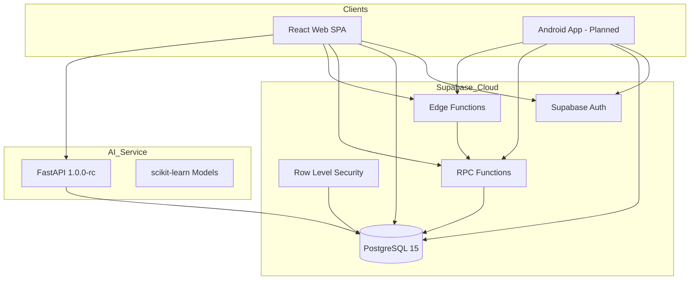

# Chapter 03 — System Architecture

## 3.1 Overview

AgroElevate follows a **three-tier distributed architecture** comprising a React web client, Supabase cloud backend (PostgreSQL + Auth + Edge Functions), and a standalone FastAPI AI microservice. Commerce-critical logic executes exclusively in PostgreSQL RPC functions marked `SECURITY DEFINER`, with Row Level Security (RLS) enforcing tenant isolation at the data layer. Payment top-ups flow through Razorpay with server-created orders—never client-side wallet inflation.

The overall architecture is illustrated in Figure 3.1 (see `../diagrams/01_overall_architecture.mmd`):



---

## 3.2 Technology Stack

| Layer | Technology | Version / Detail | Role |
|-------|------------|------------------|------|
| **Frontend** | React | 18.3.1 | Component UI, hooks, lazy routes |
| | Vite | 5.4.19 | Build tool, dev server, HMR |
| | TypeScript | 5.8.3 | Static typing across `src/` |
| | Tailwind CSS | 3.4.17 | Utility-first styling |
| | shadcn/ui + Radix | Various | Accessible UI primitives |
| | React Router | 6.30.1 | Client-side routing |
| | TanStack Query | 5.83.0 | Server state caching (60s staleTime) |
| | Recharts | 2.15.4 | Dashboard and intelligence charts |
| | Zod + React Hook Form | 3.25 / 7.61 | Form validation (Register, Profile) |
| **Backend** | Supabase | Cloud hosted | BaaS platform |
| | PostgreSQL | 15 | Primary datastore |
| | Supabase Auth | JWT sessions | Email/password authentication |
| | Supabase JS | 2.95.3 | Client SDK (`@supabase/supabase-js`) |
| | Deno Edge Functions | std 0.177 | `razorpay-create-order`, `razorpay-webhook` |
| **Payments** | Razorpay | Test Mode | Wallet top-up gateway |
| **AI Service** | FastAPI | 1.0.0-rc | Intelligence REST API |
| | Uvicorn | ASGI server | Local dev / Docker entry |
| | scikit-learn | ML models | Crop, market, income models |
| | Open-Meteo API | External | Weather in farmer/copilot UI |
| **DevOps** | Docker | ai-service/Dockerfile | Containerized AI deployment |
| | Render | render.yaml | PaaS blueprint for AI service |
| **Verification** | Node.js scripts | commerce-verify.mjs | 26 E2E checks |

Environment variables are documented in `.env.example`: `VITE_SUPABASE_URL`, `VITE_SUPABASE_ANON_KEY`, `SUPABASE_SERVICE_ROLE_KEY` (CI/harness only), `VITE_AI_API_URL`, Razorpay keys (Edge Function secrets).

---

## 3.3 Development Methodology

AgroElevate was developed using an **Agile-inspired iterative methodology** adapted for a two-member Final Year team:

| Phase | Migration / Deliverable | Focus |
|-------|---------------------------|-------|
| **Phase A** | 001–004 prod RLS, wallet RPC, checkout RPC | Baseline commerce on production camelCase schema |
| **Phase B** | 005 ai_* tables | AI persistence layer |
| **Phase D** | 006 auth profiles | Suspend/approve, admin RLS |
| **Phase F0** | 007–008, 015 v2 | E2E fixes, wallet balance sync, RLS recursion |
| **Option B P1** | 012 customer role, wallet provisioning | Android-ready role bridge |
| **Option B P2** | 013 trader royalty | 12.5% immediate royalty engine |
| **Option B P3** | 014 manufacturing | Deferred royalty, batches |
| **Phase G** | 016 Razorpay | Payment intents, receipts, webhooks |
| **Demo** | 017–018 | Admin demo wallet credits |
| **Excellence Pass** | UI polish, AI deploy, perf | v1.0.0-rc freeze |

Each phase produced a report markdown (e.g., `PHASE_2_REPORT.md`, `RAZORPAY_FINAL_IMPLEMENTATION_REPORT.md`) and extended—not replaced—prior migrations. **Additive schema only** was a governing principle to protect production data.

Sprint ceremonies were informal: weekly goal setting, migration apply checkpoints in Supabase SQL Editor, and harness-driven regression (`commerce:verify`) before marking phases complete.

---

## 3.4 Web Client Architecture

### 3.4.1 Application Structure

```
src/
├── App.tsx                 # Routes, providers, lazy loading
├── pages/                  # Route-level screens
│   ├── Index.tsx           # Marketing landing
│   ├── Login.tsx, Register.tsx
│   ├── Marketplace.tsx, ProductDetail.tsx
│   ├── Dashboard.tsx, Wallet.tsx, Orders.tsx
│   ├── intelligence/       # IntelligenceHub + role insights
│   └── admin/              # Admin, AdminPayments
├── components/             # Reusable UI, auth guards, layout
├── hooks/                  # useAuth, useTheme, useAiService
├── lib/                    # supabaseClient, auth, wallet, aiApi, marketplaceData
└── types/                  # auth.ts role definitions
```

### 3.4.2 Routing and Layout

Two layout shells partition the UX:

- **MarketingLayout:** Public pages (`/`, `/login`, `/register`, password recovery).
- **AppLayout:** Authenticated app shell with navigation sidebar, theme toggle, AI status banner.

Protected routes wrap content in `ProtectedRoute` (session required). Admin routes add `RoleRoute allowedRole="admin"`.

### 3.4.3 State Management

- **Auth state:** React Context via `AuthProvider`—profile, session, loading skeleton.
- **Server data:** TanStack Query with conservative refetch policy.
- **AI availability:** `AiServiceProvider` + `AiStatusBanner` for online/offline signaling.
- **Theme:** `next-themes` dark/light persistence.

### 3.4.4 Performance Architecture

Lazy imports for heavy routes (`Dashboard`, `Wallet`, `IntelligenceHub`, `Admin`) reduced initial JS payload ~69%. Suspense fallbacks use `PageLoading` skeleton component for perceived performance.

---

## 3.5 Backend and Supabase Architecture

### 3.5.1 Dual Identity Model

Production schema maintains parallel stores:

- **`profiles`** (snake_case, UUID PK = `auth.users.id`) — Auth-linked identity for RLS and app display.
- **`users`** (camelCase, TEXT PK `uid`) — Wallet balance (`walletBalance`) and legacy Android compatibility.

Bridge functions (`_resolve_user_identity`, `_ensure_users_row`, `ensure_profile_from_auth`) synchronize rows on registration. Role naming maps `middleman` ↔ `trader` between tables via `_role_for_profiles_table` / `_role_for_users_table`.

### 3.5.2 Commerce RPC Layer

All financial mutations flow through RPCs:

| RPC | Caller | Purpose |
|-----|--------|---------|
| `checkout_order(cart)` | Buyer | Atomic purchase + royalty splits |
| `get_wallet_balance()` | Self | Read reconciled balance |
| `transfer_funds(receiver, amount)` | Self | P2P wallet transfer |
| `ensure_profile_from_auth()` | Self | Profile + users provisioning |

Internal helpers (`_wallet_transfer`, `_wallet_ledger_entry`, `_commerce_settle_sale`) are revoked from PUBLIC—callable only from other SECURITY DEFINER functions.

### 3.5.3 Row Level Security

RLS policies enforce:

- Users read own `wallet_history` (`userId = auth.uid()::text`).
- `order_items` visible to buyer via parent `orders.buyerId` join; farmers read rows where `farmerId` matches (seller visibility fix in migration 007).
- Admin override via `is_admin()` STABLE function checking `profiles.role = 'admin'`.
- AI tables scoped by `user_id` except market predictions (authenticated read-all).

Figure 3.2 (`../diagrams/05_auth_flow.mmd`) documents JWT validation from login through RPC invocation.

### 3.5.4 Edge Functions

| Function | Method | Auth | Action |
|----------|--------|------|--------|
| `razorpay-create-order` | POST | JWT | Create Razorpay order + `payment_intents` row |
| `razorpay-webhook` | POST | Signature | Confirm deposit via `confirm_wallet_deposit` |

Edge Functions use service role client for receipt number generation and payment state updates—never exposing secrets to browsers.

---

## 3.6 AI Service Architecture

The AI microservice (`ai-service/`) is a **stateless compute layer** with **stateful persistence** to Supabase `ai_*` tables via service role key.

```
ai-service/app/
├── main.py              # FastAPI app, CORS, /health
├── routers/intelligence.py
├── services/intelligence_service.py
├── models/              # crop_recommender, market_predictor, copilot, etc.
├── feature_engineering.py
├── persistence.py       # Supabase writes
└── weather.py           # Open-Meteo client
```

**Endpoints:**

| Method | Path | Description |
|--------|------|-------------|
| GET | `/health` | Service liveness (used by `ai:verify`) |
| POST | `/api/intelligence/refresh` | Regenerate all intelligence for user |
| GET | `/api/intelligence/farmer/dashboard` | Farmer recommendations + forecasts |
| GET | `/api/intelligence/trader/dashboard` | Trader margin/inventory intel |
| GET | `/api/intelligence/industrialist/dashboard` | Procurement/supplier intel |
| POST | `/api/intelligence/copilot` | Conversational assistant |

Figure 3.3 (`../diagrams/06_ai_pipeline.mmd`) shows data flow from `order_items` → feature engineering → models → persistence → web dashboards.

The web client wraps API calls in `withFallback()`—returning empty dashboards with `_fallback: true` when AI is offline, preserving commerce UX.

---

## 3.7 Wallet Architecture

Wallet design separates **balance cache** from **authoritative ledger**:

- **Balance:** `users.walletBalance` updated synchronously in `_wallet_ledger_entry`.
- **Ledger:** `wallet_history` append-only rows with `type`, `amount`, `orderId`, `description`, optional `reference_type` / `reference_id`.

Deposit flow (Figure 3.4 — `../diagrams/04_payment_flow.mmd`):

1. Client calls Edge Function with `amount_inr`.
2. Server creates Razorpay order + `payment_intents` (status `created`).
3. User completes Razorpay Checkout (web) or Android SDK (planned).
4. Webhook invokes `confirm_wallet_deposit` → ledger `deposit` row + receipt in `payment_receipts`.
5. Client polls `get_wallet_balance` until balance reflects payment.

**Security:** Direct `add_funds` RPC raises exception for authenticated clients post-migration 016—verified in commerce harness.

**Demo path:** Admins call `admin_demo_wallet_credit` (migrations 017–018) producing `demo_credit` ledger entries audited in `demo_wallet_credits`.

---

## 3.8 Royalty Architecture

AgroElevate implements **Option B** royalty (Figure 3.5 — `../diagrams/03_royalty_workflow.mmd`):

| Rule | Flow | Royalty |
|------|------|---------|
| 1 | Farmer → Trader | None (direct sale) |
| 2 | Farmer → Industrialist | None |
| 3 | Trader → Industrialist (relisted) | **12.5% immediate** to original farmer |
| 4 | Industrialist procures → manufacturing | Deferred obligation created |
| 5 | Processed product resale | 12.5% settles obligation |

Implementation highlights:

- Relist metadata JSON in `products.description` parsed by `_parse_product_commerce_meta`.
- `_commerce_settle_sale` computes seller net = line total − royalty; transfers royalty via `_wallet_transfer` with `wallet_history.type = 'royalty_income'`.
- Phase 3 adds `royalty_obligations` for deferred settlement linked to `manufacturing_batches`.

Verified scenario: 5 kg × ₹70 = ₹350 → royalty ₹43.75 (±₹0.02 tolerance in harness).

---

## 3.9 Marketplace Architecture

Catalog uses **`products`** table (snake_case) for web listings:

- Farmers create listings via Marketplace UI insert.
- Traders relist with enriched `description` JSON preserving `original_farmer_id`.
- Checkout maps `products.id` → `order_items.cropId` (FK bridge in migration 015 v2).

Parallel **`crops`** table exists in legacy production schema; RPC `_resolve_crop_id_for_product` bridges identifiers. Marketplace page filters `quantity > 0`, supports cart checkout calling `checkout_order`.

Product detail route: `/marketplace/:id`. Toast notification confirms royalty credit on qualifying purchases.

---

## 3.10 Authentication Architecture

Registration (`Register.tsx`) collects role, KYC fields (address, phone, bank account for business roles). Flow:

1. `signUpWithEmail` → Supabase Auth creates user with metadata.
2. `ensureUserRecords` → inserts `profiles` + `users` rows.
3. Email verification path redirects to `/verify-email` when session not immediately available.

Login establishes JWT session stored by Supabase client. `ProtectedRoute` redirects unauthenticated users to `/login`. Suspended/unapproved profiles route to `/suspended` or `/pending-approval`.

Password recovery uses Supabase reset email flow (`/forgot-password`, `/reset-password`).

---

## 3.11 Deployment Architecture

| Component | Target | Notes |
|-----------|--------|-------|
| Web SPA | Static host (Vite `dist/`) | `npm run build` produces optimized assets |
| Supabase | Supabase Cloud project | Migrations applied via SQL Editor or CLI |
| Edge Functions | Supabase Functions deploy | Razorpay secrets in project vault |
| AI Service | Render (render.yaml) or local `:8000` | Docker multi-stage build |
| CI Verification | Developer machine / GitHub Actions ready | `commerce:verify`, `ai:verify` |

Production readiness score: **86/100** (`FINAL_RELEASE_REPORT.md`)—deductions primarily for AI production URL and live webhook confirmation.

---

## 3.12 Summary

AgroElevate's architecture prioritizes **server authority** for money and royalty, **client richness** for role-specific UX, and **service modularity** for AI compute. The stack—React 18, Vite 5, Supabase, FastAPI, Razorpay—is industry-standard and academically defensible. Mermaid diagrams in `docs/blackbook/diagrams/` provide evaluators visual anchors for viva presentation; this chapter maps each diagram to concrete code paths verified at 26/26 commerce checks and passing production build.

---

*Diagram references: `01_overall_architecture.mmd`, `02_er_diagram.mmd`, `03_royalty_workflow.mmd`, `04_payment_flow.mmd`, `05_auth_flow.mmd`, `06_ai_pipeline.mmd`*
