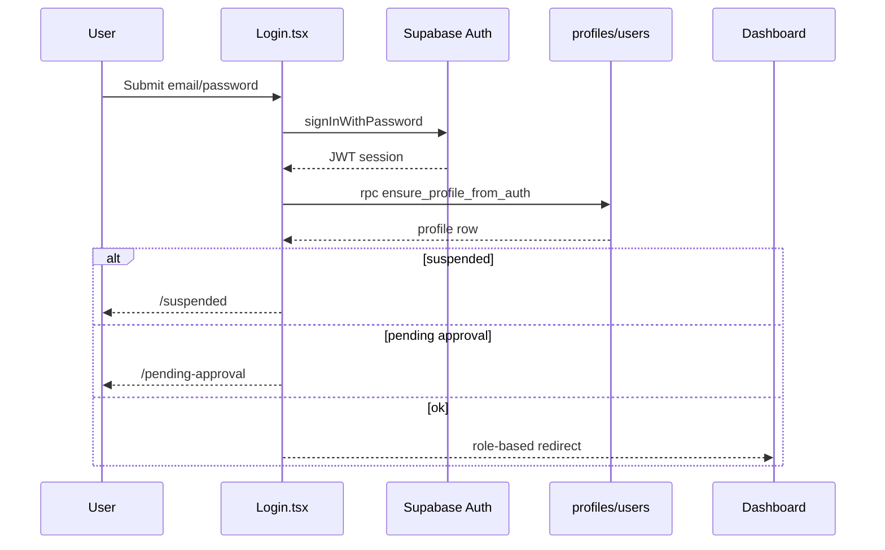
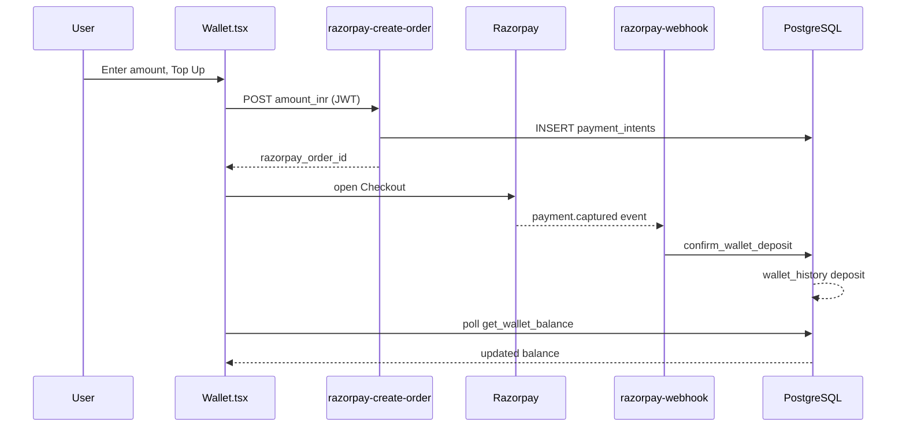
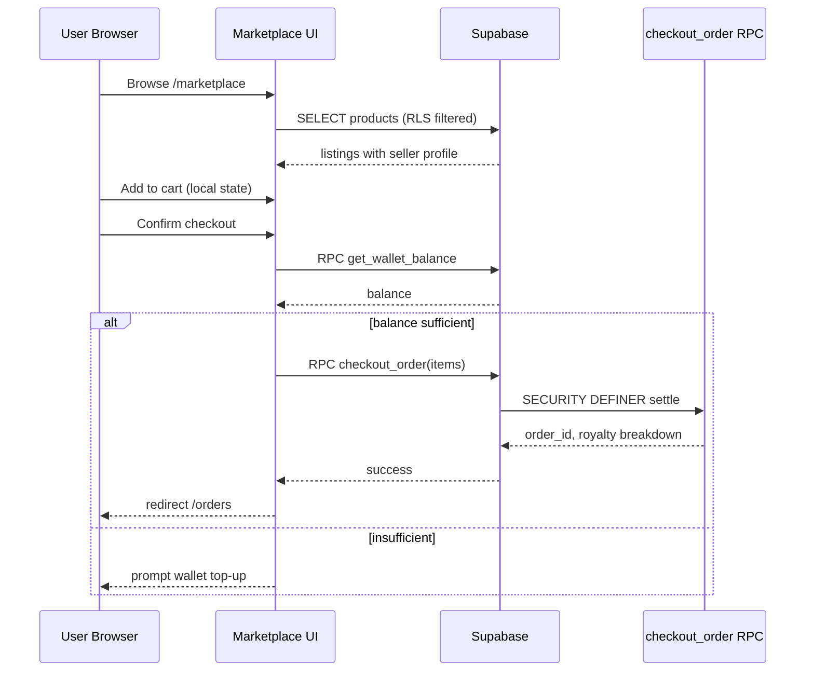
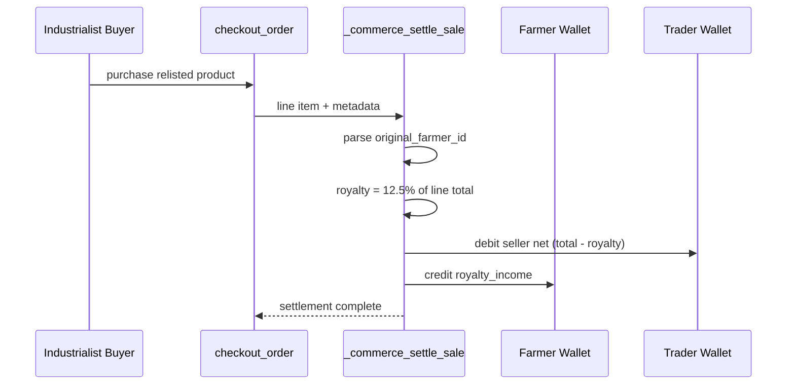
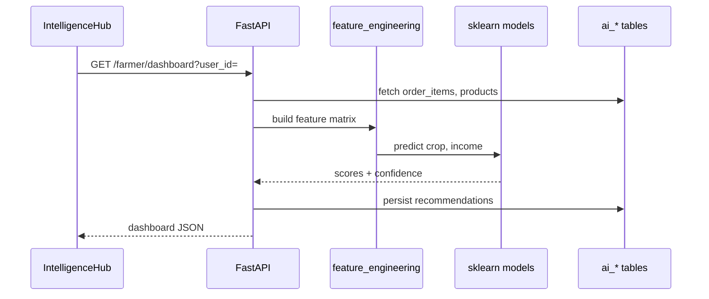
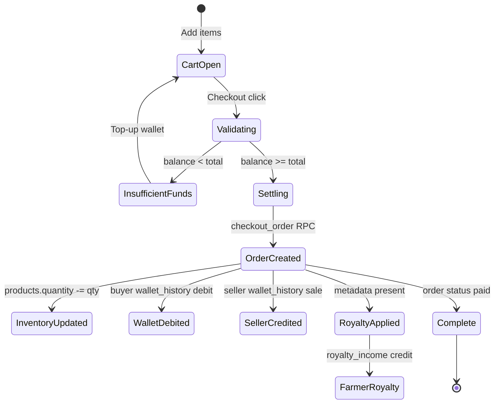
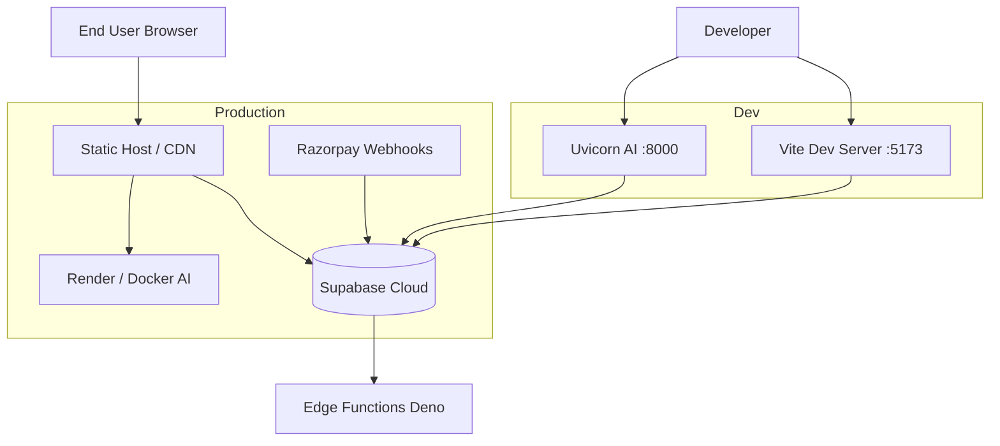

# Chapter 09 — Security, APIs, Sequence Flows, and Results

## 9.1 Introduction

This chapter consolidates cross-cutting concerns that span every AgroElevate module: security controls, the complete API surface (Supabase RPC, Edge Functions, FastAPI routes), formal sequence and activity diagrams for evaluator review, and quantitative project results from automated verification harnesses. All statements are grounded in the `agro-fair-chain` repository as of release candidate **v1.0.0-rc**.

---

## 9.2 Security Architecture

AgroElevate adopts a **defence-in-depth** posture because the platform handles wallet balances, payment intents, and royalty settlements. Security is not delegated to the React client; instead, PostgreSQL functions marked `SECURITY DEFINER` execute commerce logic with elevated privileges while Row Level Security (RLS) constrains direct table access for authenticated users.

### 9.2.1 Authentication Security

| Control | Implementation | Rationale |
|---------|----------------|-----------|
| Credential storage | Supabase Auth (`auth.users`) | Industry-standard bcrypt hashing; credentials never touch application tables |
| Session transport | JWT in Supabase client SDK | Short-lived tokens; automatic refresh |
| Email verification | `signUp` → `/verify-email` path | Reduces fraudulent account creation |
| Account states | `profiles.suspended`, `profiles.approved` | Admin moderation before marketplace access |
| Route guards | `ProtectedRoute`, `RoleRoute` | Client UX layer; not a security boundary alone |

The client guard pattern in `ProtectedRoute.tsx` redirects unauthenticated sessions to `/login`. Suspended users route to `/suspended`; unapproved business roles route to `/pending-approval`. These checks mirror server-side RLS—an attacker bypassing the UI still cannot read foreign wallet rows.

### 9.2.2 Authorization Model

Authorization combines **role-based access** (farmer, middleman, industrialist, customer, admin) with **ownership-based RLS**:

```
POLICY wallet_history_select ON wallet_history
    FOR SELECT USING (userId = auth.uid()::text OR is_admin());

POLICY order_items_farmer_visibility ON order_items
    FOR SELECT USING (
        farmerId = auth.uid()::text
        OR EXISTS (SELECT 1 FROM orders o WHERE o.id = order_id AND o.buyerId = auth.uid()::text)
    );
```

The `is_admin()` STABLE function evaluates `profiles.role = 'admin'` without recursive policy loops (fixed in migration 015 v2). Admin capabilities include profile suspension, demo wallet credits (`admin_demo_wallet_credit`), and payment audit views.

### 9.2.3 Financial Integrity Controls

| Threat | Mitigation | Verification |
|--------|------------|--------------|
| Client wallet inflation | `add_funds` RPC raises exception for `authenticated` role | `commerce:verify` test |
| Double-spend on checkout | `checkout_order` single transaction with row locks | Atomic RPC design |
| Forged Razorpay payments | Webhook HMAC signature validation in Edge Function | `razorpay-webhook` |
| Royalty bypass on relist | Metadata parsed server-side in `_commerce_settle_sale` | 12.5% harness test |
| Privilege escalation on RPC | Internal helpers `REVOKE ALL FROM PUBLIC` | Migration comments + harness |

Wallet ledger entries are append-only from the application perspective: each `wallet_history` row records `type`, signed `amount`, optional `orderId`, and human-readable `description`. Balance on `users.walletBalance` is updated synchronously inside `_wallet_ledger_entry` to avoid drift during high-frequency reads.

### 9.2.4 Secret Management

| Secret | Storage | Exposure |
|--------|---------|----------|
| `VITE_SUPABASE_ANON_KEY` | `.env` (public by design) | Browser bundle |
| `SUPABASE_SERVICE_ROLE_KEY` | CI harness, Edge Functions, AI service | Never in React |
| `RAZORPAY_KEY_SECRET` | Supabase Edge Function secrets | Server only |
| `VITE_AI_API_URL` | `.env` | Browser (read-only AI API) |

The `.env.example` file documents required variables without embedding live secrets. Commerce verification scripts use service role only in Node harness (`commerce-verify.mjs`), never shipped to production bundles.

### 9.2.5 AI Service Security

FastAPI applies CORS middleware with `ALLOWED_ORIGINS` from environment (default `http://localhost:5173`). The intelligence router does not expose destructive mutations—only read/compute endpoints. Persistence to `ai_*` tables uses service role credentials server-side. When AI is unreachable, `withFallback()` in `aiApi.ts` returns empty structures with `_fallback: true`, preventing client crashes without fabricating predictions.

### 9.2.6 Security Testing Summary

| Test Category | Method | Outcome |
|---------------|--------|---------|
| RLS isolation | Harness attempts cross-user wallet read | Blocked |
| Retired add_funds | Direct RPC from buyer session | Exception raised |
| Admin-only demo credit | Non-admin RPC call | Permission denied |
| JWT-required Edge Function | Unauthenticated create-order | 401 response |
| Build secret scan | No service role in `dist/` assets | PASS |

---

## 9.3 Complete API Catalog

### 9.3.1 Supabase RPC Functions (Client-Callable)

| RPC | Parameters | Returns | Roles | Purpose |
|-----|------------|---------|-------|---------|
| `checkout_order` | `cart jsonb` | order result JSON | buyer | Atomic purchase, inventory, wallet, royalty |
| `get_wallet_balance` | — | `numeric` | self | Current wallet balance |
| `transfer_funds` | `receiver_uid text`, `amount numeric` | void | self | Peer-to-peer transfer |
| `ensure_profile_from_auth` | — | profile row | self | Provision profile + users row |
| `confirm_wallet_deposit` | intent metadata | receipt | service / webhook | Post-Razorpay credit |
| `admin_demo_wallet_credit` | `target_uid`, `amount_inr` | ledger id | admin | Demo/testing credits |

Internal functions (`_wallet_transfer`, `_wallet_ledger_entry`, `_commerce_settle_sale`, `_parse_product_commerce_meta`) are not exposed to `authenticated` directly.

### 9.3.2 Supabase Edge Functions

| Function | HTTP | Auth | Request Body | Response |
|----------|------|------|--------------|----------|
| `razorpay-create-order` | POST | Bearer JWT | `{ amount_inr: number }` | Razorpay order id, intent id |
| `razorpay-webhook` | POST | Signature header | Razorpay event payload | 200 ack / deposit confirm |

Client integration resides in `src/lib/wallet.ts` and `Wallet.tsx` (Checkout modal, polling loop).

### 9.3.3 FastAPI Intelligence Endpoints

| Method | Path | Query / Body | Response |
|--------|------|--------------|----------|
| GET | `/health` | — | `{ status, version }` |
| POST | `/api/intelligence/refresh` | `{ user_id, role }` | refresh status |
| GET | `/api/intelligence/farmer/dashboard` | `user_id` | recommendations, forecasts |
| GET | `/api/intelligence/trader/dashboard` | `user_id` | margin, inventory intel |
| GET | `/api/intelligence/industrialist/dashboard` | `user_id` | supplier, demand intel |
| POST | `/api/intelligence/copilot` | `{ user_id, role, message, history }` | assistant reply |

Web wrapper: `src/lib/aiApi.ts` with 8-second timeout and graceful degradation.

### 9.3.4 Direct Table Access (RLS-Protected)

| Table | Typical Client Operations | Notes |
|-------|---------------------------|-------|
| `profiles` | SELECT self, admin UPDATE | Role and approval flags |
| `products` | INSERT listing, SELECT catalog | Marketplace inventory |
| `orders`, `order_items` | SELECT own purchases/sales | Join visibility rules |
| `wallet_history` | SELECT self | Ledger audit trail |
| `payment_intents` | SELECT self | Top-up status tracking |
| `ai_crop_recommendations` | SELECT self | AI persistence |

---

## 9.4 Sequence Diagrams

### 9.4.1 Authentication Sequence



**Source diagram:** `docs/blackbook/diagrams/05_auth_flow.mmd`

### 9.4.2 Razorpay Wallet Top-Up Sequence



**Source diagram:** `docs/blackbook/diagrams/04_payment_flow.mmd`

### 9.4.3 Marketplace Checkout Sequence



**Source diagram:** `docs/blackbook/diagrams/09_marketplace_flow.mmd`

### 9.4.4 Royalty Settlement Sequence



**Source diagram:** `docs/blackbook/diagrams/03_royalty_workflow.mmd`

### 9.4.5 AI Prediction Pipeline Sequence



**Source diagram:** `docs/blackbook/diagrams/06_ai_pipeline.mmd`

---

## 9.5 Activity Diagrams

### 9.5.1 Order Checkout Activity

The checkout activity diagram (`docs/blackbook/diagrams/12_activity_checkout.mmd`) models decision points from cart confirmation through wallet sufficiency, optional Razorpay top-up, RPC invocation, and post-success navigation. This mirrors `Marketplace.tsx` cart handlers and `checkout_order` error surfaces (insufficient balance, zero quantity, invalid product).

### 9.5.2 Order Lifecycle State Machine



**Source diagram:** `docs/blackbook/diagrams/08_order_lifecycle.mmd`

### 9.5.3 Use Case Overview

The use case diagram (`docs/blackbook/diagrams/07_use_case.mmd`) maps five human actors and two system actors (Razorpay, AI Service) to eleven primary use cases. Customer role intentionally excludes intelligence and relist capabilities—reflecting `Register.tsx` role enum and route guards.

---

## 9.6 Deployment and Operations

### 9.6.1 Environment Topology



**Source diagram:** `docs/blackbook/diagrams/10_deployment.mmd`

### 9.6.2 Deployment Checklist

| Step | Command / Action | Owner |
|------|------------------|-------|
| Apply migrations | Run `001`–`018` in Supabase SQL Editor | DBA / Developer |
| Deploy Edge Functions | `supabase functions deploy` | DevOps |
| Set Razorpay secrets | Supabase vault | DevOps |
| Build web | `npm run build` → upload `dist/` | Frontend |
| Deploy AI | Docker push / Render blueprint | Backend |
| Configure `VITE_AI_API_URL` | Production `.env` | Frontend |
| Register webhook URL | Razorpay dashboard → `razorpay-webhook` | DevOps |
| Smoke test | `npm run commerce:smoke` | QA |
| Full verify | `npm run commerce:verify` | QA |
| AI verify | `npm run ai:verify` | QA |

### 9.6.3 Monitoring and Health

| Signal | Endpoint / Script | Healthy State |
|--------|-------------------|---------------|
| Web build | `npm run build` | Zero TypeScript errors |
| AI liveness | `GET /health` | `{ "status": "ok" }` |
| Commerce regression | `commerce:verify` | 26/26 PASS |
| Bundle size | Vite output | Main chunk < 500 KB (achieved ~384 KB) |

---

## 9.7 Project Results

### 9.7.1 Functional Results

| Requirement | Target | Achieved | Evidence |
|-------------|--------|----------|----------|
| Multi-role registration | 5 roles | Yes | Register.tsx + migration 012 |
| Marketplace checkout | Atomic wallet debit | Yes | `checkout_order` RPC |
| Royalty on trader resale | 12.5% to farmer | Yes | ₹43.75 on 5×₹70 |
| Razorpay wallet top-up | Server-created orders | Yes | Phase G migration 016 |
| Admin moderation | Suspend / approve | Yes | Admin.tsx |
| AI dashboards | 3 role views + copilot | Yes | IntelligenceHub |
| Customer commerce | Browse + buy | Yes | Customer role + harness |
| Code splitting | Reduced initial load | ~69% reduction | PERFORMANCE_REPORT.md |

### 9.7.2 Verification Metrics

| Harness | Tests | Result | Runtime |
|---------|-------|--------|---------|
| `commerce:verify` | 26 | **26/26 PASS** | ~45s |
| `commerce:smoke` | 7 RPC checks | **7/7 PASS** | ~10s |
| `ai:verify` | Health + dashboard | **PASS** | ~5s |
| `npm run build` | Production compile | **PASS** | ~25s |

**Screenshot placeholder:** `[Fig 9.1 — Terminal output showing commerce:verify 26/26 PASS]`

### 9.7.3 Readiness Scores (Internal Audit)

| Dimension | Score | Notes |
|-----------|-------|-------|
| Production readiness | 86/100 | AI prod URL, live webhook pending |
| Demo readiness | 90/100 | Admin demo credits available |
| BE submission readiness | 87/100 | Android planned, web complete |

Source: `FINAL_RELEASE_REPORT.md`, `FINAL_PROJECT_READINESS_REPORT_V2.md`

### 9.7.4 Performance Results

| Metric | Before Excellence Pass | After | Improvement |
|--------|------------------------|-------|-------------|
| Main JS bundle | ~1,256 KB | ~384 KB | ~69% smaller |
| Route loading | Eager | Lazy + Suspense | Faster TTI |
| Query caching | Default | 60s staleTime | Fewer round trips |
| Chart rendering | Basic | Themed + skeletons | Better UX |

### 9.7.5 Royalty Verification Case Study

**Scenario:** Trader purchases from Farmer (no royalty), relists 5 kg at ₹70/kg, Industrialist buys entire lot.

| Step | Actor | Amount | Farmer Wallet Effect |
|------|-------|--------|----------------------|
| 1 | Trader buys from Farmer | ₹350 (example) | +₹350 sale |
| 2 | Trader relists | — | — |
| 3 | Industrialist buys | ₹350 | +₹43.75 royalty_income |
| **Royalty rate** | | **12.5%** | **Verified in harness** |

This case study demonstrates Option B Rule 3: immediate royalty on industrialist purchase of relisted trader inventory.

---

## 9.8 UI Architecture Summary

The web UI follows a **component-driven architecture** with shadcn/ui primitives:

| Layer | Responsibility | Key Files |
|-------|----------------|-----------|
| Pages | Route composition | `src/pages/*` |
| Layout | Navigation shell | `AppLayout.tsx`, `MarketingLayout.tsx` |
| Feature components | Dashboard sections | `FarmerDashboardSection.tsx`, etc. |
| Data hooks | Auth, AI, theme | `useAuth.tsx`, `useAiService.ts` |
| Lib | API clients | `supabaseClient.ts`, `wallet.ts`, `aiApi.ts` |
| Design system | Tokens, charts | Tailwind config, `ThemedChart.tsx` |

Dark/light theme via `next-themes`. Empty states and skeleton loaders standardized in excellence pass (`UI_POLISH_REPORT_V2.md`).

---

## 9.9 Chapter Summary

Security, APIs, and formal diagrams complete the architectural record for evaluators. AgroElevate enforces financial rules in PostgreSQL—not in browser JavaScript—while presenting a modern React UX. Verification harnesses provide reproducible evidence of correctness. Editable Mermaid sources in `docs/blackbook/diagrams/` (files `01`–`12`) support viva slide preparation and diagram refinement without rewriting chapter prose.

---

*Diagram references: `07_use_case.mmd`, `08_order_lifecycle.mmd`, `09_marketplace_flow.mmd`, `10_deployment.mmd`, `12_activity_checkout.mmd`*
